  
# 一、课程目标  
1.了解抓包技术的基本原理和应用场景  
2.了解多种抓包工具进行安卓App的网络通信分析  
3.了解网络协议的基础知识并能应用于抓包分析  
  
# 二、工具  
  
1.教程Demo(更新)  
2.Reqable  
# 三、课程内容  
  
## 1.什么是包？  
在计算机网络中，“包”通常指的是在网络上传输的数据单元，也被称为数据包。在互联网协议（IP）的语境下，数据包是由报头（Header）和载荷（Payload）组成，其中报头包含了源地址、目的地址、长度等信息，而载荷则是实际要传输的数据。  
  
## 2.什么是抓包？  
抓包具体指的是通过某些工具获取安卓App与服务器之间传输的网络数据，这些数据通常用于逆向分析、协议接口分析或App渗透测试，帮助安全工程师理解App与服务器之间的通信细节，如请求和响应的具体内容，从而进行安全评估或逆向工程。  
## 3.为什么要抓包？  
1.帮助定位加密或混淆的代码中的关键部分  
2.逆向接口(比如:一些第三方影视app的解析接口、分析是否为服务器校验)  
3.篡改数据包实现免重打包破解&屏蔽广告  
4.协议分析&爬虫需求  
## 3.抓包的前置知识  
  
### 1.什么是Web?  
Web，即万维网（World Wide Web），是互联网的一个重要组成部分，它是一种基于超文本和HTTP（HyperText Transfer Protocol，超文本传输协议）的全球性、动态交互的、跨平台的分布式图形信息系统。Web允许用户通过超链接在不同的网页之间导航，从而获取和浏览信息。  
  
### 2.什么是协议？  
在计算机网络通信中，协议（Protocol）是一种规范或一组规则，用于指导网络中不同系统之间数据的交换和通信(约定俗称的一种规则)。协议定义了数据如何在网络上传输、格式化、打包、寻址、路由、安全处理以及错误检测和纠正等方面的具体规则。它确保了来自不同制造商的设备和运行不同操作系统的计算机能够相互通信。  
  
### 3.常见的协议以及分层模型  
[一文讲透TCP/IP协议 | 图解+秒懂+史上最全](https://blog.csdn.net/sunyctf/article/details/128975665)  
网络协议可以分层，每层都有特定的任务和责任，最著名的分层模型是OSI七层模型和TCP/IP四层模型。常见的网络协议包括：  
- **TCP/IP（Transmission Control Protocol/Internet Protocol）**：这是互联网的基础协议，包括了IP协议（用于寻址和路由数据包）、TCP协议（用于建立可靠的数据流）和UDP协议（用于不需要确认的快速数据传输）。  
- **HTTP（Hypertext Transfer Protocol）**：用于从Web服务器向浏览器传输超文本文档（如HTML文件）。  
- **FTP（File Transfer Protocol）**：用于在互联网上传输文件。  
- **SMTP（Simple Mail Transfer Protocol）**：用于电子邮件的传输。  
- **DHCP（Dynamic Host Configuration Protocol）**：自动分配IP地址和其他网络配置参数给网络上的设备。  
- **DNS（Domain Name System）**：将域名转换为IP地址。  
  
PS:课下有时间要去深入学习一下OSI的七层模型，TCP的三次握手以及四次挥手，另外再推荐本书《图解HTTP》  
  
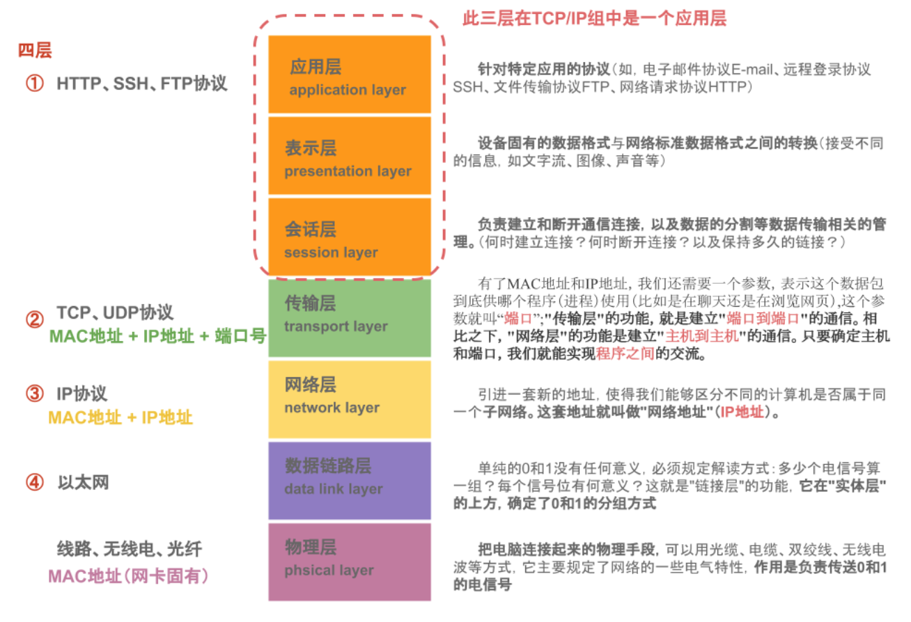  
### 4.什么是URL?  
Web 由很多资源组成，比如 HTML 页面、视频、图片，在互联网上每个资源都有一个编号，这个编号就是 URL 地址。服务器负责定义 URL，世界上任何一个资源的编号是  
唯一的，客户端通过 URL 地址在互联网中找到该资源，URL 的官方名称叫作统一资源标识符（Uniform Resource Locator）。  
URL 的规则定义如下：  
https://www.52pojie.cn/forum.php  
https 表示资源需要通过 HTTPS 这个协议才能够获取，换句话说，客户端需要通过 HTTPS这个协议请求这个资源。  
www.52pojie.cn 表示服务器地址，在互联网中每个服务器都有一个 IP 地址，但对于用户来说 IP 地址很难记住，用户一般只会记住服务器主机（比如www.52pojie.cn）名称。  
在 HTTPS 中，客户端发送 HTTPS 请求的时候，必须通过 DNS 协议将服务器主机名转换为IP 地址，这样客户端才能找到服务器。  
443 是 HTTPS 协议的默认端口（可以省略不输入），表示服务器通过 443 端口提供 HTTPS服务。  
/forum.php 表示服务器在/根目录下有一个 forum.php 资源。  
### 5.HTTP与HTTPS  
[HTTP和HTTPS协议，看一篇就够了](https://blog.csdn.net/xiaoming100001/article/details/81109617/)  
`HTTP`是一种应用层协议，用于传输超文本，如HTML文档，以及其他资源，如图像和视频。它是一种无状态的协议，这意味着每个请求都是独立的，服务器不会保存关于客户端的任何信息。HTTP工作在TCP/IP协议栈的应用层，使用TCP端口80进行通信。  
● 通信使用明文（不加密），内容可能会被窃听  
● 不验证通信方的身份，因此有可能遭遇伪装  
● 无法证明报文的完整性，所以有可能已遭篡改  
`HTTPS`是HTTP的安全版本，它通过SSL/TLS（安全套接层/传输层安全）协议对HTTP进行加密。SSL/TLS提供了数据加密、身份验证和数据完整性保护，确保数据在传输过程中的安全。HTTPS使用TCP端口443进行通信。HTTPS 并非是应用层的一种新协议。只是 HTTP 通信接口部分用SSL（Secure Socket Layer）和 TLS（Transport Layer Security）协议代替而已。  
```  
HTTP + 通信加密 + 认证 + 完整性保护 = HTTPS  
  
其中验证身份问题是通过验证服务器的证书来实现的，证书是第三方组织（CA 证书签发机构）使用数字签名技术管理的，包括创建证书、存储证书、更新证书、撤销证书。  
```  
  
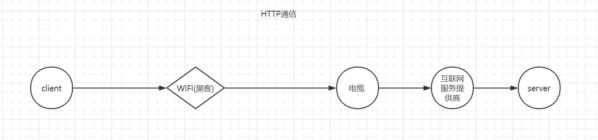  
  
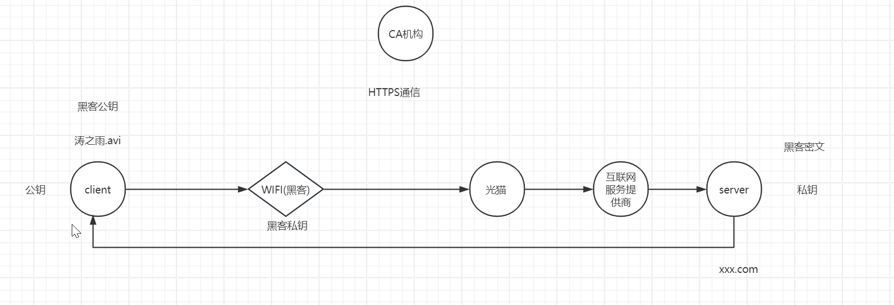  
  
### 6.什么是数字证书？  
数字证书是网络安全领域的一个重要组成部分，主要用于身份验证和加密通信。它基于公钥基础设施（Public Key Infrastructure, PKI）的原理，由证书颁发机构（Certificate Authority, CA）签发，用于证明公钥的所有者身份。  
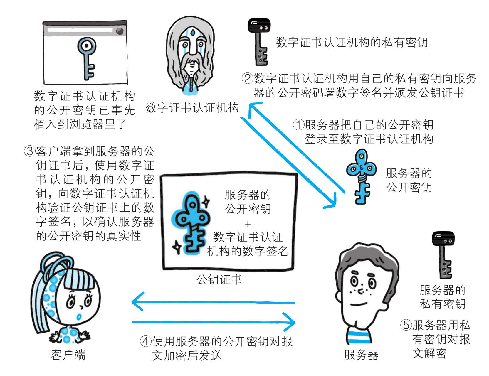  
### 7.常见抓包工具  
  
| 应用图标                                                                                       | 工具名称         | 类型                                   | 下载链接                                                                   | 简介                                                                                                                                                                                                         |  
| ---------------------------------------------------------------------------------------------- | ---------------- | -------------------------------------- | -------------------------------------------------------------------------- | ------------------------------------------------------------------------------------------------------------------------------------------------------------------------------------------------------------ |  
|                    | Charles          | 代理抓包工具                           | https://www.52pojie.cn/thread-1600964-1-1.html                             | Charles 是一个HTTP代理/HTTP监视器/反向代理，它允许开发人员查看所有的HTTP和SSL/HTTPS流量。                                                                                                                    |  
|    | Fiddler          | 代理抓包工具                           | https://www.alipan.com/s/2W8r2ko7UWz                                       | Fiddler 是一个Web调试代理，能够记录和检查从任何浏览器和客户端到服务器的所有HTTP流量。                                                                                                                        |  
|       | Burp Suite       | 代理抓包工具(理论上应该叫渗透必备工具) | https://www.52pojie.cn/thread-1544866-1-1.html                             | Burp Suite 是用于攻击web 应用程序的集成平台，包含了许多工具。Burp Suite为这些工具设计了许多接口，以加快攻击应用程序的过程。所有工具都共享一个请求，并能处理对应的HTTP 消息、持久性、认证、代理、日志、警报。 |  
| 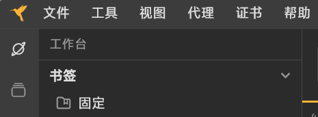   | Reqable          | 代理抓包工具                           | https://reqable.com/zh-CN/download                                         | Reqable = Fiddler + Charles + Postman<br>Reqable拥有极简的设计、丰富的功能、高效的性能和桌面手机双端平台。<br>                                                                                               |  
|   | ProxyPin         | VPN抓包工具                            | https://github.com/wanghongenpin/network_proxy_flutter/releases/tag/V1.1.0 | 开源免费抓包工具，支持Windows、Mac、Android、IOS、Linux 全平台系统<br>可以使用它来拦截、检查和重写HTTP（S）流量，ProxyPin基于Flutter开发，UI美观易用。                                                       |  
|                           | WireShark        | 网卡抓包工具                           | https://www.wireshark.org/download.html                                    | Wireshark是非常流行的网络封包分析软件，可以截取各种网络数据包，并显示数据包详细信息。常用于开发测试过程各种问题定位。                                                                                        |  
|  | r0Capture        | Hook抓包工具                           | https://github.com/r0ysue/r0capture                                        | 安卓应用层抓包通杀脚本                                                                                                                                                                                       |  
|    | tcpdump          | 内核抓包工具                           | https://github.com/the-tcpdump-group/tcpdump                               | cpdump 是一个强大的命令行网络数据包分析工具，允许用户截获并分析网络上传输的数据包，支持多种协议，包括但不限于TCP、UDP、ICMP等。tcpdump基于libpcap库，该库提供了从网络接口直接访问原始数据包的能力。          |  
| 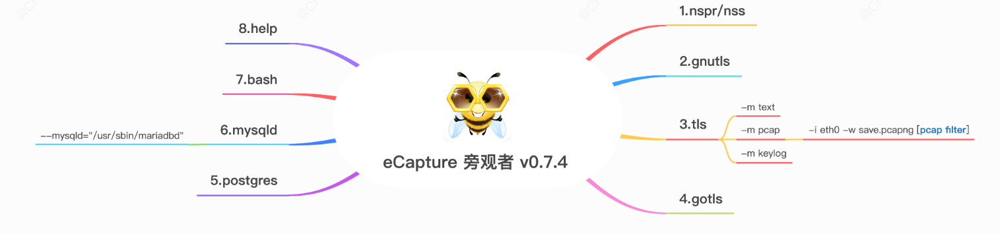  | eCapture(旁观者) | 内核抓包工具                           | https://github.com/gojue/ecapture/releases                                 | 基于eBPF技术实现TLS加密的明文捕获，无需CA证书。                                                                                                                                                              |  
| 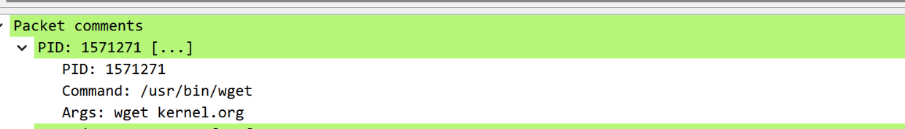  | ptcpdump         | 内核抓包工具                           | https://github.com/mozillazg/ptcpdump                                      | 基于 eBPF 的 tcpdump                                                                                                                                                                                         |  
  
## 4.抓包工具的简介以及简单抓包分析  
### 1.证书安装  
`选择适合自己的方式安装证书`  
Reqable使用经典的中间人（MITM）技术分析HTTPS流量，当客户端与Reqable的代理服务器（下文简称`中间人`）进行通信时，中间人需要重签远程服务器的SSL证书。为了保证客户端与中间人成功进行SSL握手通信，需要将中间人的根证书（下文简称`CA根证书`）安装到客户端本地的证书管理中心。  
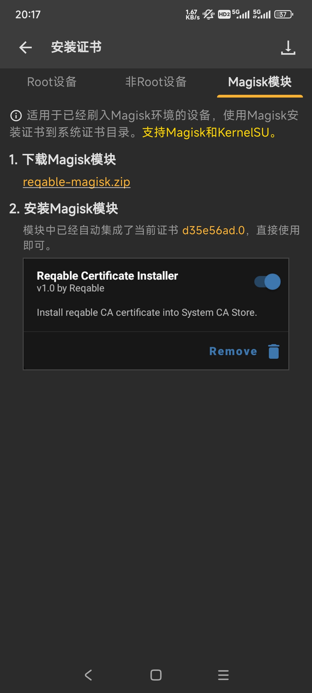  
### 2.请求体解析  
HTTP请求报文分为3部分：第一部分叫起始行（Request line），第二部分叫首部（Request Header），第三部分叫主体（Body）。  
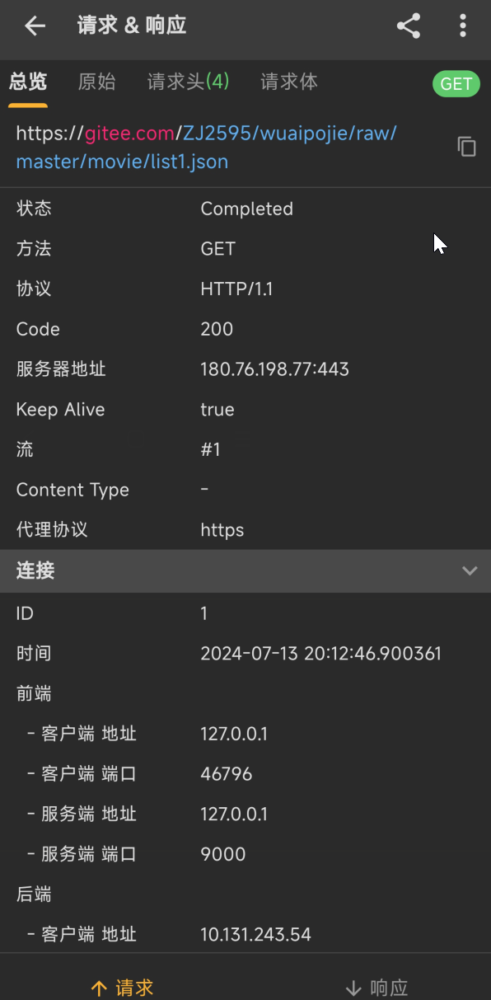  
- **状态**：表示请求的状态，这里是"Completed"，意味着请求已经完成。  
- **方法**：HTTP 请求的方法（也称为动词），这里为 "GET"，说明这是一个获取资源的请求。  
- **协议**：使用的 HTTP 协议版本，此处为 "HTTP/1.1"。(Reqable支持HTTP1、HTTP2和HTTP3（QUIC）协议)  
- **Code**：HTTP 状态码，200 表示服务器成功处理了请求。  
- **服务器地址**：请求的目标服务器的 IP 地址和端口号，这里是 "180.76.198.77:443"。  
- **Keep Alive**：是否保持连接 alive，值为 "true" 意味着会保持连接。  
- **Content Type**：返回内容的数据类型，这里没有指定具体的类型。  
- **代理协议**：如果使用了代理，则显示代理协议，此例中为 "https"。  
  
`HTTP方法`  
  
| 方法 | 描述 |  
| --- | --- |  
| GET | 请求指定的页面信息并返回实体主体 |  
| HEAD | 类似于GET请求，只不过返回的响应中没有具体的内容，用于获取报头 |  
| POST | 向指定资源提交数据进行处理请求（例如提交表单或者上传文件），数据被包含在请求体中。POST请求可能会导致新的资源的建立和/或对已有资源的修改 |  
| PUT | 从客户端向服务器传送的数据取代指定文档的内容 |  
| DELETE | 请求服务器删除指定的页面 |  
  
`HTTP常见状态码`  
  
  
| 名    称                     | 释    义                                                         |  
|-----------------------------|------------------------------------------------------------------|  
| 200 OK                      | 服务器成功处理了请求。                                          |  
| 301 Moved Permanently       | 请求的URL已被永久移动。Response应包含Location URL指向新位置。   |  
| 302 Moved Temporarily       | 请求的URL被暂时移动。Response应包含Location URL指向临时位置。   |  
| 304 Not Modified            | 客户端缓存的资源是最新的，无需重新发送，客户端应使用缓存。      |  
| 404 Not Found               | 请求的资源未在服务器上找到。                                     |  
| 401 Unauthorized            | 请求要求用户的身份认证。                                         |  
| 500 Internal Server Error   | 服务器遇到了意外的情况，无法完成请求。                           |  
  
`原始报文及请求头解析`  
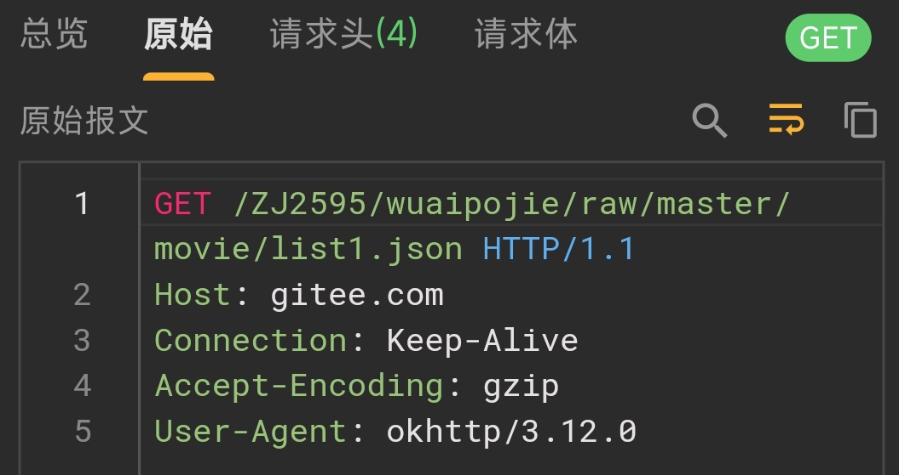  
这张图片展示的是一个HTTP请求报文的原始格式，以下是对各个行的解释：  
1. 第一行是请求行，包含了请求方法（GET）、请求路径以及HTTP协议版本（HTTP/1.1）。在这个例子中，请求方法是GET，表明这是一个获取操作；请求路径是`/ZJ2595/wuaijie/raw/master/movie/list1.json`，这意味着请求的目标资源位于gitee.com网站的某个特定目录下，具体来说是在`ZJ2595/wuaijie`仓库下的master分支中的`movie/list1.json`文件；HTTP/1.1表示使用的HTTP协议版本。  
2. 第二行 `Host: gitee.com` 是一个HTTP头字段，指明了请求要访问的具体主机名，即gitee.com。  
3. 第三行 `Connection: Keep-Alive` 表示客户端希望保持持久连接。这意味着一旦TCP连接建立之后，可以重复使用该连接来发送多个HTTP请求，而不需要为每个请求单独建立一个新的连接。  
4. 第四行 `Accept-Encoding: gzip` 告诉服务器客户端支持的压缩编码类型。在这个例子中，客户端表示它可以接受gzip压缩编码的内容。  
5. 最后一行 `User-Agent: okhttp/3.12.0` 提供了关于发起请求的应用程序的信息。User-Agent头字段通常用于标识发出请求的浏览器或应用程序的类型、版本和其他相关信息。在这里，User-Agent是okhttp/3.12.0，这表示请求是由OkHttp库的一个版本3.12.0发出的。  
  
`请求头 (Request Headers)`  
  
| 名称                         | 描述                                                                                                 |  
|------------------------------|------------------------------------------------------------------------------------------------------|  
| Accept                       | 指定客户端能接收的媒体类型。                                                                         |  
| Accept-Charset               | 指定客户端能接收的字符集。                                                                           |  
| Accept-Encoding              | 指定客户端能解码的编码方式，如gzip或deflate。                                                        |  
| Accept-Language              | 指定客户端首选的语言。                                                                               |  
| Authorization                | 包含用于访问资源的认证信息。                                                                         |  
| Cache-Control                | 控制缓存行为，如no-cache或max-age。                                                                  |  
| Connection                   | 控制HTTP连接是否保持活动状态，如keep-alive或close。                                                  |  
| Content-Length               | 指明请求体的长度。                                                                                   |  
| Content-Type                 | 指明请求体的数据类型，如application/json。                                                           |  
| Cookie                       | 包含客户端的cookie信息。                                                                             |  
| Date                         | 请求生成的时间。                                                                                     |  
| Expect                       | 指定客户端期望服务器执行的操作。                                                                     |  
| From                         | 发送请求的用户邮箱地址。                                                                             |  
| Host                         | 请求的目标服务器的域名和端口号。                                                                     |  
| If-Modified-Since            | 用于条件性GET，如果资源自指定日期后未被修改则返回304。                                               |  
| If-None-Match                | 用于条件性GET，如果资源的ETag与提供的不匹配则返回资源。                                              |  
| Origin                       | 指明请求来源的源站地址，常用于跨域资源共享（CORS）。                                                 |  
| Pragma                       | 包含与特定代理有关的指令。                                                                           |  
| Referer                      | 指明请求前一个页面的URL，可用于跟踪引用页面。                                                         |  
| TE                           | 表示客户端能处理的传输编码方式。                                                                     |  
| Trailer                      | 指明报文主体之后的尾部字段。                                                                         |  
| Transfer-Encoding            | 指明报文主体的传输编码方式，如chunked。                                                              |  
| Upgrade                      | 指示客户端希望升级到另一种协议。                                                                     |  
| User-Agent                   | 包含客户端软件的名称和版本信息。                                                                     |  
| Via                          | 记录请求经过的中间节点，用于追踪和诊断。                                                             |  
| Warning                      | 包含非致命问题的警告信息。                                                                           |  
  
### 3.响应体解析  
  
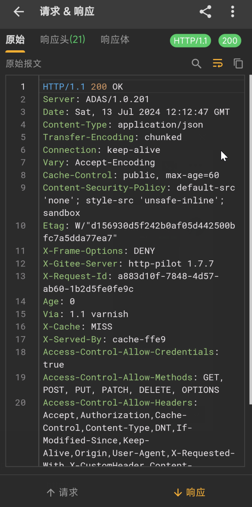  
  
`响应头 (Response Headers)`  
  
| 名称                         | 描述                                                                                                 |  
|------------------------------|------------------------------------------------------------------------------------------------------|  
| Age                          | 响应对象在代理或缓存中的存储时间。                                                                   |  
| Cache-Control                | 控制缓存行为，如public、private、no-store、no-cache等。                                              |  
| Connection                   | 指示连接是否保持打开，如keep-alive或close。                                                          |  
| Content-Encoding             | 指明响应体的编码方式，如gzip或deflate。                                                              |  
| Content-Length               | 响应体的长度。                                                                                       |  
| Content-Type                 | 响应体的数据类型，如text/html。                                                                       |  
| Date                         | 服务器生成响应的时间。                                                                               |  
| ETag                         | 响应资源的实体标签，用于判断资源是否已被修改。                                                        |  
| Expires                      | 响应过期时间，之后缓存不应再使用。                                                                   |  
| Last-Modified                | 资源最后修改的时间。                                                                                 |  
| Location                     | 用于重定向，包含资源的新位置。                                                                       |  
| Pragma                       | 与特定代理有关的指令。                                                                               |  
| Proxy-Authenticate           | 当代理服务器需要认证时使用。                                                                         |  
| Retry-After                  | 在重试之前等待的时间。                                                                               |  
| Server                       | 服务器软件的名称和版本。                                                                             |  
| Set-Cookie                   | 用于设置或更新客户端的cookie。                                                                       |  
| Trailer                      | 指明响应尾部字段。                                                                                   |  
| Transfer-Encoding            | 响应体的传输编码方式，如chunked。                                                                    |  
| Upgrade                      | 用于协议升级。                                                                                       |  
| Vary                         | 指明哪些请求头会影响响应的内容，用于缓存控制。                                                       |  
| WWW-Authenticate             | 当服务器需要认证时使用。                                                                             |  
| X-Frame-Options              | 控制页面是否可以在iframe中显示。                                                                     |  
  
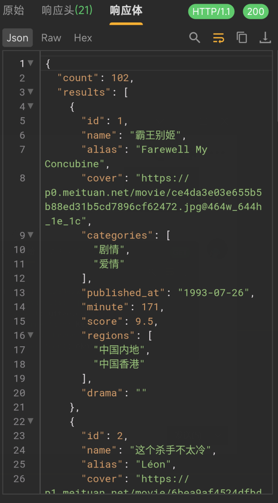  
- **count**: 表示返回的电影总数，这里是102个。  
- **results**: 这是一个包含电影信息的数组。每个电影信息包括以下字段：  
    - **id**: 电影的唯一标识符。  
    - **name**: 电影的名称。  
    - **alias**: 电影的别名或英文名称。  
    - **cover**: 电影封面的URL链接。  
    - **categories**: 电影的分类，通常是一个数组，包含多个类别。  
    - **published_at**: 电影的上映日期。  
    - **minute**: 电影的时长，以分钟为单位。  
    - **score**: 电影的评分。  
    - **regions**: 电影的上映地区，通常是一个数组，包含多个地区名称。  
    - **drama**: 电影的剧情简介。  
# 六、视频及课件地址  
  
  
[百度云](https://pan.baidu.com/s/1cFWTLn14jeWfpXxlx3syYw?pwd=nqu9)  
[阿里云](https://www.aliyundrive.com/s/TJoKMK6du6x)  
[哔哩哔哩](https://www.bilibili.com/video/BV1wT411N7sV/?spm_id_from=333.788&vd_source=6dde16dc6479f00694baaf73a2225452)  
[教程开源地址](https://github.com/ZJ595/AndroidReverse)
PS:解压密码都是52pj，阿里云由于不能分享压缩包，所以下载exe文件，双击自解压  
  
# 七、其他章节  
[《安卓逆向这档事》一、模拟器环境搭建](https://www.52pojie.cn/thread-1695141-1-1.html)  
[《安卓逆向这档事》二、初识APK文件结构、双开、汉化、基础修改](https://www.52pojie.cn/thread-1695796-1-1.html)  
[《安卓逆向这档事》三、初识smail，vip终结者](https://www.52pojie.cn/thread-1701353-1-1.html)  
[《安卓逆向这档事》四、恭喜你获得广告&弹窗静默卡](https://www.52pojie.cn/thread-1706691-1-1.html)  
[《安卓逆向这档事》五、1000-7=？&动态调试&Log插桩](https://www.52pojie.cn/thread-1714727-1-1.html)  
[《安卓逆向这档事》六、校验的N次方-签名校验对抗、PM代{过}{滤}理、IO重定向](https://www.52pojie.cn/thread-1731181-1-1.html)  
[《安卓逆向这档事》七、Sorry，会Hook真的可以为所欲为-Xposed快速上手(上)模块编写,常用Api](https://www.52pojie.cn/thread-1740944-1-1.html)  
[《安卓逆向这档事》八、Sorry，会Hook真的可以为所欲为-xposed快速上手(下)快速hook](https://www.52pojie.cn/thread-1748081-1-1.html)  
[《安卓逆向这档事》九、密码学基础、算法自吐、非标准加密对抗](https://www.52pojie.cn/thread-1762225-1-1.html)  
[《安卓逆向这档事》十、不是我说，有了IDA还要什么女朋友？](https://www.52pojie.cn/thread-1787667-1-1.html)  
[《安卓逆向这档事》十二、大佬帮我分析一下](https://www.52pojie.cn/thread-1809646-1-1.html)  
[《安卓逆向这档事》番外实战篇1-某电影视全家桶](https://www.52pojie.cn/thread-1814917-1-1.html)  
[《安卓逆向这档事》十三、是时候学习一下Frida一把梭了(上)](https://www.52pojie.cn/thread-1823118-1-1.html)  
[《安卓逆向这档事》十四、是时候学习一下Frida一把梭了(中)](https://www.52pojie.cn/thread-1838539-1-1.html)  
[《安卓逆向这档事》十五、是时候学习一下Frida一把梭了(下)](https://www.52pojie.cn/thread-1840174-1-1.html)  
  
# 八、参考文档  
  
[Hook入门与抓包](https://bbs.kanxue.com/thread-280076.htm)  
[前端人必须掌握的抓包技能](https://juejin.cn/post/7140040425129115684)  
[一种对QUIC协议的抓包方案（拿某知名APP练手）](https://bbs.kanxue.com/thread-281892.htm)  
[一文详解 HTTPS 与 TLS证书链校验](https://blog.csdn.net/liuxiao723846/article/details/127739868)  
