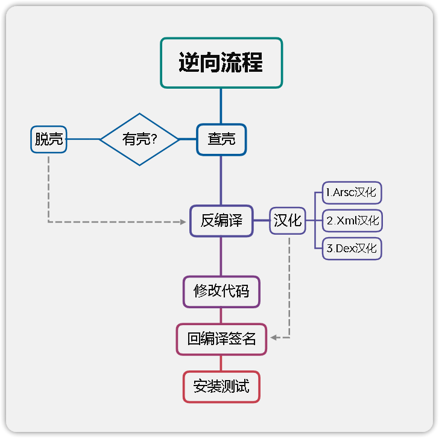

# 一、课程目标

1.了解APK文件结构

2.双开APK，简单了解原理

3.汉化APK

4.简单修改APK名字、图标

# 二、工具
1.教程Demo

2.MT管理器/NP管理器

3.开发者助手

4.雷电模拟器

# 三、课程内容

## 1、Apk结构

apk 全称 Android Package，它相当于一个压缩文件，只要在电脑上将apk后缀改为rar即可解压。

| 文件                | 注释                                                                                                                                            |     |
| ------------------- | ----------------------------------------------------------------------------------------------------------------------------------------------- | --- |
| assets目录          | 存放APK的静态资源文件，比如视频，音频，图片等                                                                                                   |     |
| lib 目录            | armeabi-v7a基本通用所有android设备，arm64-v8a只适用于64位的android设备，x86常见用于android模拟器，其目录下的.so文件是c或c++编译的动态链接库文件 |     |
| META-INF目录        | 保存应用的签名信息，签名信息可以验证APK文件的完整性，相当于APK的身份证(验证文件是否又被修改)                                                    |     |
| res目录             |res目录存放资源文件，包括图片，字符串等等，APK的脸蛋由他的layout文件设计                                                                             |     |
| AndroidMainfest.xml文件 | APK的应用清单信息，它描述了应用的名字，版本，权限，引用的库文件等等信息                                                                         |     |
| classes.dex文件     | classes.dex是java源码编译后生成的java字节码文件，APK运行的主要逻辑                                                                              |     |
| resources.arsc文件  | resources.arsc是编译后的二进制资源文件，它是一个映射表，映射着资源和id，通过R文件中的id就可以找到对应的资源                                                                                                                                                |     |

## 2.双开及原理

双开：简单来说，就是手机同时运行两个或多个相同的应用，例如同时运行两个微信
| 原理               | 解释                                                                                                                                     |
| ------------------ | ---------------------------------------------------------------------------------------------------------------------------------------- |
| 修改包名           |让手机系统认为这是2个APP，这样的话就能生成2个数据存储路径，此时的多开就等于你打开了两个互不干扰的APP                                                                                                                                          |
| 修改Framework      | 对于有系统修改权限的厂商，可以修改Framework来实现双开的目的，例如：小米自带多开                                                            |
| 通过虚拟化技术实现 | 虚拟Framework层、虚拟文件系统、模拟Android对组件的管理、虚拟应用进程管理 等一整套虚拟技术，将APK复制一份到虚拟空间中运行，例如：平行空间 |
| 以插件机制运行  |利用反射替换，动态代理，hook了系统的大部分与system—server进程通讯的函数，以此作为“欺上瞒下”的目的，欺骗系统“以为”只有一个apk在运行，瞒过插件让其“认为”自己已经安装。例如：VirtualApp                                                                                                                                          |

## 3.汉化APK

汉化：使用专门的工具对外文版的软件资源进行读取、翻译、修改、回写等一系列处理，使软件的菜单、对话框、提示等用户界面显示为中文，而程序的内核和功能保持不变，这个过程即为软件汉化

基本上字符串都是在arsc里，建议一键汉化，然后再润色。
少量没汉化到的字符串参考视频中的方法定位去逐个汉化。

### 流程图
这里还需要注意的是，如果要直装应用，那就应该先签名安装，看看是否有签名校验导致的闪退

## 4.初识AndroidMainfest.xml
---
AndroidManifest.xml文件是整个应用程序的信息描述文件，定义了应用程序中包含的Activity,Service,Content provider和BroadcastReceiver组件信息。每个应用程序在[根目录](https://so.csdn.net/so/search?q=%E6%A0%B9%E7%9B%AE%E5%BD%95&spm=1001.2101.3001.7020)下必须包含一个AndroidManifest.xml文件，且文件名不能修改。它描述了package中暴露的组件，他们各自的实现类，各种能被处理的数据和启动位置。
| 属性                               | 定义                                                     |
| ---------------------------------- | -------------------------------------------------------- |
| versionCode                        | 版本号，主要用来更新，例如:12                            |
| versionName                        | 版本名，给用户看的，例如:1.2                             |
| package                            | 包名，例如：com.zj.52pj.demo                             |
| uses-permission android:name=""    | 应用权限，例如：android.permission.INTERNET 代表网络权限 |
| android:label="@string/app_name"   |应用名称                                                          |
| android:icon="@mipmap/ic_launcher" | 应用图标路径                                                         |
|  android:debuggable="true"                                   | 应用是否开启debug权限                                                         |

#  四、课后小作业  

1.试着自己找个应用双开、修改名字、找个英文应用汉化  
2.替换第一关挑战中的图片  
  
# 六、视频及课件地址  
  
[百度云](https://pan.baidu.com/s/1cFWTLn14jeWfpXxlx3syYw?pwd=nqu9)  
[阿里云](https://www.aliyundrive.com/s/TJoKMK6du6x)  
[哔哩哔哩](https://www.bilibili.com/video/BV1wT411N7sV)  
  
# 七、其他章节  

[《安卓逆向这档事》一、模拟器环境搭建](https://www.52pojie.cn/thread-1695141-1-1.html)
[《安卓逆向这档事》二、初识APK文件结构、双开、汉化、基础修改](https://www.52pojie.cn/thread-1695796-1-1.html)  
[《安卓逆向这档事》三、初识smail，vip终结者](https://www.52pojie.cn/thread-1701353-1-1.html)    
[《安卓逆向这档事》四、恭喜你获得广告&弹窗静默卡](https://www.52pojie.cn/thread-1706691-1-1.html)  
[《安卓逆向这档事》五、1000-7=？&动态调试&Log插桩](https://www.52pojie.cn/thread-1714727-1-1.html)  
[《安卓逆向这档事》六、校验的N次方-签名校验对抗、PM代{过}{滤}理、IO重定向](https://www.52pojie.cn/thread-1731181-1-1.html)  
[《安卓逆向这档事》七、Sorry，会Hook真的可以为所欲为-Xposed快速上手(上)模块编写,常用Api](https://www.52pojie.cn/thread-1740944-1-1.html)  
[《安卓逆向这档事》八、Sorry，会Hook真的可以为所欲为-xposed快速上手(下)快速hook](https://www.52pojie.cn/thread-1748081-1-1.html)  
[《安卓逆向这档事》九、密码学基础、算法自吐、非标准加密对抗](https://www.52pojie.cn/thread-1762225-1-1.html)  
[《安卓逆向这档事》十、不是我说，有了IDA还要什么女朋友？](https://www.52pojie.cn/thread-1787667-1-1.html)  
[《安卓逆向这档事》十二、大佬帮我分析一下](https://www.52pojie.cn/thread-1809646-1-1.html)  
[《安卓逆向这档事》番外实战篇1-某电影视全家桶](https://www.52pojie.cn/thread-1814917-1-1.html)  
[《安卓逆向这档事》十三、是时候学习一下Frida一把梭了(上)](https://www.52pojie.cn/thread-1823118-1-1.html)  
[《安卓逆向这档事》十四、是时候学习一下Frida一把梭了(中)](https://www.52pojie.cn/thread-1838539-1-1.html)  
  

  
# 八、参考文档  
  

[【VirtualAPP 双开系列08】如何实现多开 - UID](https://blog.csdn.net/u014294681/article/details/116270479)  
  
  
PS:解压密码都是52pj，阿里云由于不能分享压缩包，所以下载exe文件，双击自解压
