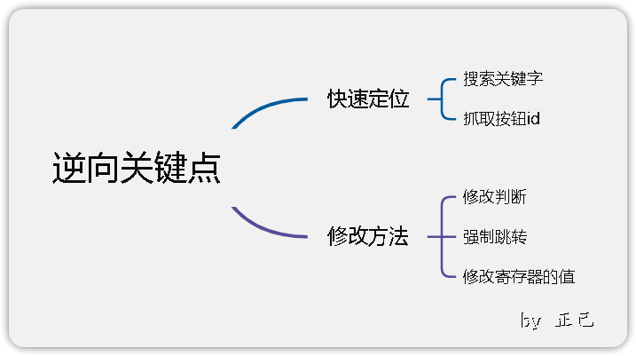

# 一、课程目标

1.了解JVM、Dalvik、ART

2.初识smali语法

3.实战修改smali

# 二、工具

1.教程Demo(更新)

2.MT管理器/NP管理器

3.雷电模拟器

4.jadx-gui

5.核心破解

# 三、课程内容
## 1.什么是JVM、Dalvik、ART
JVM是JAVA虚拟机，运行JAVA字节码程序

Dalvik是Google专门为Android设计的一个虚拟机，Dalvik有专属的文件执行格式dex(Dalvik executable)

Art(Android Runtime)相当于Dalvik的升级版，本质与Dalvik无异

## 2.smali及其语法
smali是Dalvik的寄存器语言，smali代码是dex反编译而来的。

关键字
| 名称        | 注释                       |
| ----------- | -------------------------- |
| .class      | 类名                       |
| .super      | 父类名，继承的上级类名名称 |
| .source     | 源名                       |
| .field      | 变量                       |
| .method     | 方法名                     |
| .register   | 寄存器                     |
| .end method | 方法名的结束               |
| public      | 公有                       |
| protected   | 半公开，只有同一家人才能用   |
| private     | 私有，只能自己使用         |
| .parameter  | 方法参数                   |
|  .prologue|方法开始
|.line xxx|位于第xxx行              |

数据类型对应

| smali类型 | java类型                          | 注释                 |
| --------- | --------------------------------- | -------------------- |
| V         | void                              | 无返回值             |
| Z         | boolean                           | 布尔值类型，返回0或1 |
| B         | byte                              | 字节类型，返回字节   |
| S         | short                             | 短整数类型，返回数字 |
| C         | char                              | 字符类型，返回字符   |
| I         | int                               | 整数类型，返回数字   |
| J         | long （64位 需要2个寄存器存储）   | 长整数类型，返回数字 |
| F         | float                             | 单浮点类型，返回数字 |
| D         | double （64位 需要2个寄存器存储） | 双浮点类型，返回数字 |
| string    | String                            | 文本类型，返回字符串 |
| Lxxx/xxx/xxx          | object                                  | 对象类型，返回对象                     |

常用指令

| 关键字       | 注释                                                   |
| ------------ | ------------------------------------------------------ |
| const        | 重写整数属性，真假属性内容，只能是数字类型             |
| const-string | 重写字符串内容                                         |
| const-wide   | 重写长整数类型，多用于修改到期时间。                   |
| return       | 返回指令                                               |
| if-eq        | 全称equal(a=b)，比较寄存器ab内容，相同则跳             |
| if-ne        | 全称not equal(a!=b)，ab内容不相同则跳                  |
| if-eqz       | 全称equal zero(a=0)，z即是0的标记，a等于0则跳          |
| if-nez       | 全称not equal zero(a!=0)，a不等于0则跳                 |
| if-ge        | 全称garden equal(a>=b)，a大于或等于则跳                |
| if-le        | 全称little equal(a<=b)，a小于或等于则跳                |
| goto         | 强制跳到指定位置                                       |
| switch       | 分支跳转，一般会有多个分支线，并根据指令跳转到适当位置 |
| iget         | 获取寄存器数据                                         |
|              |                                                        |


其余指令可用语法工具查询

定位方法：搜索弹窗关键字、抓取按钮id


例子：
```java
//一个私有、静态、不可变的方法   方法名
.method private static final onCreate$lambda-2(Lkotlin/jvm/internal/Ref$IntRef;Lcom/zj/wuaipojie/ui/ChallengeSecond;Landroid/widget/ImageView;Landroid/widget/ImageView;Landroid/widget/ImageView;Landroid/view/View;)Z //(这里面是方法的参数)这里是方法返回值类型，表示布尔值类型，返回假或真
    .registers 7  //寄存器数量

    .line 33  //代码所在的行数
    iget p0, p0, Lkotlin/jvm/internal/Ref$IntRef;->element:I  //读取p0(第一个参数，参考寄存器知识)中element的值赋值给p0

    const/4 p5, 0x1  //p5赋值1

    const/16 v0, 0xa //v0赋值10，在16进制里a表示10

    if-ge p0, v0, :cond_15  //判断p0的值是否大于或等于v0的值(即p0的值是否大于或等于10)，如果大于或等于则跳转到:cond_15

    .line 34  //以下是常见的Toast弹窗代码
    check-cast p1, Landroid/content/Context; //检查Context对象引用

    const-string p0, "请先获取10个硬币哦" //弹窗文本信息，把""里的字符串数据赋值给p0

    check-cast p0, Ljava/lang/CharSequence; //检查CharSequence对象引用

    invoke-static {p1, p0, p5}, Landroid/widget/Toast;->makeText(Landroid/content/Context;Ljava/lang/CharSequence;I)Landroid/widget/Toast; 
    //将弹窗文本、显示时间等信息传给p1

    move-result-object p0  //结果传递给p0

    invoke-virtual {p0}, Landroid/widget/Toast;->show()V  //当看到这个Toast;->show你就应该反应过来这里是弹窗代码

    goto :goto_31  //跳转到:goto_31

    :cond_15 //跳转的一个地址
    
    invoke-virtual {p1}, Lcom/zj/wuaipojie/ui/ChallengeSecond;->isvip()Z  //判断isvip方法的返回值是否为真(即结果是否为1)
  
    move-result p0  //结果赋值给p0
  
    if-eqz p0, :cond_43 //如果结果为0则跳转cond_43地址
    
    const p0, 0x7f0d0018  //在arsc中的id索引，这个值可以进行查询

    .line 37
    invoke-virtual {p2, p0}, Landroid/widget/ImageView;->setImageResource(I)V //设置图片资源

    const p0, 0x7f0d0008

    .line 38
    invoke-virtual {p3, p0}, Landroid/widget/ImageView;->setImageResource(I)V

    const p0, 0x7f0d000a

    .line 39
    invoke-virtual {p4, p0}, Landroid/widget/ImageView;->setImageResource(I)V

    .line 40
    sget-object p0, Lcom/zj/wuaipojie/util/SPUtils;->INSTANCE:Lcom/zj/wuaipojie/util/SPUtils; 

    check-cast p1, Landroid/content/Context;

    const/4 p2, 0x2 //p2赋值2

    const-string p3, "level" //sp的索引

    invoke-virtual {p0, p1, p3, p2}, Lcom/zj/wuaipojie/util/SPUtils;->saveInt(Landroid/content/Context;Ljava/lang/String;I)V //写入数据

    goto :goto_50 //跳转地址
    
    :cond_43
  
    check-cast p1, Landroid/content/Context;
  
  
    const-string p0, "\u8bf7\u5148\u5145\u503c\u5927\u4f1a\u5458\u54e6\uff01" //请先充值大会员哦！
  
  
    check-cast p0, Ljava/lang/CharSequence;
  
  
    invoke-static {p1, p0, p5}, Landroid/widget/Toast;->makeText(Landroid/content/Context;Ljava/lang/CharSequence;I)Landroid/widget/Toast;
  
  
    move-result-object p0


  
    invoke-virtual {p0}, Landroid/widget/Toast;->show()V
  
  
    :goto_50
    return p5  //返回p5的值
.end method //方法结束


//判断是否是大会员的方法
.method public final isvip()Z
    .registers 2
    
    const/4 v0, 0x0 //v0赋值0
    
    return v0 //返回v0的值
    
.end method

```


修改方法：修改判断、强制跳转、修改寄存器的值




## 3.寄存器
---
在smali里的所有操作都必须经过寄存器来进行:本地寄存器用v开头数字结尾的符号来表示，如v0、 v1、v2。 参数寄存器则使用p开头数字结尾的符号来表示，如p0、p1、p2。特别注意的是，p0不一定是函数中的第一个参数，在非static函数中，p0代指“this"，p1表示函数的第一个 参数，p2代表函数中的第二个参数。而在static函数中p0才对应第一个参数(因为Java的static方法中没有this方法）


#  四、课后小作业

1.关掉视频自己复现三种方法  
2.完成这个作业demo(因为最近实在是太太太忙了，绝对不是因为我懒，咕咕咕。搞懂这个demo那也基本上能理解本节课的内容)  
丑小鸭师傅的demo  
链接：[https://pan.baidu.com/s/1cUInoi](https://pan.baidu.com/s/1cUInoi) 密码：07p9  
原文链接：[教我兄弟学Android逆向02 破解第一个Android程序](https://www.52pojie.cn/thread-650395-1-1.html)

# 五、反思&答疑

关于jadx搜不到大会员的unicode编码，这是因为我录视频之前在设置里把unicode的转义打开而导致的，像你们第一次安装jadx都是默认关闭这个选项的，所以能直接搜到大会员的汉字！！！

由于准备不是很充足，我感觉我讲的不是太好，多看看我列举参考文档有利于理解smali语法。

对于开发者而言，在打包应用时，最好对代码进行混淆，否则逆向人员轻而易举得进行Crack，或者说在写代码的时候就不要用isvip、getvip等易辨识的单词作为方法名


# 六、视频及课件地址


[百度云](https://pan.baidu.com/s/1cFWTLn14jeWfpXxlx3syYw?pwd=nqu9)
[阿里云](https://www.aliyundrive.com/s/TJoKMK6du6x)
[哔哩哔哩](https://www.bilibili.com/video/BV1wT411N7sV)

PS:解压密码都是52pj，阿里云由于不能分享压缩包，所以下载exe文件，双击自解压

# 七、其他章节
[《安卓逆向这档事》一、模拟器环境搭建](https://www.52pojie.cn/thread-1695141-1-1.html)
[《安卓逆向这档事》二、初识APK文件结构、双开、汉化、基础修改](https://www.52pojie.cn/thread-1695796-1-1.html)  
[《安卓逆向这档事》三、初识smail，vip终结者](https://www.52pojie.cn/thread-1701353-1-1.html)    
[《安卓逆向这档事》四、恭喜你获得广告&弹窗静默卡](https://www.52pojie.cn/thread-1706691-1-1.html)  
[《安卓逆向这档事》五、1000-7=？&动态调试&Log插桩](https://www.52pojie.cn/thread-1714727-1-1.html)  
[《安卓逆向这档事》六、校验的N次方-签名校验对抗、PM代{过}{滤}理、IO重定向](https://www.52pojie.cn/thread-1731181-1-1.html)  
[《安卓逆向这档事》七、Sorry，会Hook真的可以为所欲为-Xposed快速上手(上)模块编写,常用Api](https://www.52pojie.cn/thread-1740944-1-1.html)  
[《安卓逆向这档事》八、Sorry，会Hook真的可以为所欲为-xposed快速上手(下)快速hook](https://www.52pojie.cn/thread-1748081-1-1.html)  
[《安卓逆向这档事》九、密码学基础、算法自吐、非标准加密对抗](https://www.52pojie.cn/thread-1762225-1-1.html)  
[《安卓逆向这档事》十、不是我说，有了IDA还要什么女朋友？](https://www.52pojie.cn/thread-1787667-1-1.html)  
[《安卓逆向这档事》十二、大佬帮我分析一下](https://www.52pojie.cn/thread-1809646-1-1.html)  
[《安卓逆向这档事》番外实战篇1-某电影视全家桶](https://www.52pojie.cn/thread-1814917-1-1.html)  
[《安卓逆向这档事》十三、是时候学习一下Frida一把梭了(上)](https://www.52pojie.cn/thread-1823118-1-1.html)  
[《安卓逆向这档事》十四、是时候学习一下Frida一把梭了(中)](https://www.52pojie.cn/thread-1838539-1-1.html)  
  

# 八、参考文档

[ 移动安全Android逆向系列：Dalvik概念&破解实例](https://forum.butian.net/share/649)

[【原木文章】Android改造者之路-02.初探smali功法](https://www.52pojie.cn/thread-1485681-1-1.html)

[吾爱破解安卓逆向入门教程（三）---深入Smali文件](https://www.52pojie.cn/thread-396966-1-1.html)  

[吾爱破解安卓逆向入门教程（四）---Smali函数分析](https://www.52pojie.cn/thread-397858-1-1.html)
