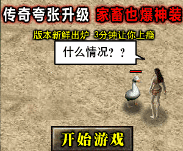
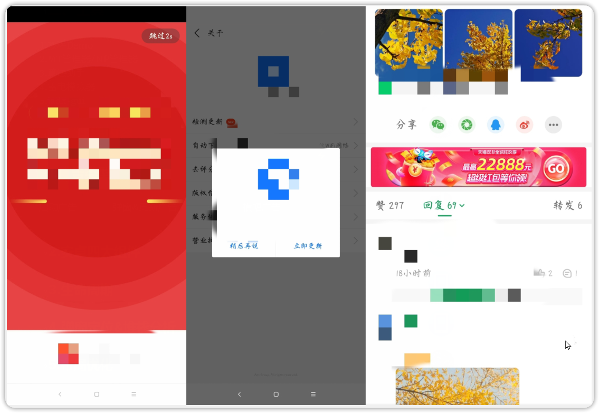
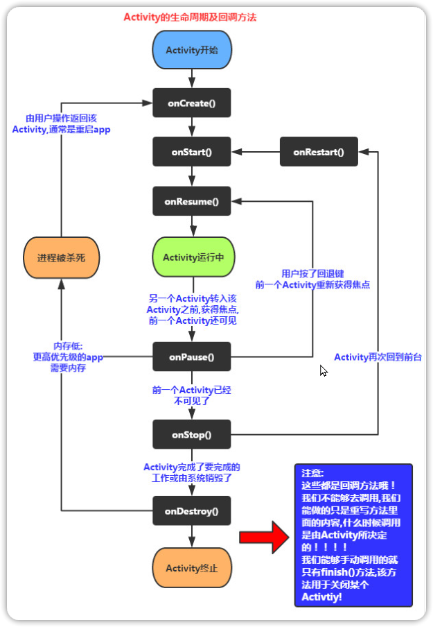

# 一、课程目标

1.了解安卓四大组件、Activity生命周期

2.弹窗定位、去更新

3.广告分析与布局优化

# 二、工具

1.教程Demo(更新)

2.MT管理器/NP管理器

3.算法助手

4.雷电模拟器

5.jadx-gui

6.开发助手

# 三、课程内容

## 1.广告类型

启动广告                                                                             弹窗&更新广告                                                               横幅广告

## 2.安卓四大组件

| 组件                           | 描述                                                                                                                                                                                                                                  |
| ------------------------------ | ------------------------------------------------------------------------------------------------------------------------------------------------------------------------------------------------------------------------------------- |
| Activity(活动)                 | 在应用中的一个Activity可以用来表示一个界面，意思可以理解为“活动”，即一个活动开始，代表 Activity组件启动，活动结束，代表一个Activity的生命周期结束。一个Android应用必须通过Activity来运行和启动，Activity的生命周期交给系统统一管理。 |
| Service(服务)                  | Service它可以在后台执行长时间运行操作而没有用户界面的应用组件，不依赖任何用户界面，例如后台播放音乐，后台下载文件等。                                                                                                                 |
| Broadcast Receiver(广播接收器) | 一个用于接收广播信息，并做出对应处理的组件。比如我们常见的系统广播：通知时区改变、电量低、用户改变了语言选项等。                                                                                                                      |
| Content Provider(内容提供者)    |作为应用程序之间唯一的共享数据的途径，Content Provider主要的功能就是存储并检索数据以及向其他应用程序提供访问数据的接口。Android内置的许多数据都是使用Content Provider形式，供开发者调用的（如视频，音频，图片，通讯录等）                                                                                                                                                                                                                                       |

### 1.activity的切换
```xml
        <!---声明实现应用部分可视化界面的 Activity，必须使用 AndroidManifest 中的 <activity> 元素表示所有 Activity。系统不会识别和运行任何未进行声明的Activity。----->
        <activity  
            android:label="@string/app_name"  
            android:name="com.zj.wuaipojie.ui.MainActivity"  
            android:exported="true">  <!--当前Activity是否可以被另一个Application的组件启动：true允许被启动；false不允许被启动-->
            <!---指明这个activity可以以什么样的意图(intent)启动--->
            <intent-filter>  
                <!--表示activity作为一个什么动作启动，android.intent.action.MAIN表示作为主activity启动--->
                <action  
                    android:name="android.intent.action.MAIN" />  
                <!--这是action元素的额外类别信息，android.intent.category.LAUNCHER表示这个activity为当前应用程序优先级最高的Activity-->
                <category  
                    android:name="android.intent.category.LAUNCHER" />  
            </intent-filter>  
        </activity>  
        <activity  
            android:name="com.zj.wuaipojie.ui.ChallengeFirst" />
        <activity  
            android:name="com.zj.wuaipojie.ui.ChallengeFifth"  
            android:exported="true" />  
        <activity  
            android:name="com.zj.wuaipojie.ui.ChallengeFourth"  
            android:exported="true" />  
        <activity  
            android:name="com.zj.wuaipojie.ui.ChallengeThird"  
            android:exported="false" />  
        <activity  
            android:name="com.zj.wuaipojie.ui.ChallengeSecond"  
            android:exported="false" />  
        <activity  
            android:name="com.zj.wuaipojie.ui.AdActivity" />  
```

启动广告流程：
启动Activity->广告Activity->主页Activity

修改方法：
1.修改加载时间
2.Acitivity切换定位，修改Intent的Activity类名

```java
	switch (position) {  
            case 0:  
                Intent intent = new Intent();  
                intent.setClass(it.getContext(), ChallengeFirst.class);  
                it.getContext().startActivity(intent);  
                return;  
            case 1:  
                Intent intent2 = new Intent();  
                intent2.setClass(it.getContext(), ChallengeSecond.class);  
                it.getContext().startActivity(intent2);  
                return;  
            case 2:  
                Intent intent3 = new Intent();  //new一个Intent，
                intent3.setClass(it.getContext(), AdActivity.class);  //传入要切换的Acitivity的类名
                it.getContext().startActivity(intent3);  //启动对应的Activity
                return;  
            case 3:  
                Intent intent4 = new Intent();  
                intent4.setClass(it.getContext(), ChallengeFourth.class);  
                it.getContext().startActivity(intent4);  
                return; 
            default:  
                return;  
        }

```


## 3.Activity生命周期

| 函数名称          | 描述 |
| ----------- | ---- |
| onCreate()   |一个Activity启动后第一个被调用的函数，常用来在此方法中进行Activity的一些初始化操作。例如创建View，绑定数据，注册监听，加载参数等。      |
| onStart()   |当Activity显示在屏幕上时，此方法被调用但此时还无法进行与用户的交互操作。      |
| onResume()  |这个方法在onStart()之后调用，也就是在Activity准备好与用户进行交互的时候调用，此时的Activity一定位于Activity栈顶，处于运行状态。      |
| onPause()   |  这个方法是在系统准备去启动或者恢复另外一个Activity的时候调用，通常在这个方法中执行一些释放资源的方法，以及保存一些关键数据。    |
| onStop()    |这个方法是在Activity完全不可见的时候调用的。      |
| onDestroy() |这个方法在Activity销毁之前调用，之后Activity的状态为销毁状态。      |
| onRestart()            | 当Activity从停止stop状态恢进入start状态时调用状态。     |



## 4.弹窗定位&堆栈分析

修改方法：
1.修改xml中的versiocode
2.Hook弹窗(推荐算法助手开启弹窗定位)
3.修改dex弹窗代码
4.抓包修改响应体(也可以路由器拦截)

## 5.布局优化

1.开发者助手抓布局
2.MT管理器xml搜索定位
3.修改xml代码
```xml
android:visibility="gone"

```


#  四、课后小作业
定位并去除作业demo首页中的弹窗  
[https://wwl.lanzoub.com/iVKJk0f0pi7g](https://wwl.lanzoub.com/iVKJk0f0pi7g)

[作业反馈贴](https://www.52pojie.cn/thread-1706783-1-1.html)

# 六、视频及课件地址


[百度云](https://pan.baidu.com/s/1cFWTLn14jeWfpXxlx3syYw?pwd=nqu9)

[阿里云](https://www.aliyundrive.com/s/TJoKMK6du6x)

[哔哩哔哩](https://www.bilibili.com/video/BV14v4y1D7yA/?vd_source=6dde16dc6479f00694baaf73a2225452)

PS:解压密码都是52pj，阿里云由于不能分享压缩包，所以下载exe文件，双击自解压
# 七、其他章节
[《安卓逆向这档事》一、模拟器环境搭建](https://www.52pojie.cn/thread-1695141-1-1.html)
[《安卓逆向这档事》二、初识APK文件结构、双开、汉化、基础修改](https://www.52pojie.cn/thread-1695796-1-1.html)  
[《安卓逆向这档事》三、初识smail，vip终结者](https://www.52pojie.cn/thread-1701353-1-1.html)    
[《安卓逆向这档事》四、恭喜你获得广告&弹窗静默卡](https://www.52pojie.cn/thread-1706691-1-1.html)  
[《安卓逆向这档事》五、1000-7=？&动态调试&Log插桩](https://www.52pojie.cn/thread-1714727-1-1.html)  
[《安卓逆向这档事》六、校验的N次方-签名校验对抗、PM代{过}{滤}理、IO重定向](https://www.52pojie.cn/thread-1731181-1-1.html)  
[《安卓逆向这档事》七、Sorry，会Hook真的可以为所欲为-Xposed快速上手(上)模块编写,常用Api](https://www.52pojie.cn/thread-1740944-1-1.html)  
[《安卓逆向这档事》八、Sorry，会Hook真的可以为所欲为-xposed快速上手(下)快速hook](https://www.52pojie.cn/thread-1748081-1-1.html)  
[《安卓逆向这档事》九、密码学基础、算法自吐、非标准加密对抗](https://www.52pojie.cn/thread-1762225-1-1.html)  
[《安卓逆向这档事》十、不是我说，有了IDA还要什么女朋友？](https://www.52pojie.cn/thread-1787667-1-1.html)  
[《安卓逆向这档事》十二、大佬帮我分析一下](https://www.52pojie.cn/thread-1809646-1-1.html)  
[《安卓逆向这档事》番外实战篇1-某电影视全家桶](https://www.52pojie.cn/thread-1814917-1-1.html)  
[《安卓逆向这档事》十三、是时候学习一下Frida一把梭了(上)](https://www.52pojie.cn/thread-1823118-1-1.html)  
[《安卓逆向这档事》十四、是时候学习一下Frida一把梭了(中)](https://www.52pojie.cn/thread-1838539-1-1.html)  

