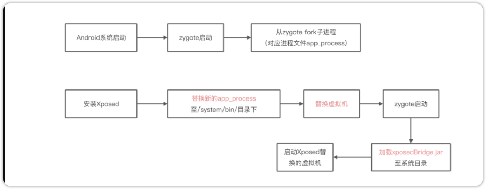
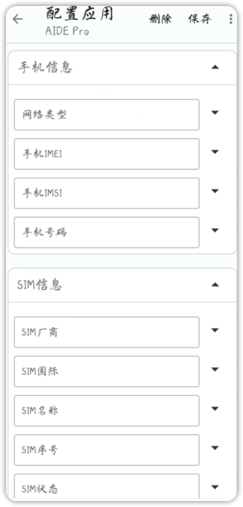

# 一、课程目标
1.了解Xposed原理及发展

2.从0到1编写xposed模块

3.配置ubuntu的逆向环境

4.了解xposed的常用Api

# 二、工具

1.教程Demo(更新)

2.jadx-gui

3.雷电模拟器

4.vmware

5.Android Studio

# 三、课程内容

## 1.什么是Xposed？

Xposed是一款可以在不修改APK的情况下影响程序运行的框架，基于它可以制作出许多功能强大的模块，且在功能不冲突的情况下同时运作。在这个框架下，我们可以编写并加载自己编写的插件APP，实现对目标apk的注入拦截等。

## 2.Xposed原理

用自己实现的**app_process**替换掉了系统原本提供的**app_process**，加载一个额外的jar包，入口从原来的：  **com.android.internal.osZygoteInit.main()被替换成了：  de.robv.android.xposed.XposedBridge.main()**，  
创建的Zygote进程就变成Hook的Zygote进程了，从而完成对zygote进程及其创建的Dalvik/ART虚拟机的劫持(zytoge注入)


## 3.Xposed的发展及免root框架


| 名称          | 地址                                            | 支持版本 | 是否免root |
| ------------- | ----------------------------------------------- | -------- | ---------- |
| xposed        | https://github.com/rovo89/Xposed                | 2.3-8.1  | 否         |
| EDXposed      | https://github.com/ElderDrivers/EdXposed        | 8.0-10   | 否         |
| LSPosed       | https://github.com/LSPosed/LSPosed              | 8.1-13   | 否         |
| VirtualXposed | https://github.com/android-hacker/VirtualXposed | 5.0-10.0 | 是         |
| 太极          | https://www.coolapk.com/apk/me.weishu.exp       | 5.0-10.0 | 是         |
| 两仪          | https://www.coolapk.com/apk/io.twoyi            | 8.1-12   | 是         |
| 天鉴              | https://github.com/Katana-Official/SPatch-Update                                                | 6-10         |  是          |


## 4.Xposed可以做什么？

1.修改app布局:[上帝模式](https://github.com/kaisar945/Xposed-GodMode)

2.劫持数据，修改参数值、返回值、主动调用等。例:微信防撤回、步数修改、一键新机
[应用变量](https://github.com/kingsollyu/AppEnv)


3.自动化操作，例:微信抢红包


学习项目:


[2022 最好的Xposed模块: GravityBox, Pixelify, XPrivacyLua](https://www.xda-developers.com/best-xposed-modules/)

[基于Xposed的抖音爬虫，抖音风控后自动一键新机，模拟一个全新的运行环境](https://github.com/Lstaynight/xposed-dy)

[基于xposed的frida持久化方案](https://github.com/svengong/xcubebase)

[A Xposed Module for Android Penetration Test, with NanoHttpd.](https://github.com/monkeylord/XServer)

[GravityBox](https://github.com/GravityBox/GravityBox)

[Xposed-Modules-Repo](https://github.com/Xposed-Modules-Repo)]

[一个旨在使QQ变得更好用的开源Xposed模块](https://github.com/ferredoxin/QNotified)

[杜比大喇叭](https://github.com/nining377/dolby_beta)

[知乎去广告Xposed模块](https://github.com/shatyuka/Zhiliao)

[哔哩漫游](https://github.com/yujincheng08/BiliRoaming)

[曲境](https://github.com/Mocha-L/QuJing)

[自动化创建Xposed模块及钩子，让Xposed模块编写时只需关注钩子实现](https://github.com/monkeylord/XposedTemplateForAS)

## 5.Xpposed环境配置

### 前置
ubuntu虚拟机镜像
内置:
-   `Frida`开发环境
-   动态分析及开发工具：android-studio
-   动态分析工具：ddms
-   静态分析工具：jadx1.4.4
-   动静态分析工具：jeb
-   动态分析工具：集成HyperPwn
-   静态分析工具：010 editor
-   抓包工具：Charles
-   抓包工具：WireShark
-   动态分析工具:unidbg

vm虚拟机：https://www.vmware.com/cn/products/workstation-pro/workstation-pro-evaluation.html
(或下载我打包好的)
激活码：ZZ5RR-6AF8H-M8EKQ-TGMNG-X2UV6


第一步，安装虚拟机调整路径，输入激活码

第二步，导入镜像，文件->打开->选择解压好的镜像

第三步，点击运行，待初始化，输入密码:toor


1.Android Studio创建新项目
2.将下载的xposedBridgeApi.jar包拖进libs文件夹
3.右击jar包，选择add as library
4.修改xml文件配置
```xml
<!-- 是否是xposed模块，xposed根据这个来判断是否是模块 -->
<meta-data
    android:name="xposedmodule"
    android:value="true" />
<!-- 模块描述，显示在xposed模块列表那里第二行 -->
<meta-data
    android:name="xposeddescription"
    android:value="这是一个Xposed模块" />
<!-- 最低xposed版本号(lib文件名可知) -->
<meta-data
    android:name="xposedminversion"
    android:value="89" />
```
5.修改build.gradle,将此处修改为compileOnly 默认的是implementation
```
implementation 使用该方式依赖的库将会参与编译和打包
compileOnly 只在编译时有效，不会参与打包
```
6.新建-->Folder-->Assets Folder，创建xposed_init(不要后缀名):只有一行代码，就是说明入口类
7.新建Hook类，实现IXposedHookLoadPackage接口，然后在handleLoadPackage函数内编写Hook逻辑
```java
import de.robv.android.xposed.IXposedHookLoadPackage; 
import de.robv.android.xposed.callbacks.XC_LoadPackage;

public class Hook implements IXposedHookLoadPackage {
    @Override
    public void handleLoadPackage(XC_LoadPackage.LoadPackageParam loadPackageParam) throws Throwable {
        
    }
}
```
继承了IXposedHookLoadPackag便拥有了hook的能力
## 6.Xpoosed常用API

[An efficient Hook API and Xposed Module solution built in Kotlin](https://github.com/fankes/YukiHookAPI)

### 1.Hook普通方法
修改返回值
```java
XposedHelpers.findAndHookMethod("com.zj.wuaipojie.Demo", classLoader, "getPublicInt", new XC_MethodHook() {
    @Override
    protected void beforeHookedMethod(MethodHookParam param) throws Throwable {
        super.beforeHookedMethod(param);
    }
    @Override
    protected void afterHookedMethod(MethodHookParam param) throws Throwable {
        super.afterHookedMethod(param);
        param.setResult(999);
    }
});

```
修改参数
```java
XposedHelpers.findAndHookMethod("com.zj.wuaipojie.Demo", classLoader, "setPublicInt", int.class, new XC_MethodHook() {
    @Override
    protected void beforeHookedMethod(MethodHookParam param) throws Throwable {
        super.beforeHookedMethod(param);
        param.args[0] = 999；
    }
    @Override
    protected void afterHookedMethod(MethodHookParam param) throws Throwable {
        super.afterHookedMethod(param);
    }
});

```

### 2.Hook复杂&自定义参数

```java
Class a = loadPackageParam.classLoader.loadClass("com.zj.wuaipojie.Demo");
XposedBridge.hookAllMethods(a, "Inner", new XC_MethodHook() {
    @Override
    protected void beforeHookedMethod(MethodHookParam param) throws Throwable {
        super.beforeHookedMethod(param);
        
        }
});

```


### 3.Hook替换函数
```java
Class a = classLoader.loadClass("类名")
XposedBridge.hookAllMethods(a,"getId",new XC_MethodReplacement() {  
    @Override  
    protected Object replaceHookedMethod(MethodHookParam methodHookParam) throws Throwable {  
        return "";  
    }  
});

```


### 4.Hook加固通杀
```java
XposedHelpers.findAndHookMethod(Application.class, "attach", Context.class, new XC_MethodHook() {  
    @Override  
    protected void afterHookedMethod(MethodHookParam param) throws Throwable {  
        Context context = (Context) param.args[0];  
        ClassLoader classLoader = context.getClassLoader();  
    }  
});

```


#  四、课后小作业
写一个xposed模块去修改上节课smali相关学习里的方法，并修改参数以及返回值


# 六、视频及课件地址


[百度云](https://pan.baidu.com/s/1cFWTLn14jeWfpXxlx3syYw?pwd=nqu9)

[阿里云](https://www.aliyundrive.com/s/TJoKMK6du6x)

[哔哩哔哩](https://www.bilibili.com/video/BV1wT411N7sV/?spm_id_from=333.788&vd_source=6dde16dc6479f00694baaf73a2225452)

PS:解压密码都是52pj，阿里云由于不能分享压缩包，所以下载exe文件，双击自解压

# 七、其他章节

[《安卓逆向这档事》一、模拟器环境搭建](https://www.52pojie.cn/thread-1695141-1-1.html)
[《安卓逆向这档事》二、初识APK文件结构、双开、汉化、基础修改](https://www.52pojie.cn/thread-1695796-1-1.html)  
[《安卓逆向这档事》三、初识smail，vip终结者](https://www.52pojie.cn/thread-1701353-1-1.html)    
[《安卓逆向这档事》四、恭喜你获得广告&弹窗静默卡](https://www.52pojie.cn/thread-1706691-1-1.html)  
[《安卓逆向这档事》五、1000-7=？&动态调试&Log插桩](https://www.52pojie.cn/thread-1714727-1-1.html)  
[《安卓逆向这档事》六、校验的N次方-签名校验对抗、PM代{过}{滤}理、IO重定向](https://www.52pojie.cn/thread-1731181-1-1.html)  
[《安卓逆向这档事》七、Sorry，会Hook真的可以为所欲为-Xposed快速上手(上)模块编写,常用Api](https://www.52pojie.cn/thread-1740944-1-1.html)  
[《安卓逆向这档事》八、Sorry，会Hook真的可以为所欲为-xposed快速上手(下)快速hook](https://www.52pojie.cn/thread-1748081-1-1.html)  
[《安卓逆向这档事》九、密码学基础、算法自吐、非标准加密对抗](https://www.52pojie.cn/thread-1762225-1-1.html)  
[《安卓逆向这档事》十、不是我说，有了IDA还要什么女朋友？](https://www.52pojie.cn/thread-1787667-1-1.html)  
[《安卓逆向这档事》十二、大佬帮我分析一下](https://www.52pojie.cn/thread-1809646-1-1.html)  
[《安卓逆向这档事》番外实战篇1-某电影视全家桶](https://www.52pojie.cn/thread-1814917-1-1.html)  
[《安卓逆向这档事》十三、是时候学习一下Frida一把梭了(上)](https://www.52pojie.cn/thread-1823118-1-1.html)  
[《安卓逆向这档事》十四、是时候学习一下Frida一把梭了(中)](https://www.52pojie.cn/thread-1838539-1-1.html)  
# 八、参考文档

[[原创]Xposed Hook技巧，代理abstract](https://bbs.kanxue.com/thread-260484.htm)

[[原创]Xposed callMethod 如何传入接口参数](https://bbs.kanxue.com/thread-257100.htm)

[[原创]源码编译（2）——Xopsed源码编译详解](https://bbs.kanxue.com/thread-269616.htm#msg_header_h2_0)


