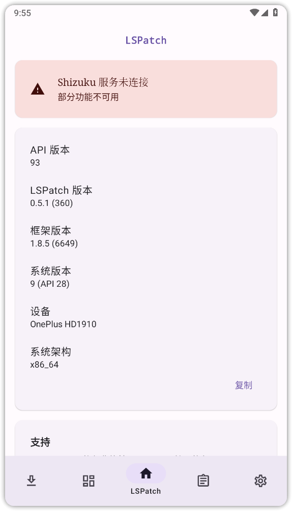
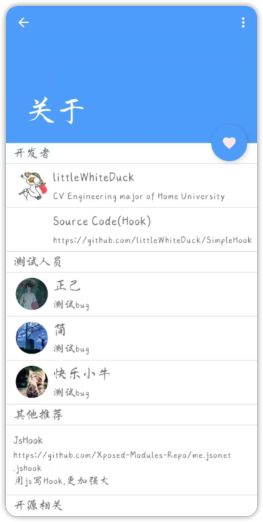
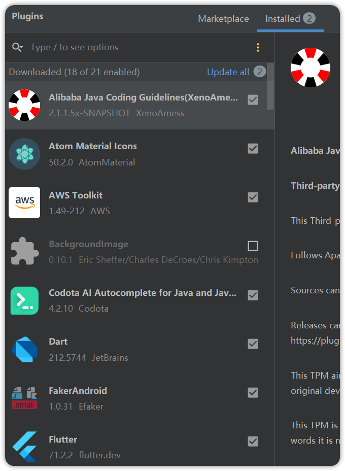

# 一、课程目标
1.了解Xposed常用API以及妙用

2.借助lspatch实现免root注入

3.SimpleHook快速hook

# 二、工具

1.教程Demo(更新)

2.MT管理器/NP管理器

3.算法助手

4.jadx-gui

5.simplehook

6.Android Studio

# 三、课程内容

虚拟机连接模拟器方法
https://www.cnblogs.com/voyage1969/p/14876449.html

## Xposed常用API
---

### 1.Hook变量
静态变量与实例变量：
-   静态变量（static）：类被初始化，同步进行初始化
-   非静态变量：类被实例化（产生一个对象的时候），进行初始化

静态变量
```java
final Class clazz = XposedHelpers.findClass("类名", classLoader);  
XposedHelpers.setStaticIntField(clazz, "变量名", 999);

```
实例变量
```java
final Class clazz = XposedHelpers.findClass("类名", classLoader);  
XposedBridge.hookAllConstructors(clazz, new XC_MethodHook() {  
    @Override  
    protected void afterHookedMethod(MethodHookParam param) throws Throwable {  
        super.afterHookedMethod(param);  
        //param.thisObject获取当前所属的对象
        Object ob = param.thisObject;  
        XposedHelpers.setIntField(ob,"变量名",9999);  
    }  
});

```

### 2.Hook构造函数


无参构造函数
```java
XposedHelpers.findAndHookConstructor("com.zj.wuaipojie.Demo", classLoader, new XC_MethodHook() {
    @Override
    protected void beforeHookedMethod(MethodHookParam param) throws Throwable {
        super.beforeHookedMethod(param);
    }
    @Override
    protected void afterHookedMethod(MethodHookParam param) throws Throwable {
        super.afterHookedMethod(param);
    }
});
```
有参构造函数
```java
XposedHelpers.findAndHookConstructor("com.zj.wuaipojie.Demo", classLoader, String.class, new XC_MethodHook() {
    @Override
    protected void beforeHookedMethod(MethodHookParam param) throws Throwable {
        super.beforeHookedMethod(param);
    }
    @Override
    protected void afterHookedMethod(MethodHookParam param) throws Throwable {
        super.afterHookedMethod(param);
    }
});

```

### 3.Hook multiDex方法
```java
XposedHelpers.findAndHookMethod(Application.class, "attach", Context.class, new XC_MethodHook() {  
    @Override  
    protected void afterHookedMethod(MethodHookParam param) throws Throwable {  
        ClassLoader cl= ((Context)param.args[0]).getClassLoader();  
        Class<?> hookclass=null;  
        try {  
            hookclass=cl.loadClass("类名");  
        }catch (Exception e){  
            Log.e("zj2595","未找到类",e);  
            return;        
        }  
        XposedHelpers.findAndHookMethod(hookclass, "方法名", new XC_MethodHook() {  
            @Override  
            protected void afterHookedMethod(MethodHookParam param) throws Throwable {  
            }        
        });  
    }  
});

```

### 4.主动调用
静态方法:
```java
Class clazz = XposedHelpers.findClass("类名",lpparam.classLoader);
XposedHelpers.callStaticMethod(clazz,"方法名",参数(非必须));
```
实例方法:
```java
Class clazz = XposedHelpers.findClass("类名",lpparam.classLoader);
XposedHelpers.callMethod(clazz.newInstance(),"方法名",参数(非必须));

```

### 5.Hook内部类
内部类:类里还有一个类class
```java
XposedHelpers.findAndHookMethod("com.zj.wuaipojie.Demo$InnerClass", lpparam.classLoader, "innerFunc",String.class,  new XC_MethodHook() {  
    @Override  
    protected void beforeHookedMethod(MethodHookParam param) throws Throwable {  
        super.beforeHookedMethod(param);  

    }  
});

```

### 6.反射大法
```java
Class clazz = XposedHelpers.findClass("com.zj.wuaipojie.Demo", lpparam.classLoader);
XposedHelpers.findAndHookMethod("com.zj.wuaipojie.Demo$InnerClass", lpparam.classLoader, "innerFunc",String.class,  new XC_MethodHook() {  
    @Override  
    protected void beforeHookedMethod(MethodHookParam param) throws Throwable {  
        super.beforeHookedMethod(param);  
        //第一步找到类
        //找到方法，如果是私有方法就要setAccessible设置访问权限
        //invoke主动调用或者set修改值(变量)
        Class democlass = Class.forName("com.zj.wuaipojie.Demo",false,lpparam.classLoader);  
        Method demomethod = democlass.getDeclaredMethod("refl");  
        demomethod.setAccessible(true);  
        demomethod.invoke(clazz.newInstance());  
    }  
});

```

### 7.遍历所有类下的所有方法

```java
XposedHelpers.findAndHookMethod(ClassLoader.class, "loadClass", String.class, new XC_MethodHook() {  
    @Override  
    protected void afterHookedMethod(MethodHookParam param) throws Throwable {  
        super.afterHookedMethod(param);  
        Class clazz = (Class) param.getResult();  
        String clazzName = clazz.getName();  
        //排除非包名的类  
        if(clazzName.contains("com.zj.wuaipojie")){  
            Method[] mds = clazz.getDeclaredMethods();  
            for(int i =0;i<mds.length;i++){  
                final Method md = mds[i];  
                int mod = mds[i].getModifiers();  
                //去除抽象、native、接口方法  
                if(!Modifier.isAbstract(mod)  
                    && !Modifier.isNative(mod)  
                    &&!Modifier.isAbstract(mod)){  
                    XposedBridge.hookMethod(mds[i], new XC_MethodHook() {  
                        @Override  
                        protected void beforeHookedMethod(MethodHookParam param) throws Throwable {  
                            super.beforeHookedMethod(param);  
                            Log.d("zj2595",md.toString());  
                        }  
                    });  
                }  
  
           }  
        }  
  
    }  
});

```

### 8.Xposed妙用
字符串赋值定位:
```java
XposedHelpers.findAndHookMethod("android.widget.TextView", lpparam.classLoader, "setText", CharSequence.class, new XC_MethodHook() {  
    @Override  
    protected void beforeHookedMethod(MethodHookParam param) throws Throwable {  
        super.beforeHookedMethod(param);  
        Log.d("zj2595",param.args[0].toString());  
		if(param.args[0].equals("已过期")){  
		    printStackTrace();  
		}
    }  
});
private static void printStackTrace() {  
    Throwable ex = new Throwable();  
    StackTraceElement[] stackElements = ex.getStackTrace();  
    for (int i = 0; i < stackElements.length; i++) {  
        StackTraceElement element = stackElements[i];  
        Log.d("zj2595","at " + element.getClassName() + "." + element.getMethodName() + "(" + element.getFileName() + ":" + element.getLineNumber() + ")");  
    }  
}
```

点击事件监听:
```java
Class clazz = XposedHelpers.findClass("android.view.View", lpparam.classLoader);
XposedBridge.hookAllMethods(clazz, "performClick", new XC_MethodHook() {  
    @Override  
    protected void afterHookedMethod(MethodHookParam param) throws Throwable {  
        super.afterHookedMethod(param);  
        Object listenerInfoObject = XposedHelpers.getObjectField(param.thisObject, "mListenerInfo");  
        Object mOnClickListenerObject = XposedHelpers.getObjectField(listenerInfoObject, "mOnClickListener");  
        String callbackType = mOnClickListenerObject.getClass().getName();  
        Log.d("zj2595",callbackType);  
    }  
});

```

改写布局:
```java
XposedHelpers.findAndHookMethod("com.zj.wuaipojie.ui.ChallengeSixth", lpparam.classLoader,  
        "onCreate", Bundle.class, new XC_MethodHook() {  
    @Override  
    protected void afterHookedMethod(MethodHookParam param) throws Throwable {  
        super.afterHookedMethod(param);  
        View img = (View)XposedHelpers.callMethod(param.thisObject,  
                "findViewById", 0x7f0800de);  
        img.setVisibility(View.GONE);  
  
    }  
});

```

## Xposed模块patch

[LSPatch](https://github.com/LSPosed/LSPatch)



PS:最低支持安卓9


## Xposed快速Hook
[SimpleHook](https://github.com/littleWhiteDuck/SimpleHook)



[jshook](https://github.com/Xposed-Modules-Repo/me.jsonet.jshook)

## Xpsode源码

[XPOSED魔改一：获取特征](https://www.52pojie.cn/thread-1149210-1-1.html)

[Lsposed 技术原理探讨 && 基本安装使用](https://www.52pojie.cn/thread-1694093-1-1.html)

[[原创]源码编译（2）——Xopsed源码编译详解](https://bbs.kanxue.com/thread-269616.htm#msg_header_h2_0)

#  四、课后小作业
没想出来


# 五、答疑
提一嘴，我感觉肯定会有人问我的as怎么跟他的不一样，那是因为我用了一些插件。插件入口：左上角File->Settings->Plugins，在这里可以搜索并安装你想安装的插件，以下是我用的插件




# 六、视频及课件地址


[百度云](https://pan.baidu.com/s/1cFWTLn14jeWfpXxlx3syYw?pwd=nqu9)

[阿里云](https://www.aliyundrive.com/s/TJoKMK6du6x)

[哔哩哔哩](https://www.bilibili.com/video/BV1wT411N7sV/?spm_id_from=333.788&vd_source=6dde16dc6479f00694baaf73a2225452)

PS:解压密码都是52pj，阿里云由于不能分享压缩包，所以下载exe文件，双击自解压

# 七、其他章节
[《安卓逆向这档事》一、模拟器环境搭建](https://www.52pojie.cn/thread-1695141-1-1.html)
[《安卓逆向这档事》二、初识APK文件结构、双开、汉化、基础修改](https://www.52pojie.cn/thread-1695796-1-1.html)  
[《安卓逆向这档事》三、初识smail，vip终结者](https://www.52pojie.cn/thread-1701353-1-1.html)    
[《安卓逆向这档事》四、恭喜你获得广告&弹窗静默卡](https://www.52pojie.cn/thread-1706691-1-1.html)  
[《安卓逆向这档事》五、1000-7=？&动态调试&Log插桩](https://www.52pojie.cn/thread-1714727-1-1.html)  
[《安卓逆向这档事》六、校验的N次方-签名校验对抗、PM代{过}{滤}理、IO重定向](https://www.52pojie.cn/thread-1731181-1-1.html)  
[《安卓逆向这档事》七、Sorry，会Hook真的可以为所欲为-Xposed快速上手(上)模块编写,常用Api](https://www.52pojie.cn/thread-1740944-1-1.html)  
[《安卓逆向这档事》八、Sorry，会Hook真的可以为所欲为-xposed快速上手(下)快速hook](https://www.52pojie.cn/thread-1748081-1-1.html)  
[《安卓逆向这档事》九、密码学基础、算法自吐、非标准加密对抗](https://www.52pojie.cn/thread-1762225-1-1.html)  
[《安卓逆向这档事》十、不是我说，有了IDA还要什么女朋友？](https://www.52pojie.cn/thread-1787667-1-1.html)  
[《安卓逆向这档事》十二、大佬帮我分析一下](https://www.52pojie.cn/thread-1809646-1-1.html)  
[《安卓逆向这档事》番外实战篇1-某电影视全家桶](https://www.52pojie.cn/thread-1814917-1-1.html)  
[《安卓逆向这档事》十三、是时候学习一下Frida一把梭了(上)](https://www.52pojie.cn/thread-1823118-1-1.html)  
[《安卓逆向这档事》十四、是时候学习一下Frida一把梭了(中)](https://www.52pojie.cn/thread-1838539-1-1.html)  


