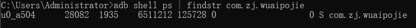
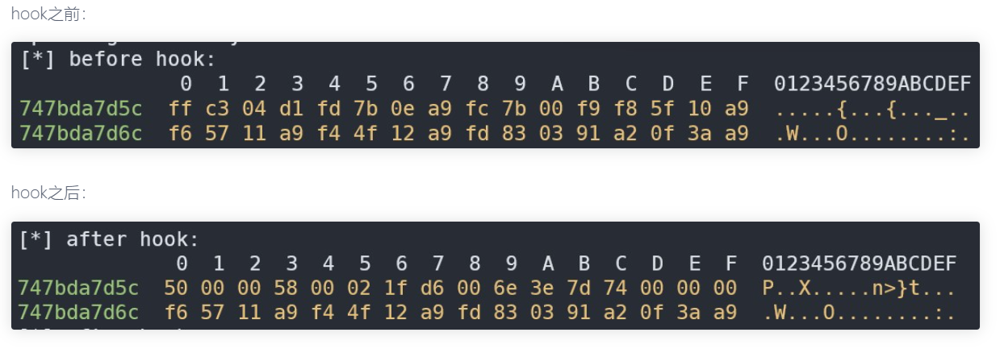

# 一、课程目标

1.了解常见frida检测
# 二、工具

1.教程Demo(更新)
2.jadx-gui
3.VS Code
4.jeb

# 三、课程内容
## 1.检测文件名、端口名、双进程保护、失效的检测点
1.检测/data/local/tmp路径下的是否有frida特征文件，server端改名，例如:fr
2.指定端口转发
```
./fs1 -l 0.0.0.0:6666
adb forward tcp:6666 tcp:6666
frida -H 127.0.0.1:6666 wuaipojie -l hook.js
```
3.spawn启动过双进程保护
```
frida -U -f 进程名 -l hook.js
```

PS:学会看注入报错的日志，比如说当app主动附加自身进程时，这时候再注入就会提示`run frida as root`（以spawn的方式启动进程即可）
4.借助脚本定位检测frida的so
```js
function hook_dlopen() {
    Interceptor.attach(Module.findExportByName(null, "android_dlopen_ext"),
        {
            onEnter: function (args) {
                var pathptr = args[0];
                if (pathptr !== undefined && pathptr != null) {
                    var path = ptr(pathptr).readCString();
                    console.log("load " + path);
                }
            }
        }
    );
}
```
5.随着firda的版本迭代，以前诸多检测点以失效
(1.)例如`检测D-Bus`
D-Bus是一种进程间通信(IPC)和远程过程调用(RPC)机制,最初是为Linux开发的,目的是用一个统一的协议替代现有的和竞争的IPC解决方案。
```c
bool check_dbus() {
    // 定义一个socket地址结构体变量sa
    struct sockaddr_in sa;
    // 创建一个socket文件描述符
    int sock;
    // 定义一个字符数组res，用于存储接收到的数据
    char res[7];

    // 循环遍历所有可能的端口号，从0到65535
    for(int i = 0; i <= 65535; i++) {
        // 创建一个新的socket连接
        sock = socket(AF_INET, SOCK_STREAM, 0);
        // 设置socket地址结构体的端口号
        sa.sin_port = htons(i);
        // 尝试连接到当前端口
        if (connect(sock, (struct sockaddr*)&sa, sizeof(sa)) != -1) {
            // 如果连接成功，记录日志信息，表示发现了一个开放的端口
            __android_log_print(ANDROID_LOG_VERBOSE, "ZJ595", "FRIDA DETECTION [1]: Open Port: %d", i);
            // 初始化res数组，清零
            memset(res, 0, 7);
            // 向socket发送一个空字节
            send(sock, "\x00", 1, 0); // 注意这里的NULL被替换为0
            // 发送AUTH请求
            send(sock, "AUTH\r\n", 6, 0);
            // 等待100微秒
            usleep(100);
            // 尝试接收响应
            if (recv(sock, res, 6, MSG_DONTWAIT) != -1) {
                // 如果接收到响应，检查响应内容是否为"REJECT"
                if (strcmp(res, "REJECT") == 0) {
                    // 如果是，关闭socket并返回true，表示检测到了Frida服务器
                    close(sock);
                    return true; // Frida server detected
                }
            }
        }
        // 如果当前端口连接失败或没有检测到Frida服务器，关闭socket
        close(sock);
    }
    // 如果遍历完所有端口都没有检测到Frida服务器，返回false
    return false; // No Frida server detected
}

```
(2)`检测fd`
/proc/pid/fd 目录的作用在于提供了一种方便的方式来查看进程的文件描述符信息，这对于调试和监控进程非常有用。通过查看文件描述符信息，可以了解进程打开了哪些文件、网络连接等，帮助开发者和系统管理员进行问题排查和分析工作。
```c
bool check_fd() {
    DIR *dir = NULL;
    struct dirent *entry;
    char link_name[100];
    char buf[100];
    bool ret = false;
    if ((dir = opendir("/proc/self/fd/")) == NULL) {
        LOGI(" %s - %d  error:%s", __FILE__, __LINE__, strerror(errno));
    } else {
        entry = readdir(dir);
        while (entry) {
            switch (entry->d_type) {
                case DT_LNK:
                    sprintf(link_name, "%s/%s", "/proc/self/fd/", entry->d_name);
                    readlink(link_name, buf, sizeof(buf));
                    if (strstr(buf, "frida") || strstr(buf, "gum-js-loop") ||
                        strstr(buf, "gmain") ||
                        strstr(buf, "-gadget") || strstr(buf, "linjector")) {
                        LOGI("check_fd -> find frida:%s", buf);
                        ret = true;
                    }
                    break;
                default:
                    break;
            }
            entry = readdir(dir);
        }
    }
    closedir(dir);
    return ret;
}

```
(3)`检测文件`
众所周知frida我们一般都会放在data/local/tmp目录下，旧版fridaserver端运行时都会释放到re.frida.server，所以这里在旧版也会被当做一个检测点，而新版已不再释放
## 2检测map
```
adb shell ps | findstr com.zj.wuaipojie
cat /proc/12186/maps|grep frida
```


| 字段    | 描述                                                                                                 |
| ------- | ---------------------------------------------------------------------------------------------------- |
| u0_a504 | 用户ID和应用ID：在Android系统中，`u0`代表系统用户（user 0），而`a504`是该应用在用户0下的唯一标识符。 |
| 28082   | PID（进程ID）：该进程在操作系统中的标识符。                                                          |
| 1935    | PPID（父进程ID）：该进程的父进程的PID。                                                              |
| 6511212 | 虚拟内存：进程使用的虚拟内存大小，通常以字节为单位。                                                 |
| 125728  | 共享内存：进程使用的共享内存大小，同样以字节为单位。                                                 |
| 0       | CPU时间/线程数：这通常表示进程的CPU时间或者是线程数，具体含义取决于`ps`命令的输出格式。              |
| S       | 状态：其中`S`代表睡眠状态（Sleeping），即进程没有在执行，而是在等待某些事件或资源。                  |


`/proc/self/maps` 是一个特殊的文件，它包含了当前进程的内存映射信息。当你打开这个文件时，它会显示一个列表，其中包含了进程中每个内存区域的详细信息。这些信息通常包括：
- 起始地址（Start Address）
- 结束地址（End Address）
- 权限（如可读、可写、可执行）
- 共享/私有标志（Shared or Private）
- 关联的文件或设备（如果内存区域是文件映射的）
- 内存区域的偏移量
- 内存区域的类型（如匿名映射、文件映射、设备映射等）
当注入frida后，在maps文件中就会存在 `frida-agent-64.so`、`frida-agent-32.so` 等文件。

```c++
bool check_maps() {
    // 定义一个足够大的字符数组line，用于存储读取的行
    char line[512];
    // 打开当前进程的内存映射文件/proc/self/maps进行读取
    FILE* fp = fopen("/proc/self/maps", "r");
    if (fp) {
        // 如果文件成功打开，循环读取每一行
        while (fgets(line, sizeof(line), fp)) {
            // 使用strstr函数检查当前行是否包含"frida"字符串
            if (strstr(line, "frida") || strstr(line, "gadget")) {
                // 如果找到了"frida"，关闭文件并返回true，表示检测到了恶意库
                fclose(fp);
                return true; // Evil library is loaded.
            }
        }
        // 遍历完文件后，关闭文件
        fclose(fp);
    } else {
        // 如果无法打开文件，记录错误。这可能意味着系统状态异常
        // 注意：这里的代码没有处理错误，只是注释说明了可能的情况
    }
    // 如果没有在内存映射文件中找到"frida"，返回false，表示没有检测到恶意库
    return false; // No evil library detected.
}

```
### 方法1
`anti脚本`
```js
// 定义一个函数anti_maps，用于阻止特定字符串的搜索匹配，避免检测到敏感内容如"Frida"或"REJECT"
function anti_maps() {
    // 查找libc.so库中strstr函数的地址，strstr用于查找字符串中首次出现指定字符序列的位置
    var pt_strstr = Module.findExportByName("libc.so", 'strstr');
    // 查找libc.so库中strcmp函数的地址，strcmp用于比较两个字符串
    var pt_strcmp = Module.findExportByName("libc.so", 'strcmp');
    // 使用Interceptor模块附加到strstr函数上，拦截并修改其行为
    Interceptor.attach(pt_strstr, {
        // 在strstr函数调用前执行的回调
        onEnter: function (args) {
            // 读取strstr的第一个参数（源字符串）和第二个参数（要查找的子字符串）
            var str1 = args[0].readCString();
            var str2 = args[1].readCString();
            // 检查子字符串是否包含"REJECT"或"frida"，如果包含则设置hook标志为true
            if (str2.indexOf("REJECT") !== -1  || str2.indexOf("frida") !== -1) {
                this.hook = true;
            }
        },
        // 在strstr函数调用后执行的回调
        onLeave: function (retval) {
            // 如果之前设置了hook标志，则将strstr的结果替换为0（表示未找到），从而隐藏敏感信息
            if (this.hook) {
                retval.replace(0);
            }
        }
    });

    // 对strcmp函数做类似的处理，防止通过字符串比较检测敏感信息
    Interceptor.attach(pt_strcmp, {
        onEnter: function (args) {
            var str1 = args[0].readCString();
            var str2 = args[1].readCString();
            if (str2.indexOf("REJECT") !== -1  || str2.indexOf("frida") !== -1) {
                this.hook = true;
            }
        },
        onLeave: function (retval) {
            if (this.hook) {
                // strcmp返回值为0表示两个字符串相等，这里同样替换为0以避免匹配成功
                retval.replace(0);
            }
        }
    });
}

```
### 方法2
`重定向maps`
```js
// 定义一个函数，用于重定向并修改maps文件内容，以隐藏特定的库和路径信息
function mapsRedirect() {
    // 定义伪造的maps文件路径
    var FakeMaps = "/data/data/com.zj.wuaipojie/maps";
    // 获取libc.so库中'open'函数的地址
    const openPtr = Module.getExportByName('libc.so', 'open');
    // 根据地址创建一个新的NativeFunction对象，表示原生的'open'函数
    const open = new NativeFunction(openPtr, 'int', ['pointer', 'int']);
    // 查找并获取libc.so库中'read'函数的地址
    var readPtr = Module.findExportByName("libc.so", "read");
    // 创建新的NativeFunction对象表示原生的'read'函数
    var read = new NativeFunction(readPtr, 'int', ['int', 'pointer', "int"]);
    // 分配512字节的内存空间，用于临时存储从maps文件读取的内容
    var MapsBuffer = Memory.alloc(512);
    // 创建一个伪造的maps文件，用于写入修改后的内容，模式为"w"（写入）
    var MapsFile = new File(FakeMaps, "w");
    // 使用Interceptor替换原有的'open'函数，注入自定义逻辑
    Interceptor.replace(openPtr, new NativeCallback(function(pathname, flag) {
        // 调用原始的'open'函数，并获取文件描述符（FD）
        var FD = open(pathname, flag);
        // 读取并打印尝试打开的文件路径
        var ch = pathname.readCString();
        if (ch.indexOf("/proc/") >= 0 && ch.indexOf("maps") >= 0) {
            console.log("open : ", pathname.readCString());
            // 循环读取maps内容，并写入伪造的maps文件中，同时进行字符串替换以隐藏特定信息
            while (parseInt(read(FD, MapsBuffer, 512)) !== 0) {
                var MBuffer = MapsBuffer.readCString();
                MBuffer = MBuffer.replaceAll("/data/local/tmp/re.frida.server/frida-agent-64.so", "FakingMaps");
                MBuffer = MBuffer.replaceAll("re.frida.server", "FakingMaps");
                MBuffer = MBuffer.replaceAll("frida-agent-64.so", "FakingMaps");
                MBuffer = MBuffer.replaceAll("frida-agent-32.so", "FakingMaps");
                MBuffer = MBuffer.replaceAll("frida", "FakingMaps");
                MBuffer = MBuffer.replaceAll("/data/local/tmp", "/data");
                // 将修改后的内容写入伪造的maps文件
                MapsFile.write(MBuffer);
            }
            // 为返回伪造maps文件的打开操作，分配UTF8编码的文件名字符串
            var filename = Memory.allocUtf8String(FakeMaps);
            // 返回打开伪造maps文件的文件描述符
            return open(filename, flag);
        }
        // 如果不是目标maps文件，则直接返回原open调用的结果
        return FD;
    }, 'int', ['pointer', 'int']));
}
```
### 方法3
用eBPF来hook系统调用并修改参数实现目的，使用bpf_probe_write_user向用户态函数地址写内容直接修改参数
```
char placeholder[] = "/data/data/com.zj.wuaipojie/maps";
bpf_probe_write_user((void*)addr, placeholder, sizeof(placeholder));
```
## 3.检测status(线程名)
```
ls /proc/pid/task 列出线程id
cat /proc/pid/task/线程id/status
```
- 在 `/proc/pid/task` 目录下，可以通过查看不同的线程子目录，来获取进程中每个线程的运行时信息。这些信息包括线程的状态、线程的寄存器内容、线程占用的CPU时间、线程的堆栈信息等。通过这些信息，可以实时观察和监控进程中每个线程的运行状态，帮助进行调试、性能优化和问题排查等工作。
- 在某些app中就会去读取 `/proc/stask/线程ID/status` 文件，如果是运行frida产生的，则进行反调试。例如：`gmain/gdbus/gum-js-loop/pool-frida`等

1. gmain：Frida 使用 Glib 库，其中的主事件循环被称为 GMainLoop。在 Frida 中，gmain 表示 GMainLoop 的线程。
2. gdbus：GDBus 是 Glib 提供的一个用于 D-Bus 通信的库。在 Frida 中，gdbus 表示 GDBus 相关的线程。
3. gum-js-loop：Gum 是 Frida 的运行时引擎，用于执行注入的 JavaScript 代码。gum-js-loop 表示 Gum 引擎执行 JavaScript 代码的线程。
4. pool-frida：Frida 中的某些功能可能会使用线程池来处理任务，pool-frida 表示 Frida 中的线程池。
5. linjector 是一种用于 Android 设备的开源工具，它允许用户在运行时向 Android 应用程序注入动态链接库（DLL）文件。通过注入 DLL 文件，用户可以修改应用程序的行为、调试应用程序、监视函数调用等，这在逆向工程、安全研究和动态分析中是非常有用的。
PS:由于frida可以随时附加到进程，所以写的检测必须覆盖APP的全周期，或者至少是敏感函数执行前

```c
bool check_status() {
    DIR *dir = opendir("/proc/self/task/");
    struct dirent *entry;
    char status_path[MAX_PATH];
    char buffer[MAX_BUFFER];
    int found = false;

    if (dir) {
        while ((entry = readdir(dir)) != NULL) {
            if (entry->d_type == DT_DIR) {
                if (strcmp(entry->d_name, ".") == 0 || strcmp(entry->d_name, "..") == 0) {
                    continue;
                }
                snprintf(status_path, sizeof(status_path), "/proc/self/task/%s/status", entry->d_name);
                if (read_file(status_path, buffer, sizeof(buffer)) == -1) {
                    continue;
                }
                if (strcmp(buffer, "null") == 0) {
                    continue;
                }
                char *line = strtok(buffer, "\n");
                while (line) {
                    if (strstr(line, "Name:") != NULL) {
                        const char *frida_name = strstr(line, "gmain");
                        if (frida_name || strstr(line, "gum-js-loop") || strstr(line, "pool-frida") || strstr(line, "gdbus")) {
                            found = true;
                            break;
                        }
                    }
                    line = strtok(NULL, "\n");
                }
                if (found) break;
            }
        }
        closedir(dir);
    }
    return found;
}
```

`anti脚本`
```js
function replace_str() {
    var pt_strstr = Module.findExportByName("libc.so", 'strstr');
    var pt_strcmp = Module.findExportByName("libc.so", 'strcmp');
 
    Interceptor.attach(pt_strstr, {
        onEnter: function (args) {
            var str1 = args[0].readCString();
            var str2 = args[1].readCString();
            if (str2.indexOf("tmp") !== -1 ||
                str2.indexOf("frida") !== -1 ||
                str2.indexOf("gum-js-loop") !== -1 ||
                str2.indexOf("gmain") !== -1 ||
                str2.indexOf("gdbus") !== -1 ||
                str2.indexOf("pool-frida") !== -1||
                str2.indexOf("linjector") !== -1) {
                //console.log("strcmp-->", str1, str2);
                this.hook = true;
            }
        }, onLeave: function (retval) {
            if (this.hook) {
                retval.replace(0);
            }
        }
    });
 
    Interceptor.attach(pt_strcmp, {
        onEnter: function (args) {
            var str1 = args[0].readCString();
            var str2 = args[1].readCString();
            if (str2.indexOf("tmp") !== -1 ||
                str2.indexOf("frida") !== -1 ||
                str2.indexOf("gum-js-loop") !== -1 ||
                str2.indexOf("gmain") !== -1 ||
                str2.indexOf("gdbus") !== -1 ||
                str2.indexOf("pool-frida") !== -1||
                str2.indexOf("linjector") !== -1) {
                //console.log("strcmp-->", str1, str2);
                this.hook = true;
            }
        }, onLeave: function (retval) {
            if (this.hook) {
                retval.replace(0);
            }
        }
    })
 
}
```

## 4.检测inlinehook
通过Frida查看一个函数hook之前和之后的机器码，以此来判断是否被Frida的inlinehook注入。

下面的方案以内存中字节和本地对应的字节进行比较，如果不一致，那么可以认为内存中的字节被修改了，即被inlinehook了
```c
#include <jni.h>
#include <string>
#include <dlfcn.h>
#include "dlfcn/local_dlfcn.h"

bool check_inlinehook() {
    // 根据系统架构选择对应的libc.so库路径
    const char *lib_path;
    #ifdef __LP64__
    lib_path = "/system/lib64/libc.so";
    #else
    lib_path = "/system/lib/libc.so";
    #endif

    // 定义要比较的字节数
    const int CMP_COUNT = 8;
    // 指定要查找的符号名，这里是"open"函数
    const char *sym_name = "open";

    // 使用local_dlopen函数打开指定的共享库，并获取操作句柄
    struct local_dlfcn_handle *handle = static_cast<local_dlfcn_handle *>(local_dlopen(lib_path));
    if (!handle) {
        return JNI_FALSE; // 如果无法打开共享库，返回false
    }

    // 获取"open"函数在libc.so中的偏移量
    off_t offset = local_dlsym(handle, sym_name);

    // 关闭handle，因为我们接下来使用标准的dlopen/dlsy来获取函数地址
    local_dlclose(handle);

    // 打开libc.so文件，准备读取数据
    FILE *fp = fopen(lib_path, "rb");
    if (!fp) {
        return JNI_FALSE; // 如果无法打开文件，返回false
    }

    // 定义一个缓冲区，用于存储读取的文件内容
    char file_bytes[CMP_COUNT] = {0};
    // 读取指定偏移量处的CMP_COUNT个字节
    fseek(fp, offset, SEEK_SET);
    fread(file_bytes, 1, CMP_COUNT, fp);
    fclose(fp);

    // 使用dlopen函数打开libc.so共享库，并获取操作句柄
    void *dl_handle = dlopen(lib_path, RTLD_NOW);
    if (!dl_handle) {
        return JNI_FALSE; // 如果无法打开共享库，返回false
    }

    // 使用dlsym函数获取"open"函数的地址
    void *sym = dlsym(dl_handle, sym_name);
    if (!sym) {
        dlclose(dl_handle);
        return JNI_FALSE; // 如果无法找到符号，返回false
    }

    // 比较原libc.so中的"open"函数内容与通过dlsym获取的"open"函数内容是否一致
    int is_hook = memcmp(file_bytes, sym, CMP_COUNT) != 0;

    // 关闭dlopen打开的共享库句柄
    dlclose(dl_handle);

    // 返回比较结果，如果函数被hook则返回JNI_TRUE，否则返回JNI_FALSE
    return is_hook ? JNI_TRUE : JNI_FALSE;
}

```

`获取hook前字节码的脚本`
```js
let bytes_count = 8
let address = Module.getExportByName("libc.so","open")

let before = ptr(address)
console.log("")
console.log("[*] before hook: ")
console.log(hexdump(before, {
    offset: 0,
    length: bytes_count,
    header: true,
    ansi: true
  }));

```

`anti脚本`
```js


function hook_memcmp_addr(){
    //hook反调试
    var memcmp_addr = Module.findExportByName("libc.so", "fread");
    if (memcmp_addr !== null) {
        console.log("fread address: ", memcmp_addr);
        Interceptor.attach(memcmp_addr, {
        onEnter: function (args) {
            this.buffer = args[0];   // 保存 buffer 参数
            this.size = args[1];     // 保存 size 参数
            this.count = args[2];    // 保存 count 参数
            this.stream = args[3];   // 保存 FILE* 参数
        },
        onLeave: function (retval) {
            // 这里可以修改 buffer 的内容，假设我们知道何时 fread 被用于敏感操作
            console.log(this.count.toInt32());
            if (this.count.toInt32() == 8) {
                // 模拟 fread 读取了预期数据，伪造返回值
                Memory.writeByteArray(this.buffer, [0x50, 0x00, 0x00, 0x58, 0x00, 0x02, 0x1f, 0xd6]);
                retval.replace(8); // 填充前8字节
                console.log(hexdump(this.buffer));
            }
        }
    });
    } else {
        console.log("Error: memcmp function not found in libc.so");
    }
}

```

## 5.刷入魔改的frida-server端
注意版本！！！
[strongR-frida-android](https://github.com/hzzheyang/strongR-frida-android)

# 五、答疑

待更新

# 六、视频及课件地址
[百度云](https://pan.baidu.com/s/1cFWTLn14jeWfpXxlx3syYw?pwd=nqu9)
[阿里云](https://www.aliyundrive.com/s/TJoKMK6du6x)
[哔哩哔哩](https://www.bilibili.com/video/BV1wT411N7sV/?spm_id_from=333.788&vd_source=6dde16dc6479f00694baaf73a2225452)
[教程开源地址]([https://github.com/ZJ595/AndroidReverse](https://github.com/ZJ595/AndroidReverse))
PS:解压密码都是52pj，阿里云由于不能分享压缩包，所以下载exe文件，双击自解压

# 七、其他章节
[《安卓逆向这档事》一、模拟器环境搭建](https://www.52pojie.cn/thread-1695141-1-1.html)  
[《安卓逆向这档事》二、初识APK文件结构、双开、汉化、基础修改](https://www.52pojie.cn/thread-1695796-1-1.html)  
[《安卓逆向这档事》三、初识smail，vip终结者](https://www.52pojie.cn/thread-1701353-1-1.html)  
[《安卓逆向这档事》四、恭喜你获得广告&弹窗静默卡](https://www.52pojie.cn/thread-1706691-1-1.html)  
[《安卓逆向这档事》五、1000-7=？&动态调试&Log插桩](https://www.52pojie.cn/thread-1714727-1-1.html)  
[《安卓逆向这档事》六、校验的N次方-签名校验对抗、PM代{过}{滤}理、IO重定向](https://www.52pojie.cn/thread-1731181-1-1.html)  
[《安卓逆向这档事》七、Sorry，会Hook真的可以为所欲为-Xposed快速上手(上)模块编写,常用Api](https://www.52pojie.cn/thread-1740944-1-1.html)  
[《安卓逆向这档事》八、Sorry，会Hook真的可以为所欲为-xposed快速上手(下)快速hook](https://www.52pojie.cn/thread-1748081-1-1.html)  
[《安卓逆向这档事》九、密码学基础、算法自吐、非标准加密对抗](https://www.52pojie.cn/thread-1762225-1-1.html)  
[《安卓逆向这档事》十、不是我说，有了IDA还要什么女朋友？](https://www.52pojie.cn/thread-1787667-1-1.html)  
[《安卓逆向这档事》十二、大佬帮我分析一下](https://www.52pojie.cn/thread-1809646-1-1.html)  
[《安卓逆向这档事》番外实战篇1-某电影视全家桶](https://www.52pojie.cn/thread-1814917-1-1.html)  
[《安卓逆向这档事》十三、是时候学习一下Frida一把梭了(上)](https://www.52pojie.cn/thread-1823118-1-1.html)
[《安卓逆向这档事》十四、是时候学习一下Frida一把梭了(中)](https://www.52pojie.cn/thread-1838539-1-1.html)
[《安卓逆向这档事》十五、是时候学习一下Frida一把梭了(下)](https://www.52pojie.cn/thread-1840174-1-1.html)
[《安卓逆向这档事》十六、是时候学习一下Frida一把梭了(终)](https://www.52pojie.cn/thread-1859820-1-1.html#/)
[《安卓逆向这档事》十七、你的RPCvs佬的RPC](https://www.52pojie.cn/thread-1892127-1-1.html#/)
[《安卓逆向这档事》番外实战篇2-【2024春节】解题领红包活动，启动!](https://www.52pojie.cn/thread-1893708-1-1.html#/)
# 八、参考文档
[frida常用检测点及其原理--一把梭方案](https://bbs.kanxue.com/thread-278145.htm)
[frida 检测](https://www.52pojie.cn/forum.php?mod=viewthread&tid=1783400)
[从inlinehook角度检测frida](https://www.52pojie.cn/forum.php?mod=viewthread&tid=1530251)
[Frida检测手段探究](https://xxr0ss.github.io/post/frida_detection/)
[Lsposed 技术原理探讨 && 基本安装使用](https://blog.csdn.net/u010559109/article/details/127095405#/)
[strongR-frida-android](https://github.com/hzzheyang/strongR-frida-android)
[[原创]绕过bilibili frida反调试](https://bbs.kanxue.com/thread-277034.htm)
[基础反检测 frida-server](https://github.com/Ylarod/Florida)
[关于frida检测的一个新思路](https://bbs.kanxue.com/thread-268586.htm)
[读取本地so文件的符号的偏移](https://github.com/luoyesiqiu/local_dlfcn)

