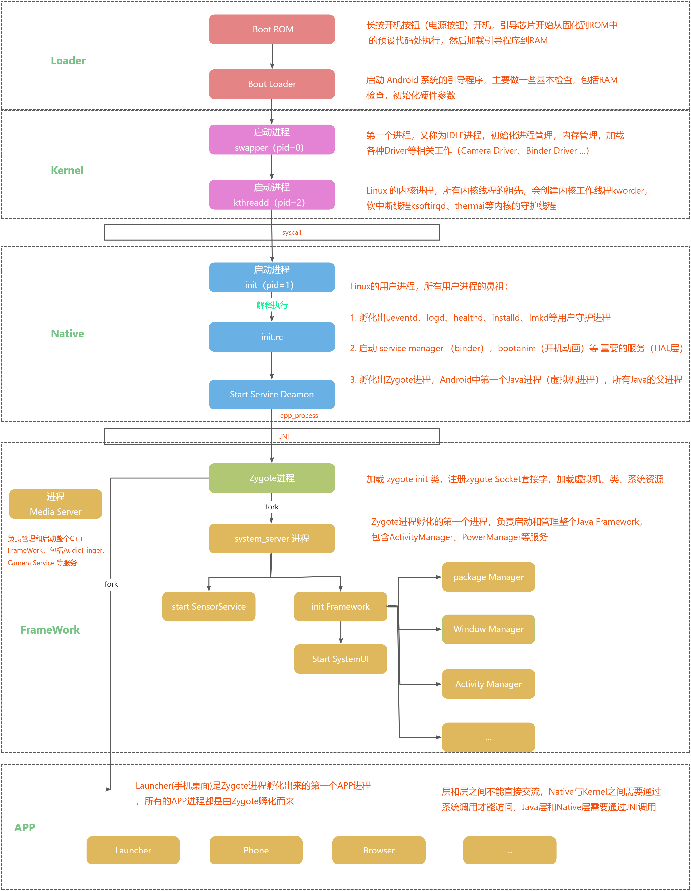
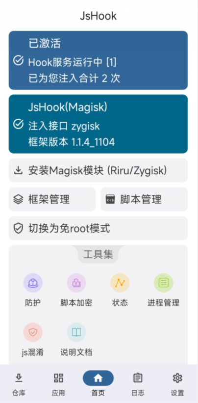
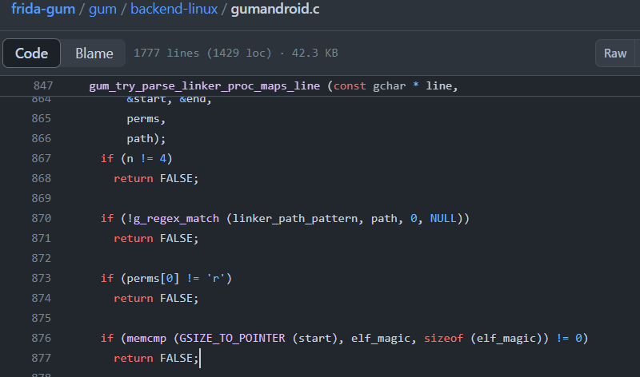
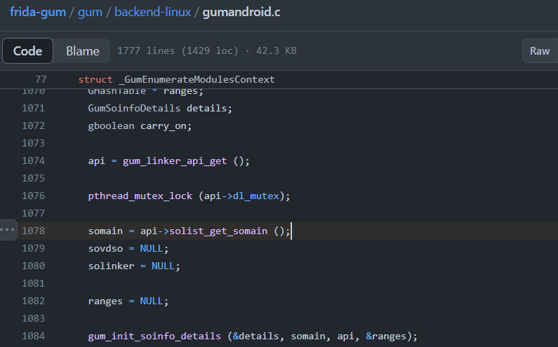
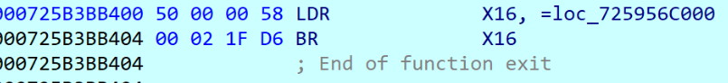

# 一、课程目标
1.了解常见frida检测
2.了解frida持久化hook
# 二、工具

1.教程Demo(更新)
2.jadx-gui
3.VS Code

# 三、课程内容

## 1.Syscall&SVC&自定义strstr
在上面的检测对抗中，我们hook了libc.so中的fread、strstr、open等系统函数，但是如果app不讲武德，自实现这些函数，阁下又该如何应对？

	在用户空间和内核空间之间，有一个叫做Syscall(系统调用, system call)的中间层，是连接用户态和内核态的桥梁。这样即提高了内核的安全型，也便于移植，只需实现同一套接口即可。Linux系统，用户空间通过向内核空间发出Syscall，产生软中断，从而让程序陷入内核态，执行相应的操作。
	**SVC(软件中断指令)指令**：在ARM架构的系统中，`svc`是一条特殊的指令，它允许用户态的程序发起一个系统调用。当这条指令被执行时，CPU会从用户态切换到内核态，从而允许内核处理这个请求。

Linux操作系统是一个巨大的图书馆，而`syscall`就是这个图书馆的前台服务窗口。当一个应用程序（比如一个读者）需要借阅书籍（获取系统资源或服务）时，它不能直接进入图书馆的内部书架去拿书，因为那样可能会造成混乱和损坏。所以，读者需要通过前台服务窗口，也就是`syscall`，来请求它想要的书籍。

`svc`就像是图书馆前台服务窗口的内部电话。当读者通过前台窗口提出请求时，前台工作人员会通过内部电话（`svc`）来联系图书馆的内部工作人员，请求他们找到并提供所需的书籍。在Linux系统中，当一个程序通过`syscall`请求服务时，实际上是通过`svc`这条指令通知内核，然后由内核来处理这些请求。
[Frida-Sigaction-Seccomp实现对Android APP系统调用的拦截](https://bbs.kanxue.com/thread-280343.htm#/)
[分享一个Android通用svc跟踪以及hook方案——Frida-Seccomp](https://bbs.kanxue.com/thread-271815.htm)
[基于seccomp+sigaction的Android通用svc hook方案](https://bbs.kanxue.com/thread-277544.htm#/)
[[原创]SVC的TraceHook沙箱的实现&无痕Hook实现思路](https://bbs.kanxue.com/thread-273160.htm)
[[原创]Seccomp技术在Android应用中的滥用与防护](https://bbs.kanxue.com/thread-276585.htm)
[[原创]批量检测android app的so中是否有svc调用](https://bbs.kanxue.com/thread-269895.htm)
 

1. 首先当我们长按开机键（电源按钮）开机，此时会引导芯片开始从固化到ROM中的预设代码处执行，然后加载引导程序到RAM。然后启动加载的引导程序，引导程序主要做一些基本的检查，包括RAM的检查，初始化硬件的参数。

2. 到达内核层的流程后，这里初始化一些进程管理、内存管理、加载各种Driver等相关操作，如Camera Driver、Binder Driver 等。下一步就是内核线程，如软中断线程、内核守护线程。下面一层就是Native层，这里额外提一点知识，层于层之间是不可以直接通信的，所以需要一种中间状态来通信。Native层和Kernel层之间通信用的是syscall，Native层和Java层之间的通信是JNI。

3. 在Native层会初始化init进程，也就是用户组进程的祖先进程。init中加载配置文件init.rc，init.rc中孵化出ueventd、logd、healthd、installd、lmkd等用户守护进程。开机动画启动等操作。核心的一步是孵化出Zygote进程，此进程是所有APP的父进程，这也是Xposed注入的核心，同时也是Android的第一个Java进程（虚拟机进程）。

4. 进入框架层后，加载zygote init类，注册zygote socket套接字，通过此套接字来做进程通信，并加载虚拟机、类、系统资源等。zygote第一个孵化的进程是system_server进程，负责启动和管理整个Java Framework，包含ActivityManager、PowerManager等服务。

5. 应用层的所有APP都是从zygote孵化而来

```c
bool anti_anti_maps() {
    // 定义一个足够大的字符数组line，用于存储读取的行
    const int buf_size = 512;
    char buf[buf_size];
    int fd;  // 文件描述符
    // 使用 my_openat 打开当前进程的内存映射文件 /proc/self/maps 进行读取
    // AT_FDCWD 表示当前工作目录，"r" 表示只读方式打开
    fd = my_openat(AT_FDCWD, "/proc/self/maps", O_RDONLY | O_CLOEXEC, 0);
    if (fd != -1) {
        // 如果文件成功打开，循环读取每一行
        while ((read_line(fd, buf, buf_size)) > 0) {
            // 使用strstr函数检查当前行是否包含"frida"字符串
            if (strstr(buf, "frida") || strstr(buf, "gadget")) {
                // 如果找到了"frida"，关闭文件并返回true，表示检测到了恶意库
                close(fd);
                return true; // Evil library is loaded.
            }
        }
        // 遍历完文件后，关闭文件
        close(fd);
    } else {
        // 如果无法打开文件，记录错误。这可能意味着系统状态异常
        // 注意：这里的代码没有处理错误，只是注释说明了可能的情况
    }
    // 如果没有在内存映射文件中找到"frida"，返回false，表示没有检测到恶意库
    return false; // No evil library detected.
}

ENTRY(my_openat)  // 定义函数入口，标签my_openat
    mov     x8, __NR_openat  // 将openat系统调用号（__NR_openat）移动到x8寄存器，x8用于存储系统调用号
    svc     #0               // 触发系统调用异常，进入操作系统执行系统调用
    cmn     x0, #(MAX_ERRNO + 1)  // 将函数返回值（存储在x0寄存器）与MAX_ERRNO + 1进行无符号比较
    cneg    x0, x0, hi       // 如果上面的比较结果大于或等于零（即没有错误），则将x0的符号位取反（如果原来是负则变正）
    b.hi    __set_errno_internal  // 如果上面的比较结果大于或等于零（即发生了错误），则跳转到__set_errno_internal进行错误处理
    ret                       // 从函数返回，继续执行调用者代码
END(my_openat)  // 标记函数结束
```

`anti脚本`
```js
function anti_svc(){
    let target_code_hex;  // 用于搜索特定汇编指令序列的十六进制字符串
    let call_number_openat;  // 系统调用号对应的数值，openat
    let arch = Process.arch;  // 获取当前进程的架构

    if ("arm" === arch){  // 如果架构是ARM
        target_code_hex = "00 00 00 EF";  // ARM架构下svc指令的十六进制表示
        call_number_openat = 322;  // openat在ARM架构中的系统调用号
    }else if("arm64" === arch){  // 如果架构是ARM64
        target_code_hex = "01 00 00 D4";  // ARM64架构下svc指令的十六进制表示
        call_number_openat = 56;  // openat在ARM64架构中的系统调用号
    }else {
        console.log("arch not support!");  // 如果架构不支持，打印错误信息
    }
    
    if (arch){  // 如果成功获取了架构信息
        console.log("\nthe_arch = " + arch);  // 打印当前架构
        // 枚举进程的内存范围，寻找只读内存段
        Process.enumerateRanges('r--').forEach(function (range) {
            if(!range.file || !range.file.path){  // 如果内存段没有文件路径，跳过
                return;
            }
            let path = range.file.path;  // 获取内存段的文件路径
            // 如果文件路径不是以"/data/app/"开头或不以".so"结尾，跳过
            if ((!path.startsWith("/data/app/")) || (!path.endsWith(".so"))){
                return;
            }
            let baseAddress = Module.getBaseAddress(path);  // 获取so库的基址
            let soNameList = path.split("/");  // 通过路径分割获取so库的名称
            let soName = soNameList[soNameList.length - 1];  // 获取so库的名称
            console.log("\npath = " + path + " , baseAddress = " + baseAddress + 
                        " , rangeAddress = " + range.base + " , size = " + range.size);
            // 在so库的内存范围内搜索target_code_hex对应的指令序列
            Memory.scan(range.base, range.size, target_code_hex, {
                onMatch: function (match){
                    let code_address = match;  // 获取匹配到的指令地址
                    let code_address_str = code_address.toString();  // 转换为字符串
                    // 如果地址的最低位是0, 4, 8, c中的任意一个，说明可能是svc指令
                    if (code_address_str.endsWith("0") || code_address_str.endsWith("4") || 
                        code_address_str.endsWith("8") || code_address_str.endsWith("c")){
                        console.log("--------------------------");
                        let call_number = 0;  // 初始化系统调用号
                        if ("arm" === arch){
                            // 获取svc指令后面的立即数，作为系统调用号
                            call_number = (code_address.sub(0x4).readS32()) & 0xFFF;
                        }else if("arm64" === arch){
                            call_number = (code_address.sub(0x4).readS32() >> 5) & 0xFFFF;
                        }else {
                            console.log("the arch get call_number not support!");  // 如果架构不支持，打印错误信息
                        }
                        console.log("find svc : so_name = " + soName + " , address = " + code_address + 
                                    " , call_number = " + call_number + " , offset = " + code_address.sub(baseAddress));
                        // 如果匹配到的系统调用号是openat，挂钩该地址
                        if (call_number_openat === call_number){
                            let target_hook_addr = code_address;
                            let target_hook_addr_offset = target_hook_addr.sub(baseAddress);
                            console.log("find svc openat , start inlinehook by frida!");
                            Interceptor.attach(target_hook_addr, {
                                onEnter: function (args){  // 当进入挂钩函数时
                                    console.log("\nonEnter_" + target_hook_addr_offset + " , __NR_openat , args[1] = " + 
                                                  args[1].readCString());
                                    // 修改openat的第一个参数为指定路径
                                    this.new_addr = Memory.allocUtf8String("/data/user/0/com.zj.wuaipojie/maps");
                                    args[1] = this.new_addr;
                                    console.log("onEnter_" + target_hook_addr_offset + " , __NR_openat , args[1] = " + 
                                                  args[1].readCString());
                                }, 
                                onLeave: function (retval){  // 当离开挂钩函数时
                                    console.log("onLeave_" + target_hook_addr_offset + " , __NR_openat , retval = " + retval)
                                }
                            });
                        }
                    }
                }, 
                onComplete: function () {}  // 搜索完成后的回调函数
            });
        });
    }
}
```
`自定义strstr`
```C
bool anti_str_maps() {
    // 定义一个足够大的字符数组line，用于存储读取的行
    char line[512];
    // 打开当前进程的内存映射文件/proc/self/maps进行读取
    FILE* fp = fopen("/proc/self/maps", "r");
    if (fp) {
        // 如果文件成功打开，循环读取每一行
        while (fgets(line, sizeof(line), fp)) {
            // 使用自定义strstr函数检查当前行是否包含"frida"指纹
            if (my_strstr(line, "frida") || my_strstr(line, "gadget")) {
                // 如果找到了，关闭文件并返回true，表示检测到了恶意库
                fclose(fp);
                return true; 
            }
        }
        // 遍历完文件后，关闭文件
        fclose(fp);
    } else {
        // 如果无法打开文件，记录错误。这可能意味着系统状态异常
        // 注意：这里的代码没有处理错误，只是注释说明了可能的情况
    }
    // 如果没有在内存映射文件中找到"frida"，返回false，表示没有检测到恶意库
    return false; 
}

//自实现了libc里的几个系统函数
__attribute__((always_inline))
static inline char *
my_strstr(const char *s, const char *find)
{
    char c, sc;
    size_t len;

    if ((c = *find++) != '\0') {
        len = my_strlen(find);
        do {
            do {
                if ((sc = *s++) == '\0')
                    return (NULL);
            } while (sc != c);
        } while (my_strncmp(s, find, len) != 0);
        s--;
    }
    return ((char *)s);
}


```
## 2.frida持久化方案
### 1.免root方案
Frida的Gadget是一个共享库，用于免root注入hook脚本。
[官方文档](https://frida.re/docs/gadget/#/)
思路:将APK解包后，通过修改smali代码或patch so文件的方式植入frida-gadget，然后重新打包安装。
优点:免ROOT、能过掉一部分检测机制
缺点:重打包可能会遇到解决不了的签名校验、hook时机需要把握

1. 基于obejction的patchapk功能
[官方文档](https://github.com/sensepost/objection/wiki/Patching-Android-Applications)
命令：
```
objection patchapk -V 14.2.18 -c config.txt -s demo.apk(注意路径不要有中文)
-V 指定gadget版本
-c 加载脚本配置信息
-s 要注入的apk
```

注意的问题:
`objection patchapk`命令基本上是其他几个系统命令的补充，可尽可能地自动化修补过程。当然，需要先安装并启用这些命令。它们是：

- `aapt`- 来自：[http://elinux.org/Android_aapt](http://elinux.org/Android_aapt)
- `adb`- 来自：[https://developer.android.com/studio/command-line/adb.html](https://developer.android.com/studio/command-line/adb.html)
- `jarsigner`- 来自：[http://docs.oracle.com/javase/7/docs/technotes/tools/windows/jarsigner.html](http://docs.oracle.com/javase/7/docs/technotes/tools/windows/jarsigner.html)
- `apktool`- 来自：[https://ibotpeaches.github.io/Apktool/](https://ibotpeaches.github.io/Apktool/)

ps:这几个环境工具，aapt、jarsigner都是Android Studio自带的，所以在配置好as的环境即可，abd的环境配置网上搜一下就行，apktool则需要额外配置，我会上传到课件当中

另外会遇到的问题，patchapk的功能在patch的时候会下载对应版本的gadget的so，但是网络问题异常慢，所以建议根据链接去下载好，然后放到这个路径下并重命名
```
C:\Users\用户名\.objection\android\arm64-v8a\libfrida-gadget.so
```

### 2.root方案
方法一:
思路:可以patch /data/app/pkgname/lib/arm64(or arm)目录下的so文件，apk安装后会将so文件解压到该目录并在运行时加载，修改该目录下的文件不会触发签名校验。
Patch SO的原理可以参考[Android平台感染ELF文件实现模块注入](https://gslab.qq.com/portal.php?mod=view&aid=163)
优点:绕过签名校验、root检测和部分ptrace保护。
缺点:需要root、高版本系统下，当manifest中的android:extractNativeLibs为false时，lib目录文件可能不会被加载，而是直接映射apk中的so文件、可能会有so完整性校验
使用方法
```
python LIEFInjectFrida.py test.apk ./ lib52pojie.so -apksign -persistence
test.apk要注入的apk名称
lib52pojie.so要注入的so名称
```
然后提取patch后是so文件放到对应的so目录下

方法二:
思路:基于magisk模块方案注入frida-gadget，实现加载和hook。寒冰师傅的[FridaManager](https://github.com/hanbinglengyue/FridaManager)
优点:无需重打包、灵活性较强
缺点:需要过root检测，magsik检测


方法三:
思路:基于jshook封装好的fridainject框架实现hook
[JsHook](https://github.com/Xposed-Modules-Repo/me.jsonet.jshook)

### 3.源码定制方案
原理:修改aosp源代码,在fork子进程的时候注入frida-gadget
[ubuntu 20.04系统AOSP(Android 11)集成Frida](https://www.mobibrw.com/2021/28588#/)
[AOSP Android 10内置FridaGadget实践01](https://www.52pojie.cn/thread-1740214-1-1.html#/)
[AOSP Android 10内置FridaGadget实践02(完)](https://www.52pojie.cn/thread-1748101-1-1.html)|

## 3.其他检测思路与反思
1.检测方法签名信息，frida在hook方法的时候会把java方法转为native方法
2.Frida在attach进程注入SO时会显式地校验ELF_magic字段，不对则直接报错退出进程，可以手动在内存中抹掉SO的magic，达到反调试的效果。
[检测点](https://github.com/frida/frida-gum/blob/8d9f4578b58c03025aef63652ec4defa19f8061c/gum/backend-linux/gumandroid.c#L876)

```C
if (memcmp (GSIZE_TO_POINTER (start), elf_magic, sizeof (elf_magic)) != 0)
    return FALSE;
```
```C
FILE *fp=fopen("/proc/self/maps","r");
while (fgets(line, sizeof(line), fp)) {
    if (strstr(line, "linker64") ) {
          start = reinterpret_cast<int *>(strtoul(strtok(line, "-"), NULL, 16));
          *(long*)start=*(long*)start^0x7f;
          }
     }
```
3.Frida源码中多次调用somain结构体,但它在调用前不会判断是否为空，只要手动置空后Frida一附加就会崩溃
[检测点](https://github.com/frida/frida-gum/blob/8d9f4578b58c03025aef63652ec4defa19f8061c/gum/backend-linux/gumandroid.c#L1078)

```C
somain = api->solist_get_somain ();
gum_init_soinfo_details (&details, somain, api, &ranges);
api->solist_get_head ()
gum_init_soinfo_details (&details, si, api, &ranges);
```
```C
int getsomainoff = findsym("/system/bin/linker64","__dl__ZL6somain");
*(long*)((char*)start+getsomainoff)=0;
```
4.通常inline hook第一条指令是mov 常数到寄存器，然后第二条是一个br 寄存器指令。检查第二条指令高16位是不是0xd61f,就可以判断目标函数是否被inline hook了！


5.还可以去hook加固壳，现在很多加固厂商都antifrida了，从壳中的代码去分析检测思路

`反思`

| 反调试现状       | 详细说明                                                                                     |
|------------------|----------------------------------------------------------------------------------------------|
| 检测方式多样     | 从通用检测、hook检测到源码检测，方式层出不穷。源码检测可以针对每行代码都能开发出不同检测方式，Frida指纹过多。 |
| 检测位置不确定   | 一般是单独开线程跑，也可以在关键函数执行前判断 |
| 强混淆加大定位难度 | 反调试通常埋几行代码，但结合混淆可达万行代码，不考虑效率可膨胀更多，定位极难。    |
# 六、视频及课件地址
[百度云](https://pan.baidu.com/s/1cFWTLn14jeWfpXxlx3syYw?pwd=nqu9)
[阿里云](https://www.aliyundrive.com/s/TJoKMK6du6x)
[哔哩哔哩](https://www.bilibili.com/video/BV1wT411N7sV/?spm_id_from=333.788&vd_source=6dde16dc6479f00694baaf73a2225452)
[教程开源地址]([https://github.com/ZJ595/AndroidReverse](https://github.com/ZJ595/AndroidReverse))

PS:解压密码都是52pj，阿里云由于不能分享压缩包，所以下载exe文件，双击自解压

# 七、其他章节
[《安卓逆向这档事》一、模拟器环境搭建](https://www.52pojie.cn/thread-1695141-1-1.html)  
[《安卓逆向这档事》二、初识APK文件结构、双开、汉化、基础修改](https://www.52pojie.cn/thread-1695796-1-1.html)  
[《安卓逆向这档事》三、初识smail，vip终结者](https://www.52pojie.cn/thread-1701353-1-1.html)  
[《安卓逆向这档事》四、恭喜你获得广告&弹窗静默卡](https://www.52pojie.cn/thread-1706691-1-1.html)  
[《安卓逆向这档事》五、1000-7=？&动态调试&Log插桩](https://www.52pojie.cn/thread-1714727-1-1.html)  
[《安卓逆向这档事》六、校验的N次方-签名校验对抗、PM代{过}{滤}理、IO重定向](https://www.52pojie.cn/thread-1731181-1-1.html)  
[《安卓逆向这档事》七、Sorry，会Hook真的可以为所欲为-Xposed快速上手(上)模块编写,常用Api](https://www.52pojie.cn/thread-1740944-1-1.html)  
[《安卓逆向这档事》八、Sorry，会Hook真的可以为所欲为-xposed快速上手(下)快速hook](https://www.52pojie.cn/thread-1748081-1-1.html)  
[《安卓逆向这档事》九、密码学基础、算法自吐、非标准加密对抗](https://www.52pojie.cn/thread-1762225-1-1.html)  
[《安卓逆向这档事》十、不是我说，有了IDA还要什么女朋友？](https://www.52pojie.cn/thread-1787667-1-1.html)  
[《安卓逆向这档事》十二、大佬帮我分析一下](https://www.52pojie.cn/thread-1809646-1-1.html)  
[《安卓逆向这档事》番外实战篇1-某电影视全家桶](https://www.52pojie.cn/thread-1814917-1-1.html)  
[《安卓逆向这档事》十三、是时候学习一下Frida一把梭了(上)](https://www.52pojie.cn/thread-1823118-1-1.html)
[《安卓逆向这档事》十四、是时候学习一下Frida一把梭了(中)](https://www.52pojie.cn/thread-1838539-1-1.html)
[《安卓逆向这档事》十五、是时候学习一下Frida一把梭了(下)](https://www.52pojie.cn/thread-1840174-1-1.html)

# 八、参考文档
[小菜花的frida-gadget持久化方案汇总](https://www.52pojie.cn/forum.php?mod=viewthread&tid=1467912)
[FridaManager:Frida脚本持久化解决方案](https://github.com/hanbinglengyue/FridaManager)
[Linux系统调用(syscall)原理](https://gityuan.com/2016/05/21/syscall/#/)
[小菜花的frida-svc-interceptor](https://bbs.kanxue.com/thread-270144-1.htm#/)
[[原创]小日本也有大安全——记一次不寻常的手游反调试，反hook分析与绕过](https://bbs.kanxue.com/thread-278113.htm)
[[原创]非root环境下frida持久化的两种方式及脚本](https://bbs.kanxue.com/thread-268175.htm#/)
[多种姿势花样使用Frida注入](https://ashenone66.cn/2021/09/20/duo-chong-zi-shi-hua-yang-shi-yong-frida-zhu-ru/#/)
