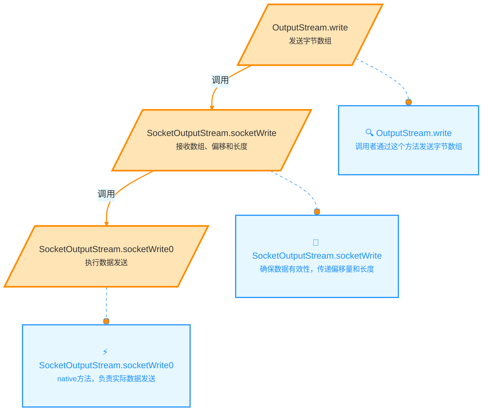
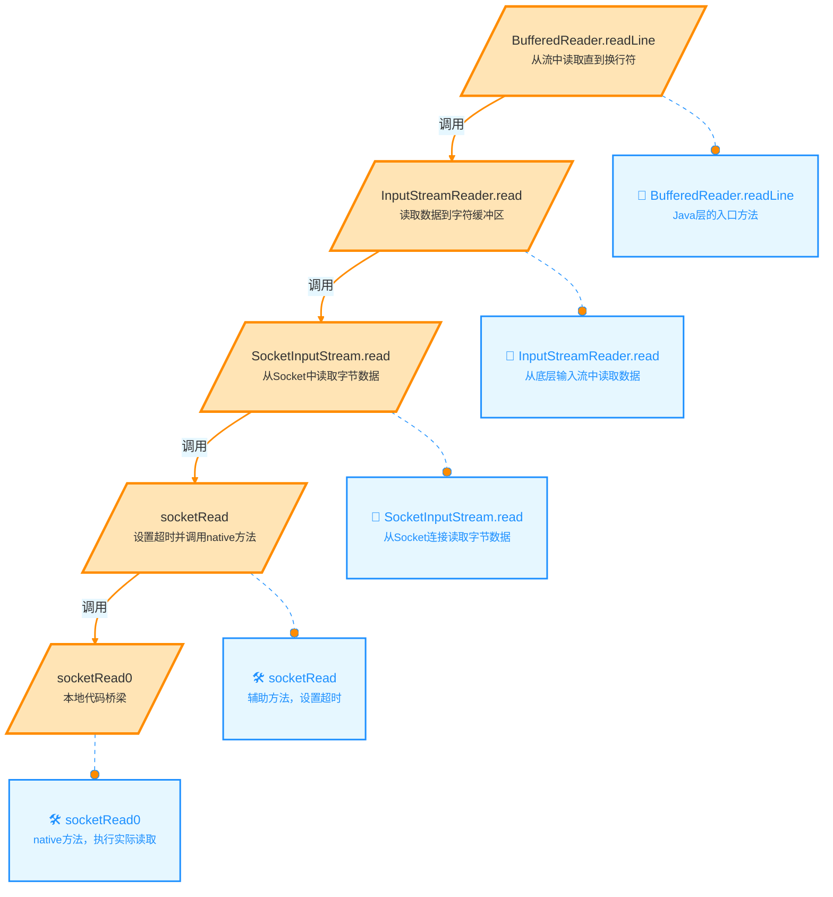
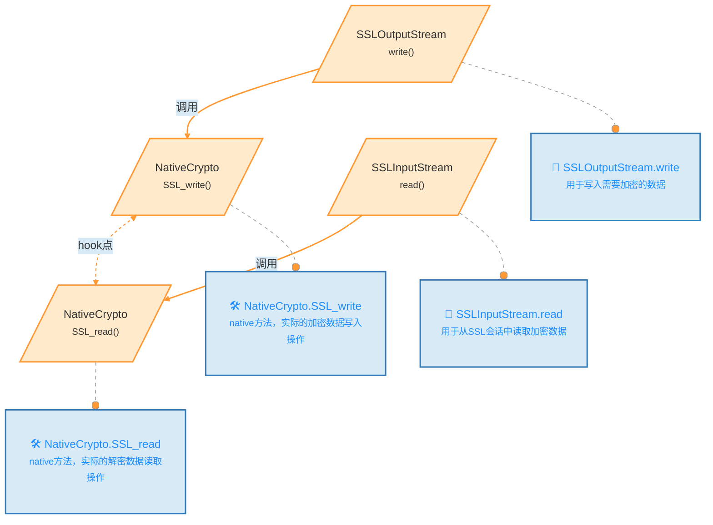
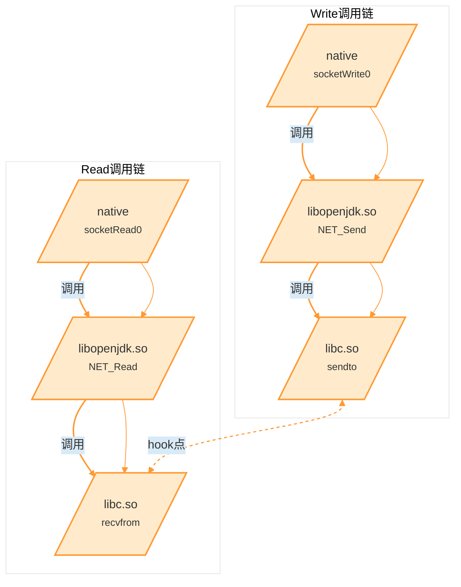
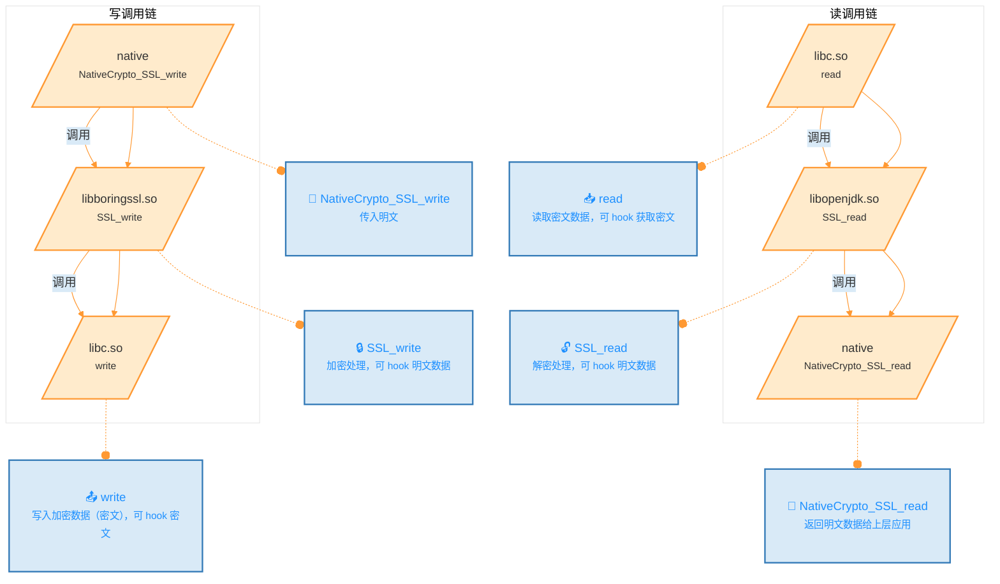
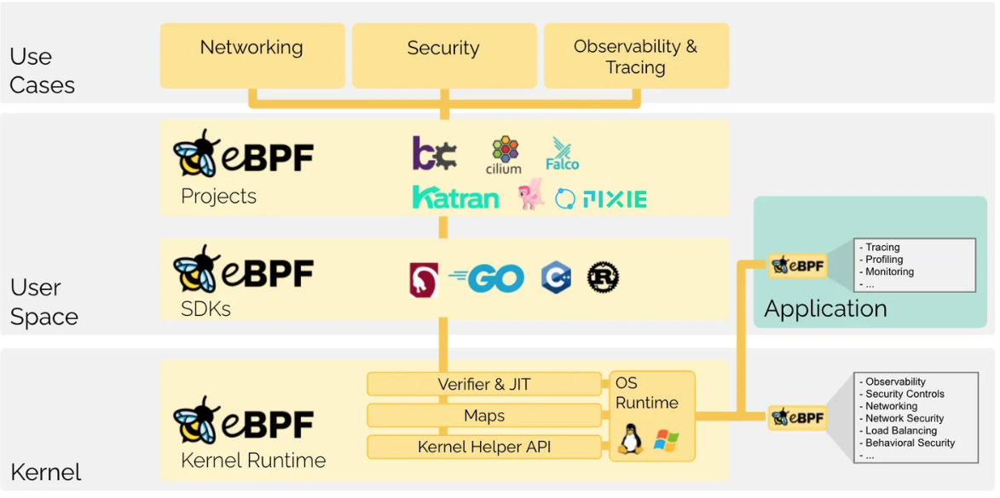
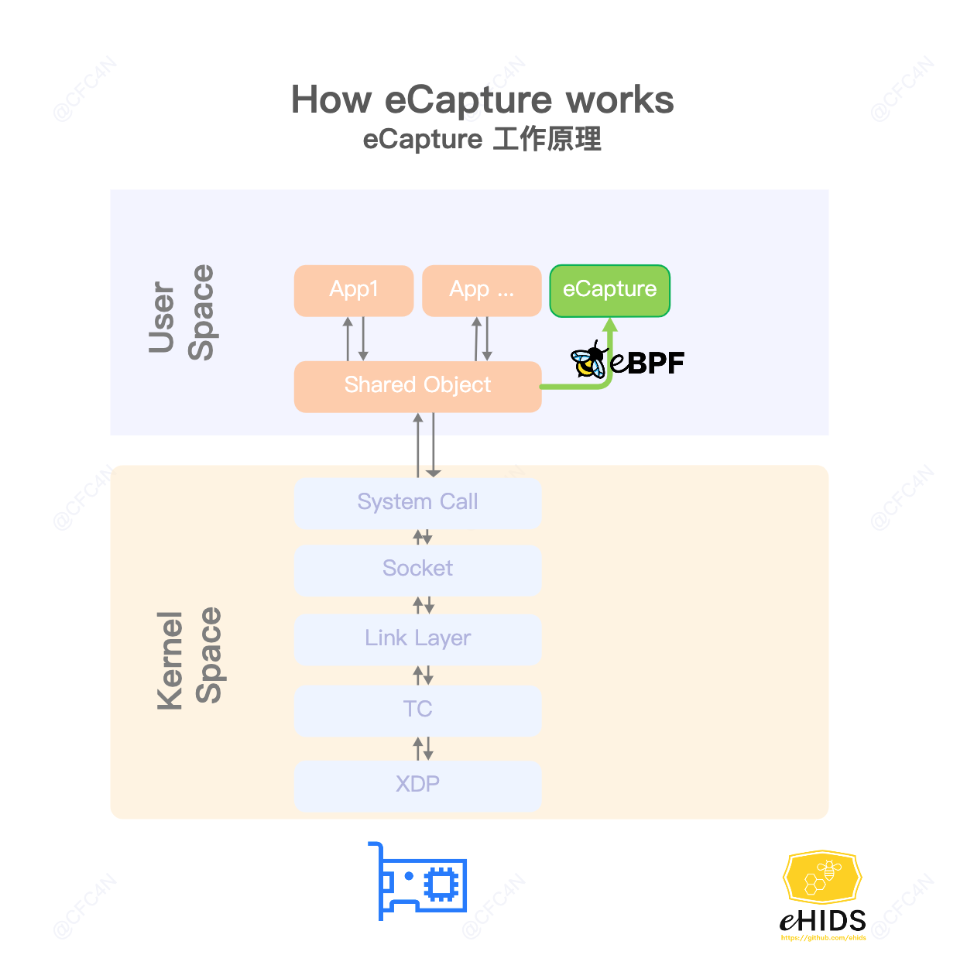

  
# 一、课程目标  
1.了解hook抓包与混淆对抗  
2.了解底层网络自吐  
3.了解ebpf抓包  
4.简单实战加解密协议  
# 二、工具  
  
1.教程Demo  
2.r0capture&ecapture  
3.Reqable  
4.wireshark  
# 三、课程内容  
## 1.Hook抓包&&关键定位&&混淆对抗  
Hook 抓包是一种截取应用程序数据包的方法，通过 Hook 应用或系统函数来获取数据流。在应用层 Hook 时，通过查找触发请求的函数来抓包，优点是不受防抓包手段影响，缺点是抓包数据不便于我们分析和筛选。  
`常见安卓网络开发框架`  
  
| 框架名称               | 描述                                                                        | GitHub 地址                                                                                                            |  
| ------------------ | ------------------------------------------------------------------------- | -------------------------------------------------------------------------------------------------------------------- |  
| Volley             | 由Google开源的轻量级网络库，支持网络请求处理、小图片的异步加载和缓存等功能                                  | [https://github.com/google/volley](https://github.com/google/volley)                                                 |  
| Android-async-http | 基于Apache HttpClient的一个异步网络请求处理库                                           | [https://github.com/android-async-http/android-async-http](https://github.com/android-async-http/android-async-http) |  
| xUtils             | 类似于Afinal，但被认为是Afinal的一个升级版，提供了HTTP请求的支持                                  | [https://github.com/wyouflf/xUtils3](https://github.com/wyouflf/xUtils3)                                             |  
| OkHttp             | 一个高性能的网络框架，已经被Google官方认可，在Android 6.0中底层源码已经使用了OkHttp来替代HttpURLConnection | [https://github.com/square/okhttp](https://github.com/square/okhttp)                                                 |  
| Retrofit           | 提供了一种类型安全的HTTP客户端接口，简化了HTTP请求的编写，通常与OkHttp配合使用                            | [https://github.com/square/retrofit](https://github.com/square/retrofit)                                             |  

[【译】OkHttp3 拦截器（Interceptor）](https://www.cnblogs.com/liyutian/p/9489016.html)  
拦截器是 OkHttp 提供的对 Http 请求和响应进行统一处理的强大机制，它可以实现网络监听、请求以及响应重写、请求失败充实等功能。  
OkHttp 中的 Interceptor 就是典型的责任链的实现，它可以设置任意数量的 Intercepter 来对网络请求及其响应做任何中间处理，比如设置缓存，Https证书认证，统一对请求加密/防篡改社会，打印log，过滤请求等等。  
OkHttp 中的拦截器分为 Application Interceptor（应用拦截器） 和 NetWork Interceptor（网络拦截器）两种  
- Network Interceptor（网络拦截器）  
    通过调用 OkHttpClient.Builder 的 addNetworkInterceptor() 方法来注册网络拦截器  
```java  
OkHttpClient client = new OkHttpClient.Builder()  
    .addNetworkInterceptor(new LoggingInterceptor())  
    .build();  
  
Request request = new Request.Builder()  
    .url("https://www.52pojie.cn/")  
    .header("User-Agent", "OkHttp Example")  
    .build();  
  
Response response = client.newCall(request).execute();  
response.body().close();  
```  
参考项目:  
[OkHttpLogger-Frida](https://github.com/siyujie/OkHttpLogger-Frida)  
`源码解析:`  
[定位OkHttpClient关键点](https://github.com/siyujie/okhttp_find/blob/dc69bb2faebb45ba803dc3389bdfdc22bf584e34/librarys/src/main/java/com/singleman/okhttp/OkHttpFinder.java#L68)  
```java  
/**  
 * 查找并配置OkHttpClient的Client和Builder类。  
 * 该方法通过反射扫描指定类的字段和方法来确定其是否符合OkHttpClient的结构特征。  
 * 如果找到符合的类，则会进一步配置和注入相关拦截器。  
 *  
 * @param classes   当前扫描的类  
 * @param className 类名，用于查找和调试  
 */  
private void findClientAndBuilderAndBuildAnd(Class classes, String className) {  
    try {  
        // 确认类是final且静态  
        if (Modifier.isFinal(classes.getModifiers())  
                && Modifier.isStatic(classes.getModifiers())) {  
  
            int listCount = 0;         // 记录List类型字段的数量  
            int finalListCount = 0;    // 记录final修饰的List字段数量  
            int listInterfaceCount = 0;// 记录List中包含接口的字段数量  
            Field[] fields = classes.getDeclaredFields();  
            Field.setAccessible(fields, true); // 设置字段访问权限  
  
            for (Field field : fields) {  
                String type = field.getType().getName();  
                if (type.contains(List.class.getName())) {  
                    listCount++; // 判断字段是否为List类型  
  
                    // 检查List是否是接口类型  
                    Class genericClass = getGenericClass(field);  
                    if (null != genericClass && genericClass.isInterface()) {  
                        listInterfaceCount++;  
                    }  
                }  
  
                // 判断字段是否为final修饰的List类型  
                if (type.contains(List.class.getName()) && Modifier.isFinal(field.getModifiers())) {  
                    finalListCount++;  
                }  
            }  
  
            // 符合OkHttpClient特征的条件检查  
            if (listCount == 4 && finalListCount == 2 && listInterfaceCount == 2) {  
                // 获取并确认OkHttpClient的包结构和父类  
                Class OkHttpClientClazz = classes.getEnclosingClass();  
                if (Cloneable.class.isAssignableFrom(OkHttpClientClazz)) {  
                    OkCompat.Cls_OkHttpClient = OkHttpClientClazz.getName();  
  
                    if (null != classes && null != classes.getPackage()) {  
                        Compat_PackageName = classes.getPackage().getName();  
                    }  
  
                    Class builderClazz = classes;  
  
                    // 查找并注入拦截器  
                    find_interceptor(builderClazz);  
  
                    // 查找OkHttpClient相关类  
                    findClientAbout(OkHttpClientClazz);  
  
                    findTag1 = true; // 标记找到目标  
                }  
            }  
        }  
    } catch (Throwable th) {  
        // 捕获所有异常以防止中断流程，但不处理  
    }  
}  
  
/**  
 * 查找并注入Interceptor拦截器到Builder类中。  
 * 此方法会扫描Builder类的字段，找到符合拦截器的字段并进行配置。  
 *  
 * @param builderClazz 需要查找的Builder类  
 */  
private void find_interceptor(Class builderClazz) {  
    // 检查包名是否符合条件  
    if (!checkPackage(builderClazz)) return;  
  
    Field[] declaredFields = builderClazz.getDeclaredFields();  
    Field.setAccessible(declaredFields, true); // 设置字段访问权限  
    int index = 0; // 用于计数找到的拦截器字段  
  
    for (Field field : declaredFields) {  
        // 检查字段是否为final修饰的List类型且包含接口  
        if (List.class.isAssignableFrom(field.getType()) && Modifier.isFinal(field.getModifiers())  
                && getGenericClass(field).isInterface()) {  
            if (index == 0) {  
                // 注入自定义Interceptor，提供给JS调用的回调  
                findInterceptor(field);  
                index++;  
            }  
        }  
    }  
}  
  
```  
[拦截器加载关键点](https://github.com/siyujie/OkHttpLogger-Frida/blob/c70da16d107c67d451d7112cfee7ee090589a527/okhttp_poker.js#L489)  
```java  
/**  
 * hookRealCall - 拦截 OkHttp 的 RealCall 类的网络请求。  
 * 该方法通过拦截 RealCall 类的 `enqueue`（异步请求）和 `execute`（同步请求）方法，  
 * 实现对网络请求和响应的捕获和处理。  
 *  
 * @param {string} realCallClassName - OkHttp RealCall 类的完整类名。  
 */  
function hookRealCall(realCallClassName) {  
    Java.perform(function () {  
        console.log(" ...........  hookRealCall  : " + realCallClassName)  
  
        // 获取 RealCall 类  
        var RealCall = Java.use(realCallClassName)  
  
        // 检查是否定义了 Cls_CallBack 类（用于异步请求拦截）  
        if ("" != Cls_CallBack) {  
            // 拦截 RealCall 类中的异步方法 enqueue  
            RealCall[M_Call_enqueue].overload(Cls_CallBack).implementation = function (callback) {  
                // 获取 callback 的类  
                var realCallBack = Java.use(callback.$className)  
  
                // 拦截 callback 中的 onResponse 方法，修改返回的响应数据  
                realCallBack[M_CallBack_onResponse].overload(Cls_Call, Cls_Response).implementation = function(call, response) {  
                    // 使用自定义的 buildNewResponse 方法创建新的响应数据  
                    var newResponse = buildNewResponse(response)  
                    // 继续执行原始的 onResponse 方法，传入新的响应数据  
                    this[M_CallBack_onResponse](call, newResponse)  
                }  
  
                // 调用原始的 enqueue 方法，传入修改后的 callback  
                this[M_Call_enqueue](callback)  
                // 释放 callback 类引用  
                realCallBack.$dispose  
            }  
        }  
  
        // 拦截 RealCall 类中的同步方法 execute  
        RealCall[M_Call_execute].overload().implementation = function () {  
            // 调用原始的 execute 方法，获取响应数据  
            var response = this[M_Call_execute]()  
            // 使用自定义的 buildNewResponse 方法创建新的响应数据  
            var newResponse = buildNewResponse(response)  
            // 返回新的响应数据  
            return newResponse;  
        }  
    })  
}  
  
```  
  
`使用操作:`  
1.将 `okhttpfind.dex` 拷贝到 `/data/local/tmp/` 目录下（顺带设置一下777权限）  
2.执行命令启动`frida -U wuaipojie -l okhttp_poker.js` 可追加 `-o [output filepath]`保存到文件  
3.执行find()和hold()方法看看效果  
```  
D:\Program Files\WORKON_HOME\frida16\frida-agent-example>frida -U wuaipojie -l okhttp_poker.js  
     ____  
    / _  |   Frida 16.1.3 - A world-class dynamic instrumentation toolkit  
   | (_| |  
    > _  |   Commands:  
   /_/ |_|       help      -> Displays the help system  
   . . . .       object?   -> Display information about 'object'  
   . . . .       exit/quit -> Exit  
   . . . .  
   . . . .   More info at https://frida.re/docs/home/  
   . . . .  
   . . . .   Connected to Redmi K30 (id=30d9b4bf)  
Attaching...  
  
------------------------- OkHttp Poker by SingleMan [V.20201130]------------------------------------  
API:  
   >>>  find()                                         检查是否使用了Okhttp & 是否可能被混淆 & 寻找okhttp3关键类及函数  
   >>>  switchLoader("okhttp3.OkHttpClient")           参数：静态分析到的okhttpclient类名  
   >>>  hold()                                         开启HOOK拦截  
   >>>  history()                                      打印可重新发送的请求  
   >>>  resend(index)                                  重新发送请求  
----------------------------------------------------------------------------------------  
[Redmi K30::wuaipojie ]-> find()  
~~~~~~~~~~~~~~~~~~~~~~~~~~~~~~~~ 未 混 淆 (仅参考)~~~~~~~~~~~~~~~~~~~~~~~~~~~~~~~~~~~~~~~~~~~~~~  
likelyClazzList size :352  
  
~~~~~~~~~~~~~~~~~~~~~~~~~~~~~~~~Start Find~~~~~~~~~~~~~~~~~~~~~~~~~~~~~~~~~~~~~~~~~~~~~~  
  
~~~~~~~~~~~~~~~~~~~~~~~~~~~~~~~~Find Result~~~~~~~~~~~~~~~~~~~~~~~~~~~~~~~~~~~~~~~~~~~~~~  
var Cls_Call = "okhttp3.Call";  
var Cls_CallBack = "okhttp3.Callback";  
var Cls_OkHttpClient = "okhttp3.OkHttpClient";  
var M_rsp$builder_build = "build";  
var M_rsp_newBuilder = "newBuilder";  
~~~~~~~~~~~~~~~~~~~~~~~~~~~~~~~~Find Complete~~~~~~~~~~~~~~~~~~~~~~~~~~~~~~~~~~~~~~~~~~~~~~  
[Redmi K30::wuaipojie ]-> hold()  
[Redmi K30::wuaipojie ]->  ...........  hookRealCall  : okhttp3.RealCall  
  
┌────────────────────────────────────────────────────────────────────────────────────────────────────────────────────  
| URL: http://192.168.124.21:5000/get_user_data  
|  
| Method: GET  
|  
| Request Headers: 0  
|     no headers  
|  
|--> END  
|  
| URL: http://192.168.124.21:5000/get_user_data  
|  
| Status Code: 200 / OK  
|  
| Response Headers: 5  
|   ┌─Server: Werkzeug/2.3.3 Python/3.10.11  
|   ┌─Date: Sun, 27 Oct 2024 04:27:52 GMT  
|   ┌─Content-Type: application/json  
|   ┌─Content-Length: 104  
|   └─Connection: close  
|  
| Response Body:  
|   {"user_data":"{\"user_id\": \"zj2595\", \"is_vip\": true, \"vip_level\": \"5\", \"coin_amount\": 115}"}  
  
|  
|<-- END HTTP  
└────────────────────────────────────────────────────────────────────────────────────────────────────────────────────  
```  
## 2.底层网络自吐&r0capture  
问题:如果app不是用okhttp开发的呢？或者混淆定位不到？  
[[原创]android抓包学习的整理和归纳](https://bbs.kanxue.com/thread-267940.htm)  
[r0capture开源地址](https://github.com/r0ysue/r0capture)  
### 1.java 层 http 发包  
  

  

  
`Hook实现`  
```js  
// 使用 Java.use 方法获取 java.net.SocketOutputStream 类，并重写 socketWrite0 方法  
Java.use("java.net.SocketOutputStream").socketWrite0.overload('java.io.FileDescriptor', '[B', 'int', 'int').implementation = function (fd, bytearry, offset, byteCount) {  
    // 调用原始的 socketWrite0 方法  
    var result = this.socketWrite0(fd, bytearry, offset, byteCount);  
  
    // 创建一个消息对象用于存储数据  
    var message = {};  
    message["function"] = "HTTP_send"; // 标识为 HTTP 发送操作  
    message["ssl_session_id"] = ""; // SSL 会话 ID 为空  
  
    // 获取本地地址和端口  
    message["src_addr"] = ntohl(ipToNumber((this.socket.value.getLocalAddress().toString().split(":")[0]).split("/").pop()));  
    message["src_port"] = parseInt(this.socket.value.getLocalPort().toString());  
  
    // 获取远程地址和端口  
    message["dst_addr"] = ntohl(ipToNumber((this.socket.value.getRemoteSocketAddress().toString().split(":")[0]).split("/").pop()));  
    message["dst_port"] = parseInt(this.socket.value.getRemoteSocketAddress().toString().split(":").pop());  
  
    // 获取调用栈信息  
    message["stack"] = Java.use("android.util.Log").getStackTraceString(Java.use("java.lang.Throwable").$new()).toString();  
  
    // 将要发送的数据拷贝到内存中  
    var ptr = Memory.alloc(byteCount);  
    for (var i = 0; i < byteCount; ++i)  
        Memory.writeS8(ptr.add(i), bytearry[offset + i]);  
  
    // 发送消息和数据  
    send(message, Memory.readByteArray(ptr, byteCount));  
  
    // 返回原始方法的结果  
    return result;  
}  
  
// 使用 Java.use 方法获取 java.net.SocketInputStream 类，并重写 socketRead0 方法  
Java.use("java.net.SocketInputStream").socketRead0.overload('java.io.FileDescriptor', '[B', 'int', 'int', 'int').implementation = function (fd, bytearry, offset, byteCount, timeout) {  
    // 调用原始的 socketRead0 方法  
    var result = this.socketRead0(fd, bytearry, offset, byteCount, timeout);  
  
    // 创建一个消息对象用于存储数据  
    var message = {};  
    message["function"] = "HTTP_recv"; // 标识为 HTTP 接收操作  
    message["ssl_session_id"] = ""; // SSL 会话 ID 为空  
  
    // 获取远程地址和端口（作为源地址）  
    message["src_addr"] = ntohl(ipToNumber((this.socket.value.getRemoteSocketAddress().toString().split(":")[0]).split("/").pop()));  
    message["src_port"] = parseInt(this.socket.value.getRemoteSocketAddress().toString().split(":").pop());  
  
    // 获取本地地址和端口（作为目标地址）  
    message["dst_addr"] = ntohl(ipToNumber((this.socket.value.getLocalAddress().toString().split(":")[0]).split("/").pop()));  
    message["dst_port"] = parseInt(this.socket.value.getLocalPort());  
  
    // 获取调用栈信息  
    message["stack"] = Java.use("android.util.Log").getStackTraceString(Java.use("java.lang.Throwable").$new()).toString();  
  
    // 如果读取到的数据字节数大于 0，将数据拷贝到内存并发送  
    if (result > 0) {  
        var ptr = Memory.alloc(result);  
        for (var i = 0; i < result; ++i)  
            Memory.writeS8(ptr.add(i), bytearry[offset + i]);  
        send(message, Memory.readByteArray(ptr, result));  
    }  
  
    // 返回原始方法的结果  
    return result;  
}  
  
  
```  
通过拦截 Java 中的 `socketWrite0` 和 `socketRead0` 方法，在数据发送和接收时收集相关信息并发送给指定的接收方，以便进行监控或调试  
  
### 2.java 层 https 发包  

  
`Hook实现`  
```js  
// 拦截 SSLOutputStream 类的 write 方法  
Java.use("com.android.org.conscrypt.ConscryptFileDescriptorSocket$SSLOutputStream").write.overload('[B', 'int', 'int').implementation = function (bytearry, int1, int2) {  
    // 调用原始的 write 方法  
    var result = this.write(bytearry, int1, int2);  
    // 获取当前调用栈的字符串形式，存储 SSL 数据写入时的调用栈  
    SSLstackwrite = Java.use("android.util.Log").getStackTraceString(Java.use("java.lang.Throwable").$new()).toString();  
    // 返回原始方法的结果  
    return result;  
}  
  
// 拦截 SSLInputStream 类的 read 方法  
Java.use("com.android.org.conscrypt.ConscryptFileDescriptorSocket$SSLInputStream").read.overload('[B', 'int', 'int').implementation = function (bytearry, int1, int2) {  
    // 调用原始的 read 方法  
    var result = this.read(bytearry, int1, int2);  
    // 获取当前调用栈的字符串形式，存储 SSL 数据读取时的调用栈  
    SSLstackread = Java.use("android.util.Log").getStackTraceString(Java.use("java.lang.Throwable").$new()).toString();  
    // 返回原始方法的结果  
    return result;  
}  
  
```  
拦截了 `SSLOutputStream` 和 `SSLInputStream` 类的 `write` 和 `read` 方法，在进行数据读写时获取当前的调用栈信息  
  
### 3.native 层 http 发包  

  
| 函数名称                   | 描述                                                    |  
| ---------------------- | ----------------------------------------------------- |  
| native.socketWrite0    | 这是一个 native 方法，负责从 Java 层向底层网络接口写入数据。                 |  
| libopenjdk.so.NET_Send | 这是 `libopenjdk.so` 中的一个函数，调用底层的 `sendto` 方法，用于发送数据。   |  
| libc.so.sendto         | 这是一个底层系统调用函数，将数据发送到指定的网络地址。                           |  
| native.socketRead0     | 这是一个 native 方法，用于从底层网络接口读取数据。                         |  
| libopenjdk.so.NET_Read | 这是 `libopenjdk.so` 中的一个函数，调用底层的 `recvfrom` 方法，负责接收数据。 |  
| libopenjdk.so.recvfrom | 这是一个底层系统调用函数，用于从网络接口接收数据包。                            |  
`Hook实现`  
```js  
// 获取 libc.so 库中的 sendto 和 recvfrom 函数的指针  
var sendtoPtr = Module.getExportByName("libc.so", "sendto");  
var recvfromPtr = Module.getExportByName("libc.so", "recvfrom");  
console.log("sendto:", sendtoPtr, ", recvfrom:", recvfromPtr);  
  
// 拦截 sendto 函数  
// sendto(int fd, const void *buf, size_t n, int flags, const struct sockaddr *addr, socklen_t addr_len)  
Interceptor.attach(sendtoPtr, {  
    onEnter: function(args) {  
        // 获取文件描述符 fd  
        var fd = args[0];  
        // 获取要发送的缓冲区指针 buff  
        var buff = args[1];  
        // 获取数据大小 size  
        var size = args[2];  
  
        // 获取套接字的相关信息  
        var sockdata = getSocketData(fd.toInt32());  
        console.log(sockdata);  
  
        // 打印缓冲区的十六进制内容  
        console.log(hexdump(buff, { length: size.toInt32() }));  
    },  
    onLeave: function(retval) {  
        // 离开 sendto 函数时不做额外处理  
    }  
});  
  
// 拦截 recvfrom 函数  
// recvfrom(int fd, void *buf, size_t n, int flags, struct sockaddr *addr, socklen_t *addr_len)  
Interceptor.attach(recvfromPtr, {  
    onEnter: function(args) {  
        // 获取文件描述符 fd  
        this.fd = args[0];  
        // 获取缓冲区指针 buff  
        this.buff = args[1];  
        // 获取数据大小 size  
        this.size = args[2];  
    },  
    onLeave: function(retval) {  
        // 获取套接字的相关信息  
        var sockdata = getSocketData(this.fd.toInt32());  
        console.log(sockdata);  
  
        // 打印接收到的缓冲区的十六进制内容  
        console.log(hexdump(this.buff, { length: this.size.toInt32() }));  
    }  
});  
  
  
```  
拦截 `sendto` 和 `recvfrom` 函数，捕获发送和接收的数据包。`onEnter` 钩子函数用于在函数调用前处理参数，获取文件描述符和缓冲区地址，调用 `hexdump` 打印缓冲区内容以便查看实际发送或接收的数据  
### 4.native 层 https 发包  

  
`Hook实现`  
```js  
// 获取 libc.so 库中的 write 和 read 函数的指针  
var writePtr = Module.getExportByName("libc.so", "write");  
var readPtr = Module.getExportByName("libc.so", "read");  
console.log("write:", writePtr, ", read:", readPtr);  
  
// 拦截 write 函数  
// write(int fd, const void *buf, size_t count)  
Interceptor.attach(writePtr, {  
    onEnter: function(args) {  
        // 获取文件描述符 fd  
        var fd = args[0];  
        // 获取写入的数据缓冲区指针 buff  
        var buff = args[1];  
        // 获取数据大小 size  
        var size = args[2];  
  
        // 获取套接字信息（假设 getSocketData 是自定义函数）  
        var sockdata = getSocketData(fd.toInt32());  
  
        // 如果套接字是 TCP 类型，打印相关数据  
        if (sockdata.indexOf("tcp") !== -1) {  
            console.log(sockdata);  
            console.log(hexdump(buff, { length: size.toInt32() }));  
        }  
    },  
    onLeave: function(retval) {  
        // 离开 write 函数时不做额外处理  
    }  
});  
  
// 拦截 read 函数  
// read(int fd, void *buf, size_t count)  
Interceptor.attach(readPtr, {  
    onEnter: function(args) {  
        // 获取文件描述符 fd  
        this.fd = args[0];  
        // 获取读取的缓冲区指针 buff  
        this.buff = args[1];  
        // 获取数据大小 size  
        this.size = args[2];  
    },  
    onLeave: function(retval) {  
        // 获取套接字信息  
        var sockdata = getSocketData(this.fd.toInt32());  
  
        // 如果套接字是 TCP 类型，打印相关数据  
        if (sockdata.indexOf("tcp") !== -1) {  
            console.log(sockdata);  
            console.log(hexdump(this.buff, { length: this.size.toInt32() }));  
        }  
    }  
});  
  
// 获取 libssl.so 中的 SSL_write、SSL_read 和 SSL_get_rfd 函数的指针  
var sslWritePtr = Module.getExportByName("libssl.so", "SSL_write");  
var sslReadPtr = Module.getExportByName("libssl.so", "SSL_read");  
console.log("sslWrite:", sslWritePtr, ", sslRead:", sslReadPtr);  
  
// 获取 SSL_get_rfd 函数的指针，用于从 SSL 结构体中获取文件描述符  
var sslGetFdPtr = Module.getExportByName("libssl.so", "SSL_get_rfd");  
// 使用 NativeFunction 创建对 SSL_get_rfd 函数的调用  
var sslGetFdFunc = new NativeFunction(sslGetFdPtr, 'int', ['pointer']);  
  
// 拦截 SSL_write 函数  
// int SSL_write(SSL *ssl, const void *buf, int num)  
Interceptor.attach(sslWritePtr, {  
    onEnter: function(args) {  
        // 获取 SSL 对象指针  
        var sslPtr = args[0];  
        // 获取要发送的缓冲区指针  
        var buff = args[1];  
        // 获取数据大小  
        var size = args[2];  
  
        // 使用 SSL_get_rfd 获取文件描述符  
        var fd = sslGetFdFunc(sslPtr);  
        // 获取套接字的数据（假设 getSocketData 是自定义函数）  
        var sockdata = getSocketData(fd);  
  
        // 打印套接字数据和发送数据的十六进制内容  
        console.log(sockdata);  
        console.log(hexdump(buff, { length: size.toInt32() }));  
    },  
    onLeave: function(retval) {  
        // 离开 SSL_write 函数时不做额外处理  
    }  
});  
  
// 拦截 SSL_read 函数  
// int SSL_read(SSL *ssl, void *buf, int num)  
Interceptor.attach(sslReadPtr, {  
    onEnter: function(args) {  
        // 获取 SSL 对象指针  
        this.sslPtr = args[0];  
        // 获取接收缓冲区指针  
        this.buff = args[1];  
        // 获取接收数据的大小  
        this.size = args[2];  
    },  
    onLeave: function(retval) {  
        // 使用 SSL_get_rfd 获取文件描述符  
        var fd = sslGetFdFunc(this.sslPtr);  
        // 获取套接字的数据  
        var sockdata = getSocketData(fd);  
  
        // 打印套接字数据和接收到的十六进制数据  
        console.log(sockdata);  
        console.log(hexdump(this.buff, { length: this.size.toInt32() }));  
    }  
});  
  
```  
`r0capture简介`  
- 仅限安卓平台，测试安卓7-14 可用 ；  
- 无视所有证书校验或绑定；  
- 通杀TCP/IP四层模型中的应用层中的全部协议；  
- 通杀协议包括：Http,WebSocket,Ftp,Xmpp,Imap,Smtp,Protobuf等等、以及它们的SSL版本；  
- 通杀所有应用层框架，包括HttpUrlConnection、Okhttp1/3/4、Retrofit/Volley等等；  
- 无视加固  
局限：部分开发实力过强的大厂或框架，采用的是自身的SSL框架，比如WebView、部分融合App、小程序或Flutter，这部分目前暂未支持。  
```  
python3 r0capture.py -U wuaipojie -v -p test.pcap  
```  
[wireshark下载地址](https://www.wireshark.org/download.html)  
## 3.ebpf抓包实战&ecapture  
### 1.什么是ebpf  
[what-is-ebpf](https://ebpf.io/what-is-ebpf/)  
eBPF是一个运行在 Linux 内核里面的虚拟机组件，它可以在无需改变内核代码或者加载内核模块的情况下，安全而又高效地拓展内核的功能。  
  
  
### 2.ebpf的功能之网络抓包  
  
| 功能         | 描述                                                         | 优势                                               |  
| ---------- | ---------------------------------------------------------- | ------------------------------------------------ |  
| **系统调用监控** | 使用 eBPF 脚本监控应用程序的系统调用，帮助分析应用行为。                            | - 不需要修改目标程序<br>- 不易被应用程序检测<br>- 性能开销低            |  
| **应用程序插桩** | 通过 kprobe/uprobe/tracepoints/USDT 对应用程序进行动态插桩，用于监视或修改程序状态。 | - 高度便携<br>- 无需重新编译应用程序<br>- 支持内核和用户空间            |  
| **性能问题分析** | 利用 eBPF 监控内核关键路径，识别性能瓶颈。                                   | - 直接在内核层面工作，减少干扰<br>- 开销低，准确性高<br>- 易于实施，已有工具支持  |  
| **网络抓包**   | 在内核网络层面上使用 eBPF 实现高效的数据包捕获，包括 HTTPS 流量。                    | - 无需设置代理或使用其他中间件<br>- 支持加密流量的捕获（理论上）<br>- 更加安全可靠 |  
  
[ecapture](https://github.com/gojue/ecapture)  
[官方案例](https://ecapture.cc/zh/examples/android.html)  
eCapture主要利用了eBPF和HOOK技术：  
- **eBPF加载机制**：利用eBPF技术进行数据包的捕获和处理，eBPF程序是事件驱动的，当内核或应用程序通过某个挂钩点时运行。预定义的钩子包括系统调用、函数入口/出口、内核跟踪点、网络事件和其他几个；  
- **HOOK机制**：使用eBPF uprobe相关函数进行用户态函数的HOOK，支持对不同编程语言实现的加密库进行HOOK，如OpenSSL、GnuTLS、NSS/NSPR。  
  
eCapture 的工作原理涉及到用户态和内核态。用户态就是运行应用程序的地方，比如各种 App。在这个区域中，eCapture 通过一个共享的模块(Shared Object)获取应用程序的网络数据。然后，它将这些数据传递给内核态的 eBPF 程序进行分析和处理。  
在内核空间，eCapture 通过 eBPF 插件捕捉网络层的数据流，比如数据包是从哪里来的、发到了哪里去。这一过程不需要修改应用程序本身，所以对系统性能影响很小。  
  
  
安卓设备的内核版本只有在5.10版本上才可以进行无任何修改的开箱抓包操作(如果你的设备是安卓13，应该可以正常使用ecapture。低于13的安卓设备，如果内核是5.10，理论也是可行的。 因为安卓使用的linux内核的ebpf环境受内核版本号的影响，而工作良好的ebpf接口是在内核5.5版本时才全部使能。)  
可通过adb命令查看自己的设备的内核版本  
```  
adb shell cat /proc/version  
或者adb shell uname -a  
```  
[下载地址](https://github.com/gojue/ecapture/releases)  
```  
adb push ecapture /data/local/tmp/  
adb shell chmod 777 /data/local/tmp/ecapture  
```  
`使用说明`  
```  
NAME:  
        eCapture - 通过eBPF捕获SSL/TLS明文数据，无需安装CA证书。支持Linux/Android内核，适用于amd64/arm64架构。  
  
USAGE:  
        eCapture [flags]  
  
VERSION:  
        androidgki_arm64:v0.8.9:6.5.0-1025-azure  
  
COMMANDS:  
        bash    捕获bash命令的执行信息  
        gotls   捕获使用TLS/HTTPS加密的Golang程序的明文通信  
        help    获取有关任何命令的帮助信息  
        tls     用于捕获TLS/SSL明文内容，无需CA证书。支持OpenSSL 1.0.x/1.1.x/3.x或更新版本。  
  
DESCRIPTION:  
        eCapture（旁观者）是一个可以捕获如HTTPS和TLS等明文数据包的工具，且不需要安装CA证书。  
        它还可以捕获bash命令，适用于安全审计场景，比如mysqld数据库审计等（在Android中禁用）。  
        支持Linux(Android)系统，内核版本为X86_64 4.18或aarch64 5.5及更高版本。  
        项目仓库：https://github.com/gojue/ecapture  
        官方主页：https://ecapture.cc  
  
        使用方法：  
          ecapture tls -h  
          ecapture bash -h  
  
        Docker使用示例：  
        docker pull gojue/ecapture:latest  
        docker run --rm --privileged=true --net=host -v ${HOST_PATH}:${CONTAINER_PATH} gojue/ecapture -h  
  
NAME:  
        tls - 用于捕获TLS/SSL明文内容，无需CA证书。支持OpenSSL 1.0.x/1.1.x/3.x及更新版本。  
  
USAGE:  
        eCapture tls [flags]  
  
DESCRIPTION:  
        使用eBPF uprobe/TC捕获进程事件数据和网络数据。还支持pcap-NG格式。  
  
        示例：  
        ecapture tls -m [text|keylog|pcap] [flags] [pcap过滤表达式（用于pcap模式）]  
        ecapture tls -m pcap -i wlan0 -w save.pcapng host 192.168.1.1 and tcp port 443  
        ecapture tls -l save.log --pid=3423  
        ecapture tls --libssl=/lib/x86_64-linux-gnu/libssl.so.1.1  
        ecapture tls -m keylog --pcapfile save_3_0_5.pcapng --ssl_version="openssl 3.0.5" --libssl=/lib/x86_64-linux-gnu/libssl.so.3  
        ecapture tls -m pcap --pcapfile save_android.pcapng -i wlan0 --libssl=/apex/com.android.conscrypt/lib64/libssl.so --ssl_version="boringssl 1.1.1" tcp port 443  
  
        Docker使用示例：  
        docker pull gojue/ecapture  
        docker run --rm --privileged=true --net=host -v /etc:/etc -v /usr:/usr -v ${PWD}:/output gojue/ecapture tls -m pcap -i wlp3s0 --pcapfile=/output/ecapture.pcapng tcp port 443  
  
OPTIONS:  
      --cgroup_path="/sys/fs/cgroup"            设置cgroup路径，默认值：/sys/fs/cgroup。  
  -h, --help[=false]                            获取tls命令的帮助信息  
  -i, --ifname=""                               (TC Classifier) 要附加探针的网络接口名称  
  -k, --keylogfile="ecapture_openssl_key.og"    存储SSL/TLS密钥的文件，eCapture捕获加密通信中的密钥并将其保存到该文件  
      --libssl=""                               指定libssl.so文件路径，默认从curl中自动查找  
  -m, --model="text"                            捕获模型，可以是：text（明文内容），pcap/pcapng（原始数据包格式），key/keylog（SSL/TLS密钥）  
  -w, --pcapfile="save.pcapng"                  将原始数据包以pcapng格式写入文件  
      --ssl_version=""                          指定OpenSSL/BoringSSL版本，例如：--ssl_version="openssl 1.1.1g" 或 --ssl_version="boringssl 1.1.1"  
  
GLOBAL OPTIONS:  
  -b, --btf=0                           启用BTF模式（0：自动选择；1：核心模式；2：非核心模式）  
  -d, --debug[=false]                   启用调试日志  
      --eventaddr=""                    设置接收捕获事件的服务器地址。默认值与logaddr相同（例如：tcp://127.0.0.1:8090）  
      --hex[=false]                     以十六进制字符串打印字节数据  
      --listen="localhost:28256"        设置HTTP服务器的监听地址，默认值：127.0.0.1:28256  
  -l, --logaddr=""                      设置日志服务器的地址。例如：-l /tmp/ecapture.log 或 -l tcp://127.0.0.1:8080  
      --mapsize=1024                    设置每个CPU的eBPF映射大小（事件缓冲区）。默认值：1024 * PAGESIZE（单位：KB）  
  -p, --pid=0                           设置目标进程ID。如果为0，则目标为所有进程  
  -u, --uid=0                           设置目标用户ID。如果为0，则目标为所有用户  
  
```  
  
```  
adb shell ps | findstr 应用包名（获取进程pid）  
./ecapture tls -p pid -m text  
```  
  
## 4.简单加解密协议实战  
说一下这里服务端配置需要通过ipconfig获取到真实的ip地址替换，除此之外，还需要对教程demo里的dex进行修改，字符串搜搜192.，然后把对应接口的ip地址换成刚才获取到的ip地址  
`服务端代码:`  
```python  
import hashlib  
import json  
import base64  
import time  
from Crypto.Cipher import AES  
from Crypto.Util.Padding import pad  
from cryptography.hazmat.primitives import padding  
from flask import Flask, jsonify, request  
  
app = Flask(__name__)  
  
  
# 加密函数  
def aes_encrypt(data: str) -> str:  
    key = b'1234567890abcdefwuaipojie0abcdef'  
    iv = b'1234567wuaipojie'  # Initialization Vector  
    cipher = AES.new(key, AES.MODE_CBC, iv)  
    encrypted_data = cipher.encrypt(pad(data.encode('utf-8'), AES.block_size))  
    return base64.b64encode(encrypted_data).decode('utf-8')  
  
# 解密函数  
def aes_decrypt(encrypted_data: str) -> dict:  
    key = b'1234567890abcdefwuaipojie0abcdef'  
    iv = b'1234567wuaipojie'  # Initialization Vector  
    cipher = AES.new(key, AES.MODE_CBC, iv)  
    encrypted_bytes = base64.b64decode(encrypted_data)  
    decrypted_data = cipher.decrypt(encrypted_bytes)  
    unpadder = padding.PKCS7(AES.block_size * 8).unpadder()  
    decrypted_unpadded = unpadder.update(decrypted_data) + unpadder.finalize()  
    decrypted_str = decrypted_unpadded.decode('utf-8')  
    return json.loads(decrypted_str)  
  
# 读取用户数据  
with open('user_data.json', 'r') as file:  
    user_data = json.load(file)  
  
# 写入本地JSON文件  
def write_json_file(file_path: str, data: dict):  
    with open(file_path, 'w') as file:  
        json.dump(data, file, indent=4)  
  
# 生成签名函数  
def generate_signature(user_id: str, coin: int, timestamp: int) -> str:  
    message = f"{user_id}&{coin}&{timestamp}"  
    hash_object = hashlib.md5(message.encode())  
    return hash_object.hexdigest()  
  
  
@app.route('/get_coin', methods=['POST'])  
def get_coin():  
    # 获取加密的数据  
    encrypted_data = request.json.get('user_data')  
    if not encrypted_data:  
        return jsonify({"error": "数据有误!"}), 400  
    try:  
        # 解密数据  
        decrypted_data = aes_decrypt(encrypted_data)  
        # 验证签名  
        timestamp = int(decrypted_data.get('timestamp'))  
        current_time = int(time.time()*1000)  
        print(timestamp)  
        print(abs(current_time - timestamp))  
        if abs(current_time - timestamp) > 5000:  
            return jsonify({"error": "请求过期!"}), 400  
        sign = decrypted_data.get('sign')  
        # 计算签名  
        expected_sign = generate_signature(decrypted_data["user_id"], 1, timestamp)  
        if sign != expected_sign:  
            return jsonify({"error": "签名验证失败!"}), 401  
        # 验证成功后，获取用户的金币数量  
        user_id = decrypted_data.get('user_id')  
        if user_id in user_data['user_id']:  
            user_data['coin_amount'] += 1  # 增加金币数量  
            write_json_file('user_data.json', user_data)  # 写入文件  
            return jsonify({"投币成功，当前数量为:": user_data['coin_amount']})  
        else:  
            return jsonify({"error": "用户未找到!"}), 404  
    except Exception as e:  
        return jsonify({"error": f"处理请求时出错: {str(e)}"}), 500  
  
@app.route('/get_user_data', methods=['GET'])  
def get_user_data():  
    # 将数据转换成字符串形式以便于加密  
    data_str = json.dumps(user_data)  
    return jsonify({"user_data": data_str})  
  
if __name__ == '__main__':  
    app.run(host='192.168.73.82', port=5000)  
```  
  
`协议实现:`  
```python  
import json  
import base64  
import hashlib  
import time  
  
from Crypto.Cipher import AES  
from Crypto.Util.Padding import pad  
from datetime import datetime  
import requests  
  
# 生成签名函数  
def generate_signature(user_id: str, coin: int, timestamp: int) -> str:  
    message = f"{user_id}&{coin}&{timestamp}"  
    hash_object = hashlib.md5(message.encode())  
    return hash_object.hexdigest()  
  
# 加密函数  
def aes_encrypt(data: str) -> str:  
    key = b'1234567890abcdefwuaipojie0abcdef'  
    iv = b'1234567wuaipojie'  # Initialization Vector  
    cipher = AES.new(key, AES.MODE_CBC, iv)  
    encrypted_data = cipher.encrypt(pad(data.encode('utf-8'), AES.block_size))  
    return base64.b64encode(encrypted_data).decode('utf-8')  
  
# 模拟用户数据  
user_data = {  
    "user_id": "zj2595",  
    "timestamp": int(time.time()*1000),  # 当前时间的时间戳  
    "sign": "",  # 这个稍后计算并赋值  
}  
  
# 计算签名  
user_data["sign"] = generate_signature(user_data["user_id"], 1, user_data["timestamp"])  
  
# 转换为JSON字符串  
data_str = json.dumps(user_data)  
  
# 加密数据  
encrypted_data = aes_encrypt(data_str)  
  
# 发送POST请求  
try:  
    response = requests.post(  
        'http://192.168.73.82:5000/get_coin',  
        json={"user_data": encrypted_data},  
  
    )  
    if response.status_code == 200:  
        print("投币成功")  
        print("Response:", response.json())  
    else:  
        print(f"Request failed with status code: {response.status_code}")  
except requests.exceptions.RequestException as e:  
    print(f"请求出现异常: {e}")  
```  
# 四、请作者喝杯咖啡  
  
  
# 六、视频及课件地址  
  
  
[百度云](https://pan.baidu.com/s/1cFWTLn14jeWfpXxlx3syYw?pwd=nqu9)  
[阿里云](https://www.aliyundrive.com/s/TJoKMK6du6x)  
[哔哩哔哩](https://www.bilibili.com/video/BV1wT411N7sV/?spm_id_from=333.788&vd_source=6dde16dc6479f00694baaf73a2225452)  
[教程开源地址](https://github.com/ZJ595/AndroidReverse)  
PS:解压密码都是52pj，阿里云由于不能分享压缩包，所以下载exe文件，双击自解压  
  
# 七、其他章节  
[《安卓逆向这档事》一、模拟器环境搭建](https://www.52pojie.cn/thread-1695141-1-1.html)  
[《安卓逆向这档事》二、初识APK文件结构、双开、汉化、基础修改](https://www.52pojie.cn/thread-1695796-1-1.html)  
[《安卓逆向这档事》三、初识smail，vip终结者](https://www.52pojie.cn/thread-1701353-1-1.html)  
[《安卓逆向这档事》四、恭喜你获得广告&弹窗静默卡](https://www.52pojie.cn/thread-1706691-1-1.html)  
[《安卓逆向这档事》五、1000-7=？&动态调试&Log插桩](https://www.52pojie.cn/thread-1714727-1-1.html)  
[《安卓逆向这档事》六、校验的N次方-签名校验对抗、PM代{过}{滤}理、IO重定向](https://www.52pojie.cn/thread-1731181-1-1.html)  
[《安卓逆向这档事》七、Sorry，会Hook真的可以为所欲为-Xposed快速上手(上)模块编写,常用Api](https://www.52pojie.cn/thread-1740944-1-1.html)  
[《安卓逆向这档事》八、Sorry，会Hook真的可以为所欲为-xposed快速上手(下)快速hook](https://www.52pojie.cn/thread-1748081-1-1.html)  
[《安卓逆向这档事》九、密码学基础、算法自吐、非标准加密对抗](https://www.52pojie.cn/thread-1762225-1-1.html)  
[《安卓逆向这档事》十、不是我说，有了IDA还要什么女朋友？](https://www.52pojie.cn/thread-1787667-1-1.html)  
[《安卓逆向这档事》十二、大佬帮我分析一下](https://www.52pojie.cn/thread-1809646-1-1.html)  
[《安卓逆向这档事》番外实战篇1-某电影视全家桶](https://www.52pojie.cn/thread-1814917-1-1.html)  
[《安卓逆向这档事》十三、是时候学习一下Frida一把梭了(上)](https://www.52pojie.cn/thread-1823118-1-1.html)  
[《安卓逆向这档事》十四、是时候学习一下Frida一把梭了(中)](https://www.52pojie.cn/thread-1838539-1-1.html)  
[《安卓逆向这档事》十五、是时候学习一下Frida一把梭了(下)](https://www.52pojie.cn/thread-1840174-1-1.html)  
[《安卓逆向这档事》十六、是时候学习一下Frida一把梭了(终)](https://www.52pojie.cn/thread-1859820-1-1.html)  
[《安卓逆向这档事》十七、你的RPCvs佬的RPC](https://www.52pojie.cn/thread-1892127-1-1.html#/)  
[《安卓逆向这档事》番外实战篇2-【2024春节】解题领红包活动，启动!](https://www.52pojie.cn/thread-1893708-1-1.html#/)  
[《安卓逆向这档事》十八、表哥，你也不想你的Frida被检测吧!(上)](https://www.52pojie.cn/thread-1921073-1-1.html)  
[《安卓逆向这档事》十九、表哥，你也不想你的Frida被检测吧!(下)](https://www.52pojie.cn/thread-1938862-1-1.html)  
[《安卓逆向这档事》二十、抓包学得好，牢饭吃得饱(上)](https://www.52pojie.cn/thread-1945285-1-1.html)  
[《安卓逆向这档事》番外实战篇3-拨云见日之浅谈Flutter逆向](https://www.52pojie.cn/thread-1951619-1-1.html)  
[《安卓逆向这档事》第二十一课、抓包学得好，牢饭吃得饱(中)](https://www.52pojie.cn/thread-1967845-1-1.html)  
  
# 八、参考文档  
[炒冷饭汇总抓包姿势-上](https://bbs.kanxue.com/thread-278142.htm)  
[安卓 App 逆向课程之四 frida 注入 Okhttp 抓包中篇](https://cloud.tencent.com/developer/article/1663828)  
  
