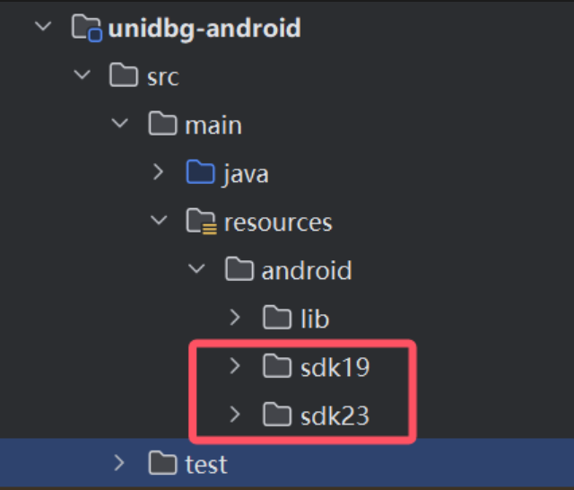
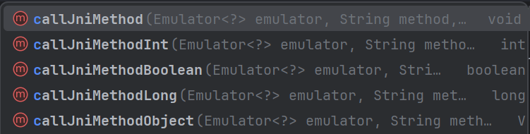
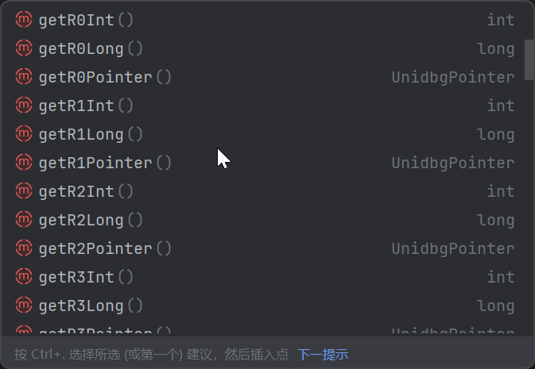
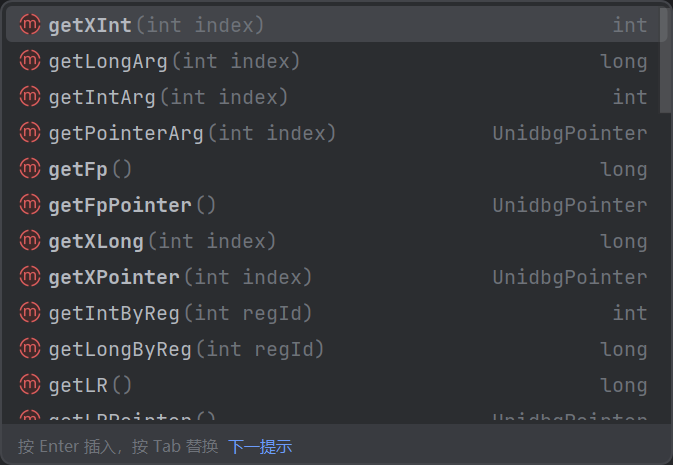

  
# 一、课程目标  
1.了解unicorn与unidbg  
2.源码学习unidbg的常用api  
3.了解unidbg_hook  
4.了解unidbg_patch  
# 二、工具  
  
1.教程Demo  
2.IDEA  
3.IDA  
# 三、课程内容  
  
## 一.unicorn&unidbg  
### 1.什么是unicorn  
  
[开源地址](https://github.com/unicorn-engine/unicorn)  
Unicorn 是一个由新加坡南洋理工大学团队在2015年开源的CPU模拟器框架，它支持多种架构，包括X86/X64/ARM/ARM64/MIPS等。Unicorn 的主要特点是：  
1. **多架构支持**：它能够模拟不同架构的CPU指令，这使得它在跨平台分析和测试中非常有用。  
2. **高性能**：Unicorn 通过使用JIT（Just-In-Time）编译技术，将模拟的指令翻译成宿主机的本地指令，从而提高了执行效率。  
3. **丰富的接口**：Unicorn 提供了多种语言的绑定，包括Python、Java、C#等，使得在不同编程环境中都能方便地使用。  
4. **Hook和拦截功能**：Unicorn 允许用户在模拟执行过程中设置Hook，拦截和处理特定的指令或内存访问，这对于逆向工程和动态分析非常有用。  
5. **专注于CPU模拟**：与一些既模拟CPU又模拟操作系统的模拟器不同，Unicorn 专注于CPU指令的模拟，提供了简单的Hook接口、内存操作接口和指令执行接口，而不涉及操作系统层面的模拟。  
  
### 2.什么是unidbg？  
[开源地址](https://github.com/zhkl0228/unidbg)  
Unidbg(Unicorn Debugger)是一个开源的轻量级模拟器，主要设计用于模拟执行Android平台上的Native代码。它由凯神在2019年开源，基于Maven构建，使用Java语言编写，可以在IDE中打开和运行。Unidbg能够模拟Android Native函数的执行，让逆向工程师和安全研究人员能够分析和理解二进制文件的运行行为。它支持模拟系统调用和JNI调用，使得可以在模拟环境中执行依赖这些调用的代码。Unidbg基于Unicorn项目，Unidbg的优势在于它提供了一种隐蔽的监控手段，可以模拟复杂的Native环境，帮助用户进行深入的动态分析。由于其开源特性，Unidbg得到了社区的广泛支持和持续更新，成为了Android Native逆向分析领域中一个强有力的工具。  
竞争者： [AndroidNativeEmu](https://github.com/AeonLucid/AndroidNativeEmu) 和继任者 [ExAndroidNativeEmu](https://github.com/maiyao1988/ExAndroidNativeEmu)     (Unidbg优点:模拟实现了更多的系统调用和 JNI)  
  
### 3.unidbg的使用场景与优缺点  
  
| 特性        | 描述                                                                                     |  
| --------- | -------------------------------------------------------------------------------------- |  
| **使用场景**  |                                                                                        |  
| 模拟执行      | 执行目标 SO 文件中用户关注的函数，获取与真机等价的结果；替代 Frida/Xposed Call 进行 RPC 调用。                          |  
| 监控观察      | 观察样本对环境的信息获取与修改；监控所有类型的外部信息访问，包括系统调用、库函数、JNI 调用、文件读写等。                                 |  
| 辅助算法分析和还原 | 提供 Hook/Debug/Trace 等分析能力，结合时间旅行调试器(Time-Travel Debugging),无疑是Android Native 上强大的分析神器。 |  
| **优点**    |                                                                                        |  
| 低成本       | 减少设备成本和改机成本，无需购置和维护大量真机或租借云手机。                                                         |  
| 灵活性       | 可以模拟或代理所有函数调用接口，方便模拟设备环境变化。                                                            |  
| 监控能力      | 能够监控 Native 层的详细执行流，包括 JNI 调用和文件访问。                                                    |  
| 分析能力      | 结合时间旅行调试器，提供强大的算法分析和还原能力。                                                              |  
| **缺点**    |                                                                                        |  
| 学习成本高     | 尤其是环境补全（补环境）部分，如果补得不好，即使跑出结果也无法使用。                                                     |  
| 执行速度慢     | 基于 Unicorn 的模拟执行速度相比真机慢很多，尽管有 Dynarmic 等方案可以提高速度，但牺牲了部分辅助算法还原的能力。                      |  
| 功能限制      | 没有为特定场景做专门的优化，也没有提供配置管理功能；没有实现对所有系统调用的良好模拟，可能导致某些逻辑处理失败。                               |  
| 扩展性差      | 作为一个 Java 项目，Unidbg 无法作为 IDA 或 Ghidra 插件，也难以轻松嵌入到其他项目中，不如 Python 项目灵活。                 |  
  
## 二.初试unidbg  
  
### 1.配置资源文件  
1.下载idea  
[社区版下载链接](https://www.jetbrains.com/zh-cn/idea/download/download-thanks.html?platform=windows&code=IIC)  
2.下载源代码，并用idea打开，并配置好sdk  
3.文件结构解析：  
```  
├── README.md                     # 项目介绍和使用指南  
├── LICENSE                       # 开源许可证文件  
├── .gitignore                    # Git 忽略文件配置  
├── pom.xml                       # Maven 配置文件，定义了项目的依赖和构建配置  
├── mvnw                          # 脚本文件，用于 Maven Wrapper (Linux/Mac)  
├── mvnw.cmd                      # 脚本文件，用于 Maven Wrapper (Windows)  
├── test.sh                       # 测试脚本 (Linux/Mac)  
├── test.cmd                      # 测试脚本 (Windows)  
├── .mvn/                         # Maven 配置目录  
│   └── wrapper/                  # Maven Wrapper 相关配置  
├── assets/                       # 存放模拟过程中使用的资源文件  
│   ├── *.dll                     # Windows 动态链接库文件  
│   └── *.so                      # Linux/Android 动态链接库文件  
├── backend/                      # 后端逻辑实现，包含核心模拟功能  
├── unidbg-api/                   # 核心接口和抽象类模块  
│   └── src/                      # API 模块的源代码目录  
├── unidbg-ios/                   # iOS 应用模拟模块  
│   └── src/                      # iOS 模拟模块的源代码目录  
├── unidbg-android/               # Android 应用模拟模块  
│   ├── pom.xml                   # Maven 构建文件  
│   ├── pull.sh                   # 拉取 Android 模拟所需依赖文件的脚本  
│   └── src/                      # unidbg-android 模块的源代码目录  
│       ├── main/  
│       │   ├── java/             # 核心 Java 源代码  
│       │   │   └── com/github/unidbg/  # 包含核心模拟器、文件系统、虚拟机组件  
│       │   │   └── net/fornwall/jelf   # ELF 文件格式解析实现  
│       │   └── resources/        # 资源文件，封装了 JNI 库、Android 系统库等  
│       ├── test/  
│       │   ├── java/             # 单元测试代码  
│       │   ├── native/android/   # 测试 Android 原生库的 C/C++ 源代码  
│       │   └── resources/        # 测试资源文件，包含预编译的二进制文件（log4j.properties这个是日志相关配置，可以对open,syscall这类的系统调用进行trace）  
└── .mvn/                         # Maven Wrapper 相关配置目录  
  
```  
  
```java  
log4j.logger.com.github.unidbg.linux.file=DEBUG //把INFO改成DEBUG  
```  
  
### 2.项目式学习  
```java  
package com.kanxue.test2;  
  
import com.github.unidbg.AndroidEmulator;  
import com.github.unidbg.Module;  
import com.github.unidbg.arm.backend.DynarmicFactory;  
import com.github.unidbg.linux.android.AndroidEmulatorBuilder;  
import com.github.unidbg.linux.android.AndroidResolver;  
import com.github.unidbg.linux.android.dvm.DalvikModule;  
import com.github.unidbg.linux.android.dvm.DvmObject;  
import com.github.unidbg.linux.android.dvm.ProxyDvmObject;  
import com.github.unidbg.linux.android.dvm.VM;  
import com.github.unidbg.memory.Memory;  
  
import java.io.File;  
  
public class MainActivity {  
  
    private final AndroidEmulator emulator; // 定义Android模拟器实例  
    private final VM vm; // 定义Dalvik虚拟机实例  
  
    public MainActivity() {  
        // 创建32位Android模拟器实例，使用Dynarmic后端  
        emulator = AndroidEmulatorBuilder.for32Bit()  
                .addBackendFactory(new DynarmicFactory(true))  
                .build();  
  
        // 获取模拟器的内存管理接口  
        Memory memory = emulator.getMemory();  
        // 设置系统类库  
        LibraryResolver resolver = new AndroidResolver(23);  
        memory.setLibraryResolver(resolver);  
  
        // 创建Dalvik虚拟机实例  
        vm = emulator.createDalvikVM();  
        // 设置是否输出详细的JNI调用日志  
        vm.setVerbose(false);  
  
        // 加载指定路径的SO库文件，不自动调用JNI_OnLoad函数  
        DalvikModule dm = vm.loadLibrary(new File("unidbg-android/src/test/resources/example_binaries/armeabi-v7a/libnative-lib.so"), false);  
        // 手动调用JNI_OnLoad方法  
        dm.callJNI_OnLoad(emulator);  
    }  
  
    public void crack() {  
        // 创建一个vm对象，模拟Java层的对象传递给JNI层  
        DvmObject<?> obj = ProxyDvmObject.createObject(vm, this);  
  
        // 记录开始时间  
        long start = System.currentTimeMillis();  
  
        // 遍历所有可能的三字符组合，尝试破解  
        for (char a : LETTERS) {  
            for (char b : LETTERS) {  
                for (char c : LETTERS) {  
                    String str = "" + a + b + c;  
                    // 调用JNI方法，传入当前组合，判断是否成功  
                    boolean success = obj.callJniMethodBoolean(emulator, "jnitest(Ljava/lang/String;)Z", str);  
                    if (success) {  
                        // 如果成功，输出结果并结束  
                        System.out.println("Found: " + str + ", off=" + (System.currentTimeMillis() - start) + "ms");  
                        return;  
                    }  
                }  
            }  
        }  
    }  
  
    private static final char[] LETTERS = {  
        'A', 'B', 'C', 'D', 'E', 'F', 'G', 'H', 'I', 'J', 'K', 'L', 'M',  
        'N', 'O', 'P', 'Q', 'R', 'S', 'T', 'U', 'V', 'W', 'X', 'Y', 'Z',  
        'a', 'b', 'c', 'd', 'e', 'f', 'g', 'h', 'i', 'j', 'k', 'l', 'm',  
        'n', 'o', 'p', 'q', 'r', 's', 't', 'u', 'v', 'w', 'x', 'y', 'z'  
	}; // 定义字母表  
  
    public static void main(String[] args) {  
	    //记录开始时间  
	    long start = System.currentTimeMillis();  
        // 创建MainActivity实例  
        MainActivity main = new MainActivity();  
        //输出调用结果  
        System.out.println("load offset=" + (System.currentTimeMillis() - start) + "ms");  
        // 调用破解方法  
        main.crack();  
    }  
}  
  
  
```  
  
```java  
emulator = AndroidEmulatorBuilder.for32Bit()  
            .addBackendFactory(new DynarmicFactory(true))  
            .build();  
```  
- 1.for32Bit()的意思是创建32位Android模拟器实例，for64Bit()则是创建64位，apk lib 里只有armeabi-v7a，那就只能选择 32 位，apk lib 里只有arm64-v8a，就选择 64 位。区别：64位的执行速度较快，浮动10%左右；Unidbg 对 ARM32 的支持和完善程度高于 ARM64  
- 2.Unidbg 支持了数个后端，目前共五个 Backend，分别是 Unicorn、Unicorn2、Dynarmic(执行速度较快)、Hypervisor、KVM。new DynarmicFactory(true)中的true，标志着在出现异常时是否使用默认后端unicorn。  
  
```java  
.setRootDir() //设置虚拟机的根目录，可以实现io重定向，例如：app读取/data/data/123.txt，rootDir设置为E:/unidbg，那么真正的目录是E:/unidbg/data/data/123.txt，  
```  
  
#### 1.emulator常用Api  
  
| **方法名**                           | **返回类型**        | **描述**                             |  
|--------------------------------------|---------------------|---------------------------------------|  
| `getMemory()`                        | `Memory`            | 获取内存操作接口。                   |  
| `getPid()`                           | `int`               | 获取进程的 PID。                      |  
| `createDalvikVM()`                   | `VM`                | 创建虚拟机。                         |  
| `createDalvikVM(File apkFile)`       | `VM`                | 创建虚拟机并指定 APK 文件路径。       |  
| `getDalvikVM()`                      | `VM`                | 获取已创建的虚拟机。                 |  
| `showRegs()`                         | `void`              | 显示当前寄存器状态，可指定寄存器。    |  
| `getBackend()`                       | `Backend`           | 获取后端 CPU。                       |  
| `getProcessName()`                   | `String`            | 获取进程名。                         |  
| `getContext()`                       | `RegisterContext`   | 获取寄存器上下文。                   |  
| `traceRead(long begin, long end)`    | `void`              | Trace 读内存操作。                   |  
| `traceWrite(long begin, long end)`   | `void`              | Trace 写内存操作。                   |  
| `traceCode(long begin, long end)`    | `void`              | Trace 汇编指令执行。                 |  
| `isRunning()`                        | `boolean`           | 判断当前 Emulator 是否正在运行。     |  
  
```java  
    LibraryResolver resolver = new AndroidResolver(23);  
    memory.setLibraryResolver(resolver);  
```  
23 和 19 分别对应于 sdk23（Android 6.0） 和 sdk19（Android 4.4）的运行库环境，处理 64 位 SO 时只能选择 SDK23。  
  
#### 2.memory常用Api  
  
| **方法名**                             | **返回类型**                | **描述**                                                                 |  
|----------------------------------------|-----------------------------|---------------------------------------------------------------------------|  
| `setLibraryResolver(AndroidResolver resolver)` | `void`                     | 设置 Android SDK 版本解析器，目前支持 19 和 23 两个版本。                 |  
| `getStackPoint()`                      | `long`                      | 获取当前栈指针的值。                                                     |  
| `pointer(long address)`                | `UnidbgPointer`             | 获取指针，指向指定内存地址，可通过指针操作内存。                         |  
| `getMemoryMap()`                       | `Collection<MemoryMap>`     | 获取当前内存的映射情况。                                                 |  
| `findModule(String moduleName)`        | `Module`                    | 根据模块名获取指定模块。                                                 |  
| `findModuleByAddress(long address)`    | `Module`                    | 根据地址获取指定模块。                                                   |  
| `loadLibrary(File file, boolean forceLoad)` | `ElfModule`               | 加载 SO 文件，会调用 `Linker.do_dlopen()` 方法完成加载。                  |  
| `allocatestack(int size)`              | `UnidbgPointer`             | 在栈上分配指定大小的内存空间。                                           |  
| `writestackstring(String value)`       | `UnidbgPointer`             | 将字符串写入栈内存中。                                                   |  
| `writestackBytes(byte[] value)`        | `UnidbgPointer`             | 将字节数组写入栈内存中。                                                 |  
| `malloc(int size, boolean runtime)`    | `UnidbgPointer`             | 分配指定大小的内存空间，返回指向该内存的指针。                           |  
`vm常用Api`  
```java  
	// 创建Dalvik虚拟机实例  
	vm = emulator.createDalvikVM();  
	// 设置是否输出详细的JNI调用日志  
	vm.setVerbose(false);  
	// 加载指定路径的SO库文件，不自动调用JNI_OnLoad函数  
	DalvikModule dm = vm.loadLibrary(new File("unidbg-android/src/test/resources/example_binaries/armeabi-v7a/libnative-lib.so"), false);  
	// 手动调用JNI_OnLoad方法  
	dm.callJNI_OnLoad(emulator);  
```  
  
  
| **方法名**                                               | **返回类型**            | **描述**                            |  
| ----------------------------------------------------- | ------------------- | --------------------------------- |  
| `createDalvikVM(File apkFile)`                        | `VM`                | 创建虚拟机，指定 APK 文件，file可为空           |  
| `setVerbose(boolean verbose)`                         | `void`              | 设置是否输出 JNI 运行日志。                  |  
| `loadLibrary(File soFile, boolean callInit)`          | `DalvikModule`      | 加载 SO 模块，参数二设置是否自动调用 `init` 函数。   |  
| `setJni(Jni jni)`                                     | `void`              | 设置 JNI 交互接口，推荐实现 `AbstractJni`。   |  
| `getJNIEnv()`                                         | `Pointer`           | 获取 JNIEnv 指针，可作为参数传递。             |  
| `getJavaVM()`                                         | `Pointer`           | 获取 JavaVM 指针，可作为参数传递。             |  
| `callJNI_OnLoad(Emulator<?> emulator, Module module)` | `void`              | 调用 `JNI_OnLoad` 函数。               |  
| `addGlobalObject(DvmObject<?> obj)`                   | `int`               | 向 VM 添加全局对象，返回该对象的 hash 值。        |  
| `addLocalObject(DvmObject<?> obj)`                    | `int`               | 向 VM 添加局部对象，返回该对象的 hash 值。        |  
| `getObject(int hash)`                                 | `DvmObject<?>`      | 根据 hash 值获取虚拟机中的对象。               |  
| `resolveClass(String className)`                      | `DvmClass`          | 解析指定类名，构建并返回一个 `DvmClass` 对象。     |  
| `getPackageName()`                                    | `String`            | 获取 APK 包名。                        |  
| `getVersionName()`                                    | `String`            | 获取 APK 版本名称。                      |  
| `getVersionCode()`                                    | `String`            | 获取 APK 版本号。                       |  
| `openAsset(String assetName)`                         | `InputStream`       | 打开 APK 中的指定资源文件。                  |  
| `getManifestXml()`                                    | `String`            | 获取 `AndroidManifest.xml` 文件的文本内容。 |  
| `getSignatures()`                                     | `CertificateMeta[]` | 获取 APK 签名信息。                      |  
| `findClass(String className)`                         | `DvmClass`          | 通过类名获取已经加载的类（`DvmClass` 对象）。      |  
| `getEmulator()`                                       | `Emulator<?>`       | 获取模拟器对象 `emulator`。               |  
- 1.`VM dalvikVM = emulator.createDalvikVM(new File("apk file path"))`-创建虚拟机并指定APK文件，加载指定APK文件，unidbg可以帮我们完成一些小操作，例如：解析 Apk 基本信息，Apk 的版本名、版本号、包名、 Apk 签名等信息，减少补环境操作；解析和管理 Apk 资源文件，加载 Apk 后可以通过 `openAsset`获取 APK `assets`目录下的文件。  
- 2.`loadLibrary`三个重载方法  
```java  
/**  
 * 加载指定名称的库文件。  
 * @param libname 库文件的名称，不包括前缀 "lib" 和后缀 ".so"（例如 "example" 对应 "libexample.so"）。  
 * @param forceCallInit 是否强制调用库的初始化函数（如 JNI_OnLoad）。  
 * @return 加载后的 DalvikModule 对象，封装了加载的库模块。  
 */  
DalvikModule loadLibrary(String libname, boolean forceCallInit);  
  
/**  
 * 从原始字节数组中加载指定的库文件。  
 * @param libname 库文件的名称，仅用于标识该库，与文件路径无关。  
 * @param 传入buffer方便解析elf  
 */  
DalvikModule loadLibrary(String libname, byte[] raw, boolean forceCallInit);  
  
/**  
 * 从指定路径的加载ELF。  
 * @param elfFile 表示库的 ELF 文件，必须是有效的 ELF 格式文件。例如:new File("unidbg-android/src/test/resources/example_binaries/armeabi-v7a/libnative-lib.so")  
 * @param forceCallInit 是否强制调用库的初始化函数（如 JNI_OnLoad）。  
 */  
DalvikModule loadLibrary(File elfFile, boolean forceCallInit);  
  
```  
  
#### 3.jni函数的调用  
  
```java  
//第一个参数传入模拟器实例  
//第二个参数传入要调用的函数在java层方法签名信息  
//第三个参数传入可变参数列表，这里的参数在旧版本有很多需要自己封装，新版则帮我们封装好了，详细看callJniMethod方法  
boolean success = obj.callJniMethodBoolean(emulator, "jnitest(Ljava/lang/String;)Z", str);  
  
/**  
 * 调用 JNI 方法的辅助函数。  
 *  
 * @param emulator   模拟器实例。  
 * @param vm         Dalvik 虚拟机实例。  
 * @param objectType 调用方法的类（DvmClass）。  
 * @param thisObj    方法调用的对象实例（DvmObject）。  
 * @param method     要调用的方法签名（例如 "methodName(参数类型)返回类型"）。  
 * @param args       方法的可变参数列表。  
 * @return           方法执行后的返回值（Number 类型），可能是整数或浮点数。  
 */  
protected static Number callJniMethod(Emulator<?> emulator, VM vm, DvmClass objectType, DvmObject<?> thisObj, String method, Object... args) {  
    // 查找对应的本地函数指针（Native 方法）  
    UnidbgPointer fnPtr = objectType.findNativeFunction(emulator, method);  
    // 将当前对象添加到本地引用表，防止被垃圾回收  
    vm.addLocalObject(thisObj);  
    // 创建用于存放函数参数的列表，初始容量为10  
    List<Object> list = new ArrayList<>(10);  
    // 添加 JNI 环境指针（JNIEnv*）  
    list.add(vm.getJNIEnv());  
    // 添加 this 对象的引用（jobject）  
    list.add(thisObj.hashCode());  
    // 处理传入的参数列表  
    if (args != null) {  
        for (Object arg : args) {  
            if (arg instanceof Boolean) {  
                // 如果参数是布尔值，转换为 JNI_TRUE 或 JNI_FALSE  
                list.add((Boolean) arg ? VM.JNI_TRUE : VM.JNI_FALSE);  
                continue;  
            } else if (arg instanceof Hashable) {  
                // 如果参数实现了 Hashable 接口，表示是 DvmObject 或其子类  
                list.add(arg.hashCode()); // 添加对象引用（jobject）  
                if (arg instanceof DvmObject) {  
                    // 将 DvmObject 对象添加到本地引用表  
                    vm.addLocalObject((DvmObject<?>) arg);  
                }  
                continue;  
            } else if (arg instanceof DvmAwareObject ||  
                    arg instanceof String ||  
                    arg instanceof byte[] ||  
                    arg instanceof short[] ||  
                    arg instanceof int[] ||  
                    arg instanceof float[] ||  
                    arg instanceof double[] ||  
                    arg instanceof Enum) {  
                // 如果参数是 DvmAwareObject、字符串、数组或枚举等类型  
                // 创建一个代理 DvmObject 对象  
                DvmObject<?> obj = ProxyDvmObject.createObject(vm, arg);  
                // 添加对象引用（jobject）  
                list.add(obj.hashCode());  
                // 将对象添加到本地引用表  
                vm.addLocalObject(obj);  
                continue;  
            }  
  
            // 对于其他类型的参数，直接添加到参数列表  
            list.add(arg);  
        }  
    }  
    // 调用本地函数，传入参数列表，并返回结果  
    return Module.emulateFunction(emulator, fnPtr.peer, list.toArray());  
}  
  
```  
基本类型直接传递，int、long、boolean、double 等。  
- 下面几种对象类型unidbg也帮我们封装好了  
- String  
- byte 数组  
- short 数组  
- int 数组  
- float 数组  
- double 数组  
- Enum 枚举类型  
#### 4.特殊参数构造  
对于其他数据类型需要借助`resolveClass`构造，例如`Context`  
```java  
DvmObject<?> context = vm.resolveClass("android/content/Context").newObject(null);  
```  
  
#### 5.符号调用与偏移调用  
`符号调用`  
```java  
Symbol symbol = module.findSymbolByName("导出符号");  
if (symbol != null){  
	//第一个模拟器实例，第二个jnienv，第三个jclass，第四个可变参数  
    Number numbers = symbol.call(emulator, vm.getJNIEnv(), vm.addLocalObject(实例类), 可变参数);  
    int result = numbers.intValue();  
    System.out.println(result);  
    //如果返回值是string，可以通过vm.getObject(retval)获取  
    System.out.println(vm.getObject(result).getValue());  
}else {  
    System.out.println("符号未找到");  
}  
```  
`偏移调用`  
```java  
//第一个模拟器实例，第二个偏移地址(thumb记得+1)，第三个jnienv，第四个jclass，第五个可变参数  
Number number = module.callFunction(emulator, 0x11240, vm.getJNIEnv(),vm.addLocalObject(SecurityUtils),vm.addLocalObject(new StringObject(vm, "超级")));  
DvmObject<?> object = vm.getObject(number.intValue());  
System.out.println("result:" + object.getValue());  
```  
### 3.unidbg之hook  
| **类别**                       | **描述**                                                                                 | **优点**                                                                               | **缺点**                                                                                                   |  
| ---------------------------- | -------------------------------------------------------------------------------------- | ------------------------------------------------------------------------------------ | -------------------------------------------------------------------------------------------------------- |  
| **内置的第三方 Hook 框架**           | 包括 Dobby（前身为 HookZz）、Whale 和 xHook 等。HookZz对于32位支持较好，Dobby64位，XHook不能Hook Sub_xxx 子函数。 | - **功能丰富**：支持多种 Hook 方式，如 Inline Hook 和 PLT Hook。<br>- **易于使用**：提供简洁的 API 接口，便于快速上手。 | - **可能被检测**：某些应用可能检测到这些 Hook 框架的存在。<br>- **局限性**：Inline Hook 在短函数或相邻地址的函数中可能出现问题；PLT Hook 无法 Hook 非导出函数。 |  
| **基于 Unicorn 引擎的原生 Hook 功能** | 利用 Unicorn 引擎实现的指令级Hook，块级Hook，内存读写Hook，异常Hook等功能，Unidbg 在此基础上还封装了 Console Debugger。   | - **隐蔽性强**：原生 Hook 方式更难被应用检测到。<br>- **灵活性高**：可对任意代码位置进行 Hook，无特定限制。                  | - **使用复杂度较高**：需要深入理解底层机制，配置相对复杂。                                                                         |  
  
#### 1.HookZz&Dobby  
```java  
// 获取 HookZz 实例，用于后续的 Hook 操作  
IHookZz hookZz = HookZz.getInstance(emulator);  
// 使用 HookZz 的 wrap 方法对导出函数 "ss_encrypt" 进行 Inline Hook  
hookZz.wrap(module.findSymbolByName("ss_encrypt"), new WrapCallback<RegisterContext>() {  
    @Override  
    public void preCall(Emulator<?> emulator, RegisterContext ctx, HookEntryInfo info) {  
        // 在函数调用前执行的操作  
        // 获取第三个参数的指针  
        Pointer pointer = ctx.getPointerArg(2);  
        // 获取第四个参数的整数值  
        int length = ctx.getIntArg(3);  
        // 读取指针指向的内存内容，获取密钥数据  
        byte[] key = pointer.getByteArray(0, length);  
        // 使用 Inspector 工具输出密钥内容，便于调试和分析  
        Inspector.inspect(key, "ss_encrypt key");  
    }  
  
    @Override  
    public void postCall(Emulator<?> emulator, RegisterContext ctx, HookEntryInfo info) {  
        // 在函数调用后执行的操作  
        // 输出函数返回值的值  
        System.out.println("ss_encrypt.postCall R0=" + ctx.getLongArg(0));  
    }  
});  
```  
**1.获取 HookZz 实例**：  
```java  
IHookZz hookZz = HookZz.getInstance(emulator);  
```  
**2.wrap_hook函数**：  
```java  
hookZz.wrap(functionAddress, new WrapCallback<RegisterContext>() {  
    @Override  
    public void preCall(Emulator<?> emulator, RegisterContext context, HookEntryInfo info) {  
        // 函数调用前的操作  
        UnidbgPointer input = ctx.getPointerArg(2);  
		System.out.println("preCall:"+vm.getObject(input.toIntPeer()));  
  
    }  
  
    @Override  
    public void postCall(Emulator<?> emulator, RegisterContext context, HookEntryInfo info) {  
        // 函数调用后的操作  
        //获取整数型的返回值  
        System.out.println("postCall:" + ctx.getLongArg(0));  
        //获取jstr  
		UnidbgPointer input = ctx.getPointerArg(0);  
		System.out.println("postCall:"+vm.getObject(input.toIntPeer()));  
    }  
});  
```  
`wrap`函数有两个重载，一个基于符号寻址，一个基于地址寻址，本质没区别，符号寻址的最终也是会调用`symbol.getAddress()`  
参数里的WrapCallback的泛型接口有三个`RegisterContext(函数 Hook)`、`HookZzArm32RegisterContext(针对ARM32位)`和`HookZzArm64RegisterContext(针对ARM64位)`因为可以访问某个寄存器的值，所以适用于inline hook  
  
而在`HookZzArm64RegisterContext`中则是通过以下的方法去获取对应的寄存器的值  
  
**3.instrument_inline_hook函数**  
```java  
// 使用 HookZz 的 instrument 方法对特定地址的指令进行 Inline Hook, thumb记得+1  
hookZz.instrument(module.base + 0x11470, new InstrumentCallback<Arm64RegisterContext>() {  
    @Override  
    public void dbiCall(Emulator<?> emulator, Arm64RegisterContext ctx, HookEntryInfo info) {  
	    // 在指定指令执行时触发的操作  
        // 输出 W0 寄存器的值  
        System.out.println("W0=" + ctx.getXInt(0));  
    }  
});  
```  
**4.replace替换函数***  
```java  
// 使用 dobby 的 replace 方法替换 "Java_com_zj_wuaipojie_util_SecurityUtil_diamondNum" 函数的实现  
Dobby dobby = Dobby.getInstance(emulator);  
dobby.replace(module.findSymbolByName("Java_com_zj_wuaipojie_util_SecurityUtil_diamondNum"), new ReplaceCallback() { // 使用Dobby inline hook导出函数  
    @Override  
    public HookStatus onCall(Emulator<?> emulator, HookContext context, long originFunction) {  
		//替换整数型  
        return HookStatus.LR(emulator,888888);  
        //字符串  
        return HookStatus.LR(emulator, vm.addLocalObject(new StringObject(vm, "超级")));  
    }  
});  
  
```  
  
#### 2.Unicorn_Hook  
```java  
emulator.getBackend().hook_add_new(new CodeHook() {  
    @Override  
    public void hook(Backend backend, long address, int size, Object user) {  
        Arm64RegisterContext context = emulator.getContext();  
        if (address == module.base + 0x11330) {  
            int x0=emulator.getBackend().reg_read(Arm64Const.UC_ARM64_REG_X0).intValue();  
            System.out.println("x0:"+vm.getObject(x0));  
            emulator.getBackend().reg_write(Arm64Const.UC_ARM64_REG_X0,vm.addLocalObject(new StringObject(vm, "超级")));  
        }  
    }  
    @Override  
    public void onAttach(UnHook unHook) {  
    }  
    @Override  
    public void detach() {  
    }  
}, module.base + 0x11240,module.base + 0x11340,null);  
StringObject Result = SecurityUtils.callStaticJniMethodObject(emulator, "vipLevel(Ljava/lang/String;)Ljava/lang/String;", "123");  
System.out.println("Result: " + Result.getValue());  
```  
#### 3.Console Debugge  
Console Debugger（控制台调试器）是 Unidbg 提供的一个强大工具，允许用户在模拟执行过程中设置断点、单步调试、查看和修改内存及寄存器等操作，从而深入分析目标程序的行为。  
```java  
Debugger attach = emulator.attach();  
attach.addBreakPoint(module.base + 0x11070); //下断地址  
//调用  
Number number = module.callFunction(emulator, 0x11014, vm.getJNIEnv(),vm.addLocalObject(SecurityUtils),vm.addLocalObject(new StringObject(vm, "123456")));  
System.out.println("result:" + number.intValue());  
```  
  
`替换返回值`  
```java  
emulator.attach().addBreakPoint(module.findSymbolByName("verifyApkSign").getAddress(), new BreakPointCallback() {  
        @Override  
        public boolean onHit(Emulator<?> emulator, long address) {  
            System.out.println("替换函数 verifyApkSign");  
            RegisterContext registerContext = emulator.getContext();  
            emulator.getBackend().reg_write(ArmConst.UC_ARM_REG_PC, registerContext.getLRPointer().peer);  
            emulator.getBackend().reg_write(ArmConst.UC_ARM_REG_R0, 0);  
            return true;  
        }  
    });  
  
```  
  
| 命令                                              | 功能说明                            |     |  
| ----------------------------------------------- | ------------------------------- | --- |  
| `c`                                             | 继续执行程序                          |     |  
| `n`                                             | 跨过当前指令                          |     |  
| `bt`                                            | 回溯堆栈                            |     |  
| `st hex`                                        | 搜索堆栈                            |     |  
| `shw hex`                                       | 搜索可写堆                           |     |  
| `shr hex`                                       | 搜索可读堆                           |     |  
| `shx-hex`                                       | 搜索可执行堆                          |     |  
| `nb`                                            | 在下一个区块中断                        |     |  
| `s`                                             | 步入当前指令                          |     |  
| `s [decimal]`                                   | 执行指定数量的指令                       |     |  
| `s (blx)`                                       | 执行直到 `blx` 助记符（性能较低）            |     |  
| `m (op) [size]`                                 | 显示内存，默认大小为 `0x70`，大小可为十六进制或十进制  |     |  
| `mr0-mr7, mfp, mip, msp [size]`                 | 显示指定寄存器的内存                      |     |  
| `m (address) [size]`                            | 显示指定地址的内存，地址需以 `0x` 开头          |     |  
| `wr0-wr7, wfp, wip, wsp <value>`                | 写入指定寄存器                         |     |  
| `wb(address), ws(address), wi(address) <value>` | 写入指定地址的（字节、短、整数）内存，地址需以 `0x` 开头 |     |  
| `wx (address) <hex>`                            | 将字节写入指定地址的内存，地址需以 `0x` 开头       |     |  
| `b (address)`                                   | 添加临时断点，地址需以 `0x` 开头，可为模块偏移量     |     |  
| `b`                                             | 添加寄存器 `PC` 的断点                  |     |  
| `r`                                             | 删除寄存器 `PC` 的断点                  |     |  
| `blr`                                           | 添加寄存器 `LR` 的临时断点                |     |  
| `p (assembly)`                                  | 在 PC 地址修补汇编指令                   |     |  
| `where`                                         | 显示 Java 堆栈跟踪                    |     |  
| `trace [begin-end]`                             | 设置指令跟踪                          |     |  
| `traceRead [begin-end]`                         | 设置内存读取跟踪                        |     |  
| `traceWrite [begin-end]`                        | 设置内存写入跟踪                        |     |  
| `vm`                                            | 查看已加载的模块                        |     |  
| `vbs`                                           | 查看断点                            |     |  
| `d`                                             | 显示反汇编代码                         |     |  
| `d (0x)`                                        | 在指定地址显示反汇编代码                    |     |  
| `stop`                                          | 停止模拟                            |     |  
| `run [arg]`                                     | 运行测试                            |     |  
| `gc`                                            | 运行 `System.gc()`                |     |  
| `threads`                                       | 显示线程列表                          |     |  
| `cc size`                                       | 将地址范围的汇编代码转为 C 函数               |     |  
  
### 4.unidbg之patch  
Patch 就是直接对二进制文件进行修改，Patch本质上只有两种形式  
- patch 二进制文件  
- 在内存里 patch  
Patch的应用场景很多，在一些场景比Hook更好用，这就是需要介绍它的原因。Patch 二进制文件的形式是大多数人所熟悉的，在IDA中使用KeyPatch打补丁的体验很友好。这里主要介绍unidbg的内存Patch。  
`借助Keystone 汇编引擎`  
```java  
UnidbgPointer pointer = UnidbgPointer.pointer(emulator,module.base + 0x1146C);  
//在进行 Patch 操作前，需确保已正确定位目标函数的地址和指令集类型（如 ARM 或 Thumb）  
//如果是32位的，代码如下：Keystone keystone = new Keystone(KeystoneArchitecture.Arm, KeystoneMode.ArmThumb);  
Keystone keystone = new Keystone(KeystoneArchitecture.Arm64, KeystoneMode.LittleEndian);  
String s = "MOV W0, #0x99";  //具体要修改的汇编指令  
byte[] machineCode = keystone.assemble(s).getMachineCode();   //转换为机器码  
pointer.write(machineCode); //写入内存  
  
```  
  
  
  
  
# 四、请作者喝杯咖啡  
  
  
# 六、视频及课件地址  
  
  
[百度云](https://pan.baidu.com/s/1cFWTLn14jeWfpXxlx3syYw?pwd=nqu9)  
[阿里云](https://www.aliyundrive.com/s/TJoKMK6du6x)  
[哔哩哔哩](https://www.bilibili.com/video/BV1wT411N7sV/?spm_id_from=333.788&vd_source=6dde16dc6479f00694baaf73a2225452)  
[教程开源地址](https://github.com/ZJ595/AndroidReverse)  
PS:解压密码都是52pj，阿里云由于不能分享压缩包，所以下载exe文件，双击自解压  
  
# 七、其他章节  
[《安卓逆向这档事》一、模拟器环境搭建](https://www.52pojie.cn/thread-1695141-1-1.html)  
[《安卓逆向这档事》二、初识APK文件结构、双开、汉化、基础修改](https://www.52pojie.cn/thread-1695796-1-1.html)  
[《安卓逆向这档事》三、初识smail，vip终结者](https://www.52pojie.cn/thread-1701353-1-1.html)  
[《安卓逆向这档事》四、恭喜你获得广告&弹窗静默卡](https://www.52pojie.cn/thread-1706691-1-1.html)  
[《安卓逆向这档事》五、1000-7=？&动态调试&Log插桩](https://www.52pojie.cn/thread-1714727-1-1.html)  
[《安卓逆向这档事》六、校验的N次方-签名校验对抗、PM代{过}{滤}理、IO重定向](https://www.52pojie.cn/thread-1731181-1-1.html)  
[《安卓逆向这档事》七、Sorry，会Hook真的可以为所欲为-Xposed快速上手(上)模块编写,常用Api](https://www.52pojie.cn/thread-1740944-1-1.html)  
[《安卓逆向这档事》八、Sorry，会Hook真的可以为所欲为-xposed快速上手(下)快速hook](https://www.52pojie.cn/thread-1748081-1-1.html)  
[《安卓逆向这档事》九、密码学基础、算法自吐、非标准加密对抗](https://www.52pojie.cn/thread-1762225-1-1.html)  
[《安卓逆向这档事》十、不是我说，有了IDA还要什么女朋友？](https://www.52pojie.cn/thread-1787667-1-1.html)  
[《安卓逆向这档事》十二、大佬帮我分析一下](https://www.52pojie.cn/thread-1809646-1-1.html)  
[《安卓逆向这档事》番外实战篇1-某电影视全家桶](https://www.52pojie.cn/thread-1814917-1-1.html)  
[《安卓逆向这档事》十三、是时候学习一下Frida一把梭了(上)](https://www.52pojie.cn/thread-1823118-1-1.html)  
[《安卓逆向这档事》十四、是时候学习一下Frida一把梭了(中)](https://www.52pojie.cn/thread-1838539-1-1.html)  
[《安卓逆向这档事》十五、是时候学习一下Frida一把梭了(下)](https://www.52pojie.cn/thread-1840174-1-1.html)  
[《安卓逆向这档事》十六、是时候学习一下Frida一把梭了(终)](https://www.52pojie.cn/thread-1859820-1-1.html)  
[《安卓逆向这档事》十七、你的RPCvs佬的RPC](https://www.52pojie.cn/thread-1892127-1-1.html#/)  
[《安卓逆向这档事》番外实战篇2-【2024春节】解题领红包活动，启动!](https://www.52pojie.cn/thread-1893708-1-1.html#/)  
[《安卓逆向这档事》十八、表哥，你也不想你的Frida被检测吧!(上)](https://www.52pojie.cn/thread-1921073-1-1.html)  
[《安卓逆向这档事》十九、表哥，你也不想你的Frida被检测吧!(下)](https://www.52pojie.cn/thread-1938862-1-1.html)  
[《安卓逆向这档事》二十、抓包学得好，牢饭吃得饱(上)](https://www.52pojie.cn/thread-1945285-1-1.html)  
[《安卓逆向这档事》番外实战篇3-拨云见日之浅谈Flutter逆向](https://www.52pojie.cn/thread-1951619-1-1.html)  
[《安卓逆向这档事》第二十一课、抓包学得好，牢饭吃得饱(中)](https://www.52pojie.cn/thread-1967845-1-1.html)  
  
# 八、参考文档  
[白龙unidbg教程](https://blog.csdn.net/qq_38851536/category_11102404.html)  
[凯神博客](https://kkkkkkkem.gitbook.io/ni-xiang-xue-xi-bi-ji/shi-yong-gong-ju/3.-unidbg/3.1-unidbg-de-ji-ben-jie-shao)  
[app逆向](https://blog.csdn.net/weixin_74178589/article/details/140778060?ops_request_misc=%257B%2522request%255Fid%2522%253A%252234A4DE6C-B96F-49FE-AC98-E5655001E380%2522%252C%2522scm%2522%253A%252220140713.130102334..%2522%257D&request_id=34A4DE6C-B96F-49FE-AC98-E5655001E380&biz_id=0&utm_medium=distribute.pc_search_result.none-task-blog-2~blog~sobaiduend~default-2-140778060-null-null.nonecase&utm_term=unidbg&spm=1018.2226.3001.4450)  
[【转载】Unidbg Hook 大全](https://blog.seeflower.dev/archives/67/)  
  
