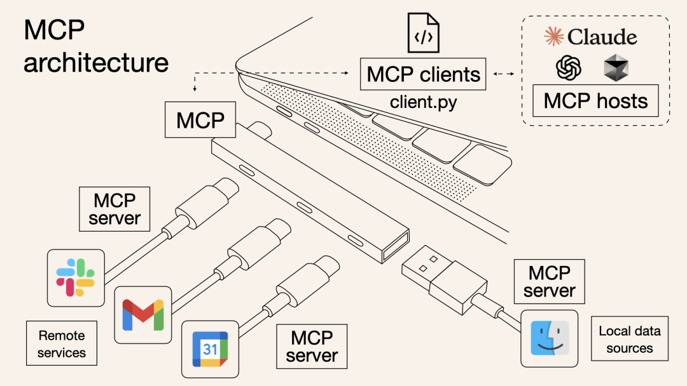
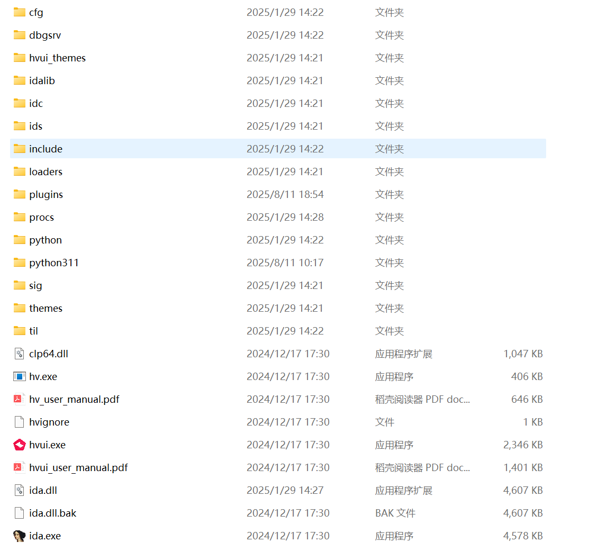
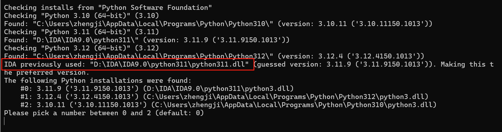
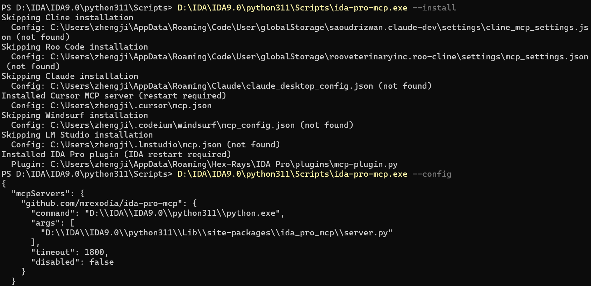
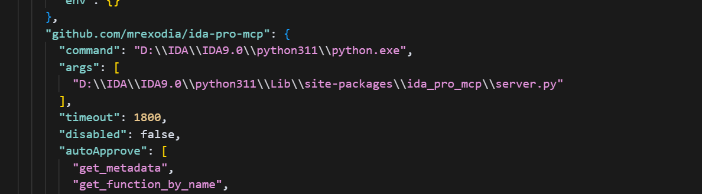
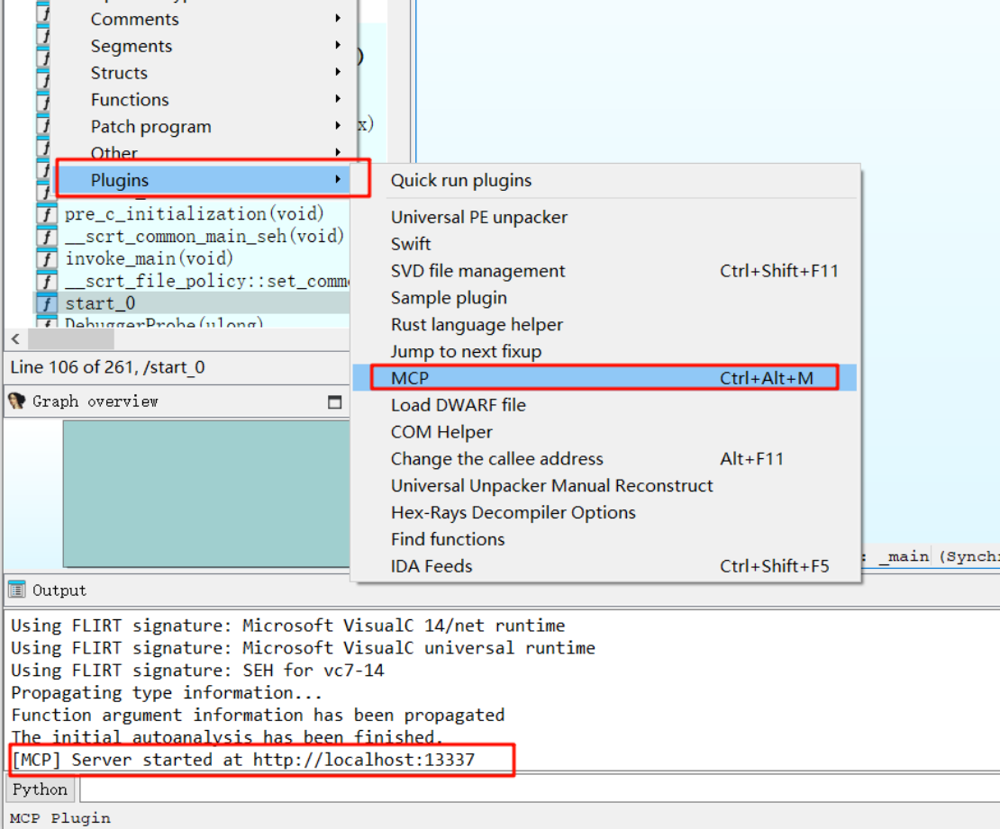
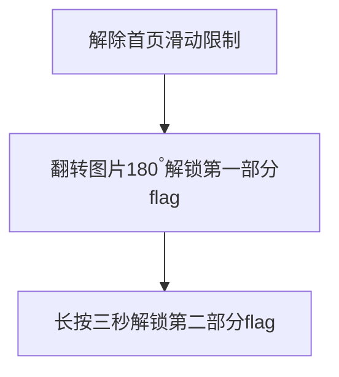

  
# 一、课程目标  
1.了解unidbg_trace，精准控制追踪，提升逆向分析效率  
2.配置 mcp 服务，利用AI辅助逆向，加速关键算法分析  
3.unidbg 之补 jni，模拟各类Java层调用  
  
  
# 二、工具  
1.教程Demo  
2.IDEA  
3.IDA  
4.Cursor  
# 三、课程内容  
  
## 一.Unidbg_Trace  
### 1.Trace 的分类  
  
|**Trace 类型**|**描述**|  
|---|---|  
|**函数 Trace**|包括无差别的函数 Trace、导出函数 Trace、库函数 Trace、系统调用 Trace 等，用于分析算法执行流、应对 OLLVM 混淆与动态跳转。|  
|**基本块 Trace**|也叫 Block Trace，用于控制流分析与反混淆。|  
|**汇编 Trace**|包括指令级 Trace、特定指令 Trace 等，尤其适用于分析自定义算法、花指令；它也是最重要的 Trace 类型，基于它可实现其他类型 Trace。|  
### 2.Unidbg Trace 的优劣  
  
| **维度**   | **表现**                                                                                                                                                                                             |  
| -------- | -------------------------------------------------------------------------------------------------------------------------------------------------------------------------------------------------- |  
| **易用性**  | 必须掌握 Unidbg 的使用，但一旦会用，就能得到目标函数完整执行的 Trace。开启指令追踪十分简单，只需 `emulator.traceCode(begin, end)` 一句码。  <br>对比：Frida Stalker、IDA Instruction trace 的启动更复杂。                                                  |  
| **效率**   | 速度中等：测试环境下约可达 **40w 行执行流/分钟**（2400w/小时）。  <br>简单样本约 10 分钟即可完成 Trace，中等样本则需 2 小时，复杂、混淆严重的样本可能长达 12 小时甚至更多。  <br>与 **IDA  trace** 相比快很多，但比 **Stalker** 等动态重编译方慢。  <br>实际速度会因范围过滤等处理而折减至理论值的 1/4 或更低。 |  
| **稳定性**  | 稳定性好：基于 Unicorn，引发崩溃或异常 Trace 的情况较少。  <br>对比：IDA Trace 容易中断或导致应用崩溃，Stalker 对某些指令支持有 Bug。                                                                                                           |  
| **兼容性**  | 支持 **ARM32** 与 **ARM64**。<br>比多数指令追踪方案（如 Stalker 不完全支持 ARM32）更全面。  <br>相比 IDA Trace 对 X86、MIPS 等架构的支持仍有不足。                                                                                         |  
| **展示效果** | 信息维度丰富：包括时间、绝对地址、模块、相对偏移、机器码、汇编代码、执行前后寄存器变化等。  <br>信息处理也很出色，细节优化多。                                                                                                                                 |  
### 3.Trace实例  
  
**1. 基础用法**  
在调用目标函数前，只需简单地调用 `emulator.traceCode()` 即可开启对后续所有指令的追踪。  
```java  
// 在调用目标函数前开启指令追踪  
emulator.traceCode();  
boolean result = security.callStaticJniMethodBoolean(emulator, "check", "123456");  
```  
**2. 约束追踪范围**  
通常我们只关心目标 SO 的执行流，而非 libc 等系统库的内部执行。`traceCode` 的重载方法 `traceCode(long begin, long end)` 允许我们精确设定追踪的内存地址范围。  
```java  
// 获取目标模块对象  
Module module = dm.getModule();  
// 仅追踪目标模块地址范围内的指令  
emulator.traceCode(module.base, module.base + module.size);  
// 注意：第二个参数是结束地址，不是长度！这是一个常见误区。  
```  
**3. 精确控制追踪时机**  
  * **追踪 JNI\_OnLoad**: 将 `traceCode` 放在 `dm.callJNI_OnLoad(emulator)` 之前。  
  * **追踪初始化函数 (init\_array)**: `JNI_OnLoad` 之前还有初始化函数。要追踪它们，需要在加载模块的第一时间开启 Trace。最佳实践是使用 `ModuleListener`。  
```java  
memory.addModuleListener(new ModuleListener() {  
    @Override  
    public void onLoaded(Emulator<?> emulator, Module module) {  
        // 当我们关心的模块被加载时，立即开启trace  
        if("lib52pojie.so".equals(module.name)){  
            emulator.traceCode(module.base, module.base + module.size);  
        }  
    }  
});  
// 这之后再加载模块  
DalvikModule dm = vm.loadLibrary(new File("unidbg-android/src/test/java/com/zj/wuaipojie/util/lib52pojie.so"), true);  
```  
**4. 预估追踪耗时**  
等待一个未知的 Trace 过程是痛苦的。我们可以通过一个轻量级的 `CodeHook` 快速统计指令总数，从而预估总耗时。这基本不含反汇编和寄存器打印的开销，所以速度极快。  
```java  
private long instructionCount = 0; // 用于指令计数  
emulator.getBackend().hook_add_new(new CodeHook() {  
    @Override  
    public void hook(Backend backend, long address, int size, Object user) {  
        instructionCount++;  
    }  
    @Override  
    public void onAttach(UnHook unHook) {}  
    @Override  
    public void detach() {}  
}, module.base, module.base + module.size, null);  
System.out.println("总共执行ARM指令数: " + test.instructionCount);  
```  
**PS:**：在较好的测试条件下，unidbg 每分钟约可追踪 40 万行执行流。你可以根据统计出的总行数来判断是泡杯咖啡等几分钟，还是需要去睡一觉等几个小时。  
**5. 限定特定函数**  
结合断点，可以实现对单个函数内部的精确追踪。  
  * **场景一：只关心某次特定调用**  
    在函数调用指令处下断点开启 Trace，在调用指令的下一条指令处下断点关闭 Trace。  
```java  
long callAddr = module.base + 0xE53C; // 假设这是BL指令的地址  
final TraceHook[] traceHook = new TraceHook[1];  
// 在调用处开启追踪  
emulator.attach().addBreakPoint(callAddr, new BreakPointCallback() {  
    @Override  
    public boolean onHit(Emulator<?> emulator, long address) {  
        traceHook[0] = emulator.traceCode(module.base, module.base + module.size);  
        return true;  
    }  
});  
// 在调用返回后关闭追踪  
emulator.attach().addBreakPoint(callAddr + 4, new BreakPointCallback() {  
    @Override  
    public boolean onHit(Emulator<?> emulator, long address) {  
        if (traceHook[0] != null) {  
            traceHook[0].stopTrace();  
        }  
        return true;  
    }  
});  
```  
  
 **6.函数调用追踪 (`debugger.traceFunctionCall`) 详解**  
`traceFunctionCall` 是 unidbg 0.9.6 版本后新增的强大功能，用于追踪函数粒度的调用关系，对理清高层逻辑和对抗 OLLVM 等混淆有奇效。  
**1. 基础用法**  
它属于 `Debugger` 的一部分，使用时需要先 `attach()` 到模拟器。  
```java  
// 获取调试器实例  
Debugger debugger = emulator.attach();  
// 追踪目标模块内的所有函数调用  
debugger.traceFunctionCall(module, new FunctionCallListener() {  
    @Override  
    public void onCall(Emulator<?> emulator, long callerAddress, long functionAddress) {  
        // 函数调用前（相当于Frida onEnter）  
        System.out.println("onCall: " + UnidbgPointer.pointer(emulator, callerAddress) + " -> " + UnidbgPointer.pointer(emulator, functionAddress));  
    }  
    @Override  
    public void postCall(Emulator<?> emulator, long callerAddress, long functionAddress, Number[] args) {  
        // 函数调用后（相当于Frida onLeave）  
        // 注意：这里的args是寄存器R0-R7(x0-x7)的值，不完全等同于函数参数  
    }  
});  
```  
**2. 构建函数调用树**  
通过获取栈回溯深度，我们可以格式化输出，形成一个清晰的函数调用树，这对于分析复杂的调用逻辑极其有用。  
首先修改一下源码，路径：unidbg-api\src\main\java\com\github\unidbg\unwind  
添加以下方法：  
```java  
/**  
 * 将给定的内存地址格式化为包含详细信息、可读的字符串。  
 * 这个方法会尝试解析地址，并提供尽可能多的上下文信息，如模块名、函数名（符号）、偏移量等。  
 *  
 * @param address 要格式化的绝对内存地址。  
 * @return 一个包含地址详细信息的格式化字符串。  
 */  
public String formatAddressDetails(long address) {  
    // 1. 尝试根据地址查找其所属的模块（例如，一个 .so 文件）。  
    Module module = emulator.getMemory().findModuleByAddress(address);  
  
    // 2. 如果地址位于一个已加载的模块内：  
    if (module != null) {  
        // 2.1. 在模块中查找离该地址最近的符号（即函数或全局变量的名称）。  
        //      `true` 参数表示也查找非导出的内部符号。  
        Symbol symbol = module.findClosestSymbolByAddress(address, true);  
  
        // 2.2. 如果找到了一个符号：  
        if (symbol != null) {  
            // 2.2.1. 创建一个 demangler 实例，用于将 C++ "mangled"（混淆）的符号名还原为可读的函数签名。  
            GccDemangler demangler = DemanglerFactory.createDemangler();  
            // 2.2.2. 对符号名进行 demangle 操作。  
            String demangledName = demangler.demangle(symbol.getName());  
            // 2.2.3. 计算当前地址相对于符号起始地址的偏移量。  
            long offset = address - symbol.getAddress();  
            // 2.2.4. 返回最详细的格式化字符串，例如："[libnative.so] JNI_OnLoad + 0x10 (at 0x...)"  
            return String.format("[%s] %s + 0x%x (at 0x%x)", module.name, demangledName, offset, address);  
        } else {  
            // 2.3. 如果在模块内但没有找到具体的符号，则将其视为一个未命名的子程序（subroutine）。  
            //      计算地址相对于模块基地址的偏移量。  
            long offset = address - module.base;  
            // 2.3.1. 返回一个通用的子程序格式，例如："[libnative.so] sub_c80 (at 0x...)"  
            return String.format("[%s] sub_%x (at 0x%x)", module.name, offset, address);  
        }  
    }  
  
    // 3. 如果地址不属于任何模块，则尝试查找它是否位于一个已知的内存区域中（例如，栈或堆）。  
    MemRegion region = emulator.getSvcMemory().findRegion(address);  
    if (region != null) {  
        // 3.1. 如果找到了，返回区域名称，例如："[stack] (at 0x...)"  
        return String.format("[%s] (at 0x%x)", region.getName(), address);  
    }  
  
    // 4. 如果以上所有尝试都失败了，返回一个表示“未知”的通用格式。  
    return String.format("[unknown] (at 0x%x)", address);  
}  
  
```  
调用实例:  
```java  
Debugger debugger = emulator.attach();  
System.out.println("函数调用关系追踪器已附加，结果将输出到日志文件。");  
debugger.traceFunctionCall(null, new FunctionCallListener() {  
    private int depth = 0;  
    private String getPrefix(int currentDepth) {  
        if (currentDepth <= 0) {  
            return "";  
        }  
        StringBuilder sb = new StringBuilder();  
        for (int i = 0; i < currentDepth - 1; i++) {  
            sb.append("│  ");  
        }  
        sb.append("├─ ");  
        return sb.toString();  
    }  
    @Override  
    public void onCall(Emulator<?> emulator, long callerAddress, long functionAddress) {  
        String prefix = getPrefix(depth + 1);  
        String details = emulator.getUnwinder().formatAddressDetails(functionAddress);  
        traceStream.printf("%sCALL -> %s%n", prefix, details);  
        depth++;  
    }  
    @Override  
    public void postCall(Emulator<?> emulator, long callerAddress, long functionAddress, Number[] args) {  
        depth--;  
        String prefix = getPrefix(depth + 1);  
        String details = emulator.getUnwinder().formatAddressDetails(functionAddress);  
        Backend backend = emulator.getBackend();  
        Number retVal = emulator.is64Bit() ? backend.reg_read(Arm64Const.UC_ARM64_REG_X0) : backend.reg_read(ArmConst.UC_ARM_REG_R0);  
        long retValLong = retVal.longValue();  
        // 尝试将返回值作为指针解析  
        String retValFormatted = String.format("0x%x", retValLong);  
        UnidbgPointer pointer = UnidbgPointer.pointer(emulator, retValLong);  
        if (pointer != null) {  
            String cstring = safeReadCString(pointer);  
            // 如果是一个可打印的字符串，则附加到日志中  
            if (isPrintable(cstring)) {  
                retValFormatted += String.format(" -> \"%s\"", cstring);  
            }  
        }  
        traceStream.printf("%sRET  <- %s, ret=%s%n", prefix, details, retValFormatted);  
    }  
});  
```  
  
完整代码:  
```java  
package com.example.ndkdemo;  
  
import com.github.unidbg.*;  
import com.github.unidbg.arm.backend.Backend;  
import com.github.unidbg.arm.backend.CodeHook;  
import com.github.unidbg.arm.backend.UnHook;  
import com.github.unidbg.arm.backend.Unicorn2Factory;  
import com.github.unidbg.arm.context.Arm64RegisterContext;  
import com.github.unidbg.debugger.BreakPointCallback;  
import com.github.unidbg.debugger.Debugger;  
import com.github.unidbg.debugger.FunctionCallListener;  
import com.github.unidbg.linux.android.AndroidEmulatorBuilder;  
import com.github.unidbg.linux.android.AndroidResolver;  
import com.github.unidbg.linux.android.dvm.DalvikModule;  
import com.github.unidbg.linux.android.dvm.DvmClass;  
import com.github.unidbg.linux.android.dvm.VM;  
import com.github.unidbg.memory.Memory;  
import com.github.unidbg.pointer.UnidbgPointer;  
import unicorn.Arm64Const;  
import unicorn.ArmConst;  
  
import java.io.*;  
  
public class MainActivity {  
    private final AndroidEmulator emulator;  
    private final VM vm;  
    private final Module module;  
    private final DvmClass security;  
    private final boolean logging;  
    private long instructionCount = 0; // 用于指令计数  
  
    MainActivity(boolean logging) {  
        this.logging = logging;  
  
        // 1. 创建模拟器实例  
        emulator = AndroidEmulatorBuilder.for64Bit()  
                .setProcessName("com.example.ndkdemo")  
                .addBackendFactory(new Unicorn2Factory(true))  
                .build();  
  
        // 2. 设置内存和系统库解析  
        final Memory memory = emulator.getMemory();  
        memory.setLibraryResolver(new AndroidResolver(23));  
  
        // 3. 创建Dalvik虚拟机并加载SO文件  
        vm = emulator.createDalvikVM();  
        vm.setVerbose(logging);  
        DalvikModule dm = vm.loadLibrary(new File("unidbg-android/src/test/java/com/zj/wuaipojie/util/libndkdemo.so"), false);  
        dm.callJNI_OnLoad(emulator);  
        module = dm.getModule();  
  
        // 4. 获取DVM类  
        security = vm.resolveClass("com/example/ndkdemo/MainActivity");  
  
        // 5. 设置指令计数钩子 (可选)  
        emulator.getBackend().hook_add_new(new CodeHook() {  
            @Override  
            public void hook(Backend backend, long address, int size, Object user) {  
                instructionCount++;  
            }  
            @Override  
            public void onAttach(UnHook unHook) {}  
            @Override  
            public void detach() {}  
        }, module.base, module.base + module.size, null);  
  
  
        // 6.设置函数追踪与x0寄存器检查  
        attachTraceAndInspectX0(module.base + 0x15F8);  
    }  
  
    /**  
     * 【模块化功能】: 附加一个函数调用追踪器 (traceFunctionCall)。  
     * 此功能会监听所有的函数调用，并以树状结构打印出调用关系。  
     * @param traceStream 日志输出流  
     */  
    public void attachFunctionCallTracer(final PrintStream traceStream) {  
        Debugger debugger = emulator.attach();  
        System.out.println("函数调用关系追踪器已附加，结果将输出到日志文件。");  
  
        debugger.traceFunctionCall(null, new FunctionCallListener() {  
            private int depth = 0;  
  
            private String getPrefix(int currentDepth) {  
                if (currentDepth <= 0) {  
                    return "";  
                }  
                StringBuilder sb = new StringBuilder();  
                for (int i = 0; i < currentDepth - 1; i++) {  
                    sb.append("│  ");  
                }  
                sb.append("├─ ");  
                return sb.toString();  
            }  
  
            @Override  
            public void onCall(Emulator<?> emulator, long callerAddress, long functionAddress) {  
                String prefix = getPrefix(depth + 1);  
                String details = emulator.getUnwinder().formatAddressDetails(functionAddress);  
                traceStream.printf("%sCALL -> %s%n", prefix, details);  
                depth++;  
            }  
  
            @Override  
            public void postCall(Emulator<?> emulator, long callerAddress, long functionAddress, Number[] args) {  
                depth--;  
                String prefix = getPrefix(depth + 1);  
                String details = emulator.getUnwinder().formatAddressDetails(functionAddress);  
  
                Backend backend = emulator.getBackend();  
                Number retVal = emulator.is64Bit() ? backend.reg_read(Arm64Const.UC_ARM64_REG_X0) : backend.reg_read(ArmConst.UC_ARM_REG_R0);  
                long retValLong = retVal.longValue();  
  
                // 尝试将返回值作为指针解析  
                String retValFormatted = String.format("0x%x", retValLong);  
                UnidbgPointer pointer = UnidbgPointer.pointer(emulator, retValLong);  
                if (pointer != null) {  
                    String cstring = safeReadCString(pointer);  
                    // 如果是一个可打印的字符串，则附加到日志中  
                    if (isPrintable(cstring)) {  
                        retValFormatted += String.format(" -> \"%s\"", cstring);  
                    }  
                }  
  
                traceStream.printf("%sRET  <- %s, ret=%s%n", prefix, details, retValFormatted);  
            }  
        });  
    }  
  
    /**  
     * 在指定地址设置断点，实现对一个函数调用的追踪，并在函数返回后检查 x0 寄存器的内容。  
     *  
     * @param callAddress 函数调用指令（例如 BL, B）的绝对地址  
     */  
    private void attachTraceAndInspectX0(long callAddress) {  
        final TraceHook[] traceHook = new TraceHook[1];  
  
        emulator.attach().addBreakPoint(callAddress, (emu, address) -> {  
            traceHook[0] = emu.traceCode(module.base, module.base + module.size);  
            return true;  
        });  
  
        long returnAddress = callAddress + 4;  
        emulator.attach().addBreakPoint(returnAddress, new BreakPointCallback() {  
            @Override  
            public boolean onHit(Emulator<?> emu, long address) {  
                if (traceHook[0] != null) {  
                    traceHook[0].stopTrace();  
                    System.out.println();  
                }  
  
                Arm64RegisterContext ctx = emu.getContext();  
                long x0 = ctx.getXLong(0);  
                System.out.printf("[+] 检查地址: 0x%x, x0寄存器值: 0x%x\n", address, x0);  
  
                UnidbgPointer pointer = UnidbgPointer.pointer(emu, x0);  
                if (pointer == null) {  
                    System.out.println("[-] x0的值不是一个有效的指针或指向未映射的内存");  
                    return true;  
                }  
  
                String cstring = safeReadCString(pointer);  
                if (cstring != null && isPrintable(cstring)) {  
                    System.out.println("[+] x0指向的字符串: " + cstring);  
                } else {  
                    System.out.println("[-] x0指向的内容不是一个可打印的字符串");  
                }  
  
                int dumpSize = 256;  
                byte[] data = pointer.getByteArray(0, dumpSize);  
                System.out.println("[+] x0指向内存的HexDump (前" + dumpSize + "字节):");  
                System.out.println(prettyHexDump(data, x0));  
                System.out.println("--- x0寄存器检查结束 ---\n");  
  
                return true;  
            }  
        });  
    }  
  
    private static String safeReadCString(UnidbgPointer p) {  
        try {  
            return p.getString(0);  
        } catch (Exception e) {  
            return null;  
        }  
    }  
  
    private static boolean isPrintable(String s) {  
        if (s == null || s.isEmpty()) {  
            return false;  
        }  
        int printableChars = 0;  
        for (int i = 0; i < s.length(); i++) {  
            char c = s.charAt(i);  
            if ((c >= 32 && c <= 126) || Character.isWhitespace(c)) {  
                printableChars++;  
            }  
        }  
        return s.length() >= 2 && (double) printableChars / s.length() > 0.8;  
    }  
  
    private static String prettyHexDump(byte[] data, long baseAddr) {  
        StringBuilder sb = new StringBuilder();  
        for (int i = 0; i < data.length; i += 16) {  
            sb.append(String.format("%016x: ", baseAddr + i));  
            StringBuilder hexPart = new StringBuilder();  
            StringBuilder asciiPart = new StringBuilder();  
            for (int j = 0; j < 16; j++) {  
                if (i + j < data.length) {  
                    byte b = data[i + j];  
                    hexPart.append(String.format("%02x ", b));  
                    char c = (b >= 32 && b <= 126) ? (char) b : '.';  
                    asciiPart.append(c);  
                } else {  
                    hexPart.append("   ");  
                }  
                if (j == 7) {  
                    hexPart.append(" ");  
                }  
            }  
            sb.append(hexPart).append(" |").append(asciiPart).append("|\n");  
        }  
        return sb.toString();  
    }  
  
    private void crack() {  
        emulator.traceCode();  
        boolean result = security.callStaticJniMethodBoolean(emulator, "check", "1234567");  
        System.out.println("函数调用结束，返回结果: " + result);  
    }  
  
    void destroy() {  
        try {  
            emulator.close();  
            if (logging) {  
                System.out.println("模拟器已成功关闭");  
            }  
        } catch (IOException e) {  
            e.printStackTrace();  
        }  
    }  
  
    public static void main(String[] args) {  
        MainActivity test = new MainActivity(false);  
        String traceFile = "unidbg-android/src/test/resources/traceFunctions.txt";  
        try (PrintStream traceStream = new PrintStream(new FileOutputStream(traceFile), true)) {  
            // 在调用 crack 之前附加追踪器，持久化日志  
            test.attachFunctionCallTracer(traceStream);  
            // 执行会触发函数调用的模拟代码  
            test.crack();  
        } catch (IOException e) {  
            e.printStackTrace();  
        } finally {  
            // 确保模拟器资源被释放  
            test.destroy();  
            System.out.println("总共执行ARM指令数: " + test.instructionCount);  
        }  
    }  
}  
```  
  
## 二. Mcp 配置  
`MCP概念:`  
MCP（Model Context Protocol，模型上下文协议）是什么？  
**MCP是一种标准化协议，旨在为人工智能模型（如大语言模型）与外部工具、数据源之间的交互提供统一接口。(为 AI 装上了手脚)**  
MCP是AI智能体与外部工具的"USB接口"，定义了AI模型与外部工具（如API、数据库、文档编辑器等）的交互标准，开发者无需为每个工具单独开发适配代码。  
MCP协议旨在实现大型语言模型（LLM）与外部数据源和工具之间的无缝集成，通过提供标准化的接口，使AI应用程序能够安全、可控地与本地或远程资源进行交互。  
  
  
[项目地址](https://github.com/mrexodia/ida-pro-mcp)  
要求:  
1.IDA Pro 8.3 以上，最好是 9  
2.python3.11 或更高版本，使用`idapyswitch`切换到Python 版本  
3.支持 Mcp 的客户端，这里以 Cursor 为例  
  
`环境配置:`  
```  
pip install git+https://github.com/mrexodia/ida-pro-mcp  
```  
Ps: 如果你现有的 python 版本低于十一，可以单独下载一个版本然后安装到 ida 的目录下  
  
接着打开 `idapyswitch` 切换 3.11 的版本  
  
然后 cmd 窗口打开新安装的 python.exe 再运行 pip 命令  
```  
D:\IDA\IDA9.0\python311\python.exe -m pip install --upgrade git+https://github.com/mrexodia/ida-pro-mcp  
```  
接下来，再运行命令：  
```  
ida-pro-mcp --install  
```  
这步如果报错，可以打开 11 版本 python 目录下的 Scripts 文件夹，找到 ida-pro-mcp.exe  
Cmd 窗口运行：  
```  
这里需要你自己拖动exe文件到cmd窗口  
D:\IDA\IDA9.0\python311\Scripts\ida-pro-mcp.exe --install  
```  
最后运行：  
```  
ida-pro-mcp --config  
报错则运行下面这个:  
D:\IDA\IDA9.0\python311\Scripts\ida-pro-mcp.exe --config  
```  
  
接下来打开 cursor，发现 ida_pro_mcp 已经亮绿灯了，说明 mcp 服务正常了。如果没有你就复制 ida-pro-mcp --config 输出的那串 json 到 mcp.json  
  
  
最后在 IDA 中将 server 端开启即可。  
  
  
## 三.Unidbg补环境  
`定义:`  
“Unidbg 补环境”是指在使用 Unidbg 模拟执行 Android 原生 (Native) 代码时，为了使程序能够正常运行并获得与真实设备一致的结果，对 Unidbg 模拟器**环境中的缺失或不完善部分进行补充和调整**的过程  
  
### 一. 补 Jni 环境  
  
#### 一、 JNI 补环境的核心概念  
JNI (Java Native Interface) 补环境是 Unidbg 应用中的核心环节。当 Unidbg 模拟执行的原生库（. So 文件）尝试通过 JNI 调用 Java 层的代码时，Unidbg 必须能够提供这些 Java 方法的模拟实现。如果 Unidbg 缺少某个方法的实现，或者默认实现不符合预期，程序就会抛出 `UnsupportedOperationException` 异常，导致模拟中断。因此，JNI 补环境的目的就是拦截这些 JNI 调用，并提供一个符合目标 SO 文件逻辑预期的返回值或行为，从而“欺骗”SO 文件，使其认为自己运行在真实的 Android 环境中。(本质就是缺啥补啥)  
#### 二、 Java 层函数补全：继承 `AbstractJni`  
这是最主要的 Java 层补环境方式。通过创建一个继承自`com.github.unidbg.linux.android.dvm.AbstractJni` 的自定义类，并重写其关键方法，可以模拟任意 JNI 调用。  
**具体步骤：**  
1. **extends AbstractJni**：  
    ```java  
    public class ChallengeTenUnidbg extends AbstractJni {  
    }  
    ```  
2. **关联 Jni 类与虚拟机 (VM)** ：  
    - 在创建了 `DalvikVM` 实例后，将 AbstractJni的实例设置给它。  
    - **强烈建议开启详细日志** (`vm.setVerbose(true)`)，这会在控制台打印出所有 JNI 调用的详细信息（包括方法签名），是定位哪个方法需要补全的关键。  
    ```java  
    VM vm = emulator.createDalvikVM();  
    vm.setJni(this);  
    vm.setVerbose(true); // 开启详细日志  
    ```  
3. **重写关键方法以拦截 JNI 调用**：  
    - 根据 SO 文件调用的 Java 方法类型（静态/实例、返回类型），重写 `AbstractJni` 中对应的方法。  
    - **方法命名规律**：`call[Static]XXXMethodV`，其中 `Static` 表示静态方法，`XXX` 表示返回类型（如 `Object`, `Boolean`, `Int`, `Void` 等）。  
    - **核心参数**：  
        - `signature`: 完整的方法签名字符串，如 `"com/example/MyClass->getAppContext()Landroid/content/Context;"`，用于 `switch` 或 `if` 判断具体是哪个方法被调用。  
        - `vaList`: 包含了调用时传递的所有参数。  
  
| JNI 原型                            | `AbstractJni` 覆写方法                 | 典型用途                          |  
| --------------------------------- | ---------------------------------- | ----------------------------- |  
| `jobject CallStaticObjectMethodV` | `callStaticObjectMethodV`          | 返回 `Context`, `Application` 等 |  
| `jint CallIntMethodV`             | `callIntMethodV`                   | 返回版本号、随机数                     |  
| `jobject NewObjectV`              | `newObjectV`                       | 构造 `ZipFile`, `Cipher`        |  
| `void Set<Object>Field`           | `setObjectField` 等                 | SO 写回 Java 字段                 |  
| `jint RegisterNatives`            | `invokeRegisterNatives`            | 动态注册补环境                       |  
| `jint NewGlobalRef`               | `newGlobalRef` / `deleteGlobalRef` | 线程间对象共享                       |  
  
4. **方法实现示例**：  
  
    - **模拟静态方法 (`callStaticObjectMethodV`)** ：  
        ```java  
        @Override  
        public DvmObject<?> callStaticObjectMethodV(BaseVM vm, DvmClass dvmClass, String signature, VaList vaList) {  
            switch (signature) {  
                case "com/example/MyClass->getAppContext()Landroid/content/Context;":  
                    // 返回一个模拟的 Context 对象  
                    return vm.resolveClass("android/content/Context").newObject(null);  
                // 可以添加更多 case 来处理其他需要补全的 Java 方法  
                default:  
                    // 对于未处理的方法，务必调用父类的默认实现  
                    return super.callStaticObjectMethodV(vm, dvmClass, signature, vaList);  
            }  
        }  
        ```  
    - **模拟构造方法 (`newObjectV`)** ：  
        ```java  
        @Override  
public DvmObject<?> newObjectV(BaseVM vm, DvmClass dvmClass, String signature, VaList vaList) {  
    switch (signature) {  
        case "java/util/HashMap-><init>()V": {  
            return ProxyDvmObject.createObject(vm, new HashMap<>());  
        }  
  
        case "com/zj/wuaipojie/ui/ChallengeTen$UserInfo-><init>(Ljava/lang/String;Ljava/lang/String;JLjava/lang/String;Lcom/zj/wuaipojie/ui/ChallengeTen$AccountStatus;Ljava/util/Map;)V": {  
            System.out.println("【补环境 Level 3】拦截到 UserInfo 构造方法");  
            Map<String, DvmObject<?>> userInfoData = new HashMap<>();  
            userInfoData.put("status", vaList.getObjectArg(4));  
            userInfoData.put("properties", vaList.getObjectArg(5));  
            return dvmClass.newObject(userInfoData);  
        }  
    }  
    return super.newObjectV(vm, dvmClass, signature, vaList);  
}  
        ```  
    - **模拟字段访问 (`Get/Set<Type>Field`)** ：  
```java  
@Override  
public DvmObject<?> getStaticObjectField(BaseVM vm, DvmClass dvmClass, String signature) {  
    // 匹配枚举类的 PREMIUM 静态字段  
    if ("com/zj/wuaipojie/ui/ChallengeTen$AccountStatus->PREMIUM:Lcom/zj/wuaipojie/ui/ChallengeTen$AccountStatus;".equals(signature)) {  
        System.out.println("【补环境】拦截到获取 AccountStatus.PREMIUM 静态字段");  
        // 创建一个枚举实例（用字符串"PREMIUM"作为其值，方便后续name()方法返回正确结果）  
        DvmObject<?> premium = dvmClass.newObject("PREMIUM");  
        return premium;  
    }  
    return super.getStaticObjectField(vm, dvmClass, signature);  
}  
  
@Override  
public void setIntField(BaseVM vm, DvmObject<?> dvmObject, String signature, int value) {  
    // signature的格式是：com/example/User->age:I  
    if ("com/example/User->age:I".equals(signature)) {  
        System.out.println("SO 正在设置 User 对象的 age 字段，值为: " + value);  
        // 你可以在这里记录值，或者什么都不做  
        return; // 注意set方法是void返回  
    }  
    super.setIntField(vm, dvmObject, signature, value);  
}  
```  
5. **处理不同类型的对象**：  
    - **Android 特有类** (如 `Context`, `Application`): 使用 `vm.resolveClass(className).newObject(value)` 创建模拟对象。  
    - **JDK 标准库类** (如 `HashMap`): 使用 `ProxyDvmObject.createObject(vm, realJavaObject)` 来包装一个真实的 Java 对象进行模拟。这在处理集合类（如 `Map`）时非常有用。  
	- 对于 JNI 来说，继承和多态是非常重要的概念。当 Native 代码通过一个父类或接口的引用来调用子类实例的方法时（例如通过 `Map` 引用调用 `HashMap` 实例的 `put` 方法），JNI 的运行时必须能够顺着继承链向上查找，才能找到正确的方法定义和 ID。  
  
  
#### 三、处理复杂 JNI 数据结构  
处理复杂的数据结构（如结构体、数组）是 JNI 补环境的难点和重点。  
**1. 数组 `byte[]`、`String[]`、 `int[]`**  
- 在加密、解密等协议分析场景中非常常见。  
- Unidbg 的 `DvmObject` 和 `ArrayObject` 类可以帮助在 Java 的数组 和 Native 层的内存指针之间进行转换。  
```java  
@Override  
public DvmObject<?> callStaticObjectMethodV(BaseVM vm, DvmClass dvmClass, String signature, VaList vaList) {  
    if ("com/example/Utils->getSignKeys()[Ljava/lang/String;".equals(signature)) {  
        // 伪造的Key列表  
        StringObject key1 = new StringObject(vm, "key_alpha");  
        StringObject key2 = new StringObject(vm, "key_beta");  
        // 创建一个包含这些DvmObject的ArrayObject  
        return new ArrayObject(key1, key2);  
    }  
    return super.callStaticObjectMethodV(vm, dvmClass, signature, vaList);  
}  
```  
**2.结构体 (Struct)**  
- **通过 `jobject` 传递**：如果 Java 层有一个类与 C/C++ 结构体对应，Native 代码会通过 JNI 的 `Get/Set<Type>Field` 系列函数访问字段。在 Unidbg 中，需要模拟这些 JNI 调用，使用`DvmObject` 提供的 `setValue` 和 `getValue` 方法来操作模拟对象的字段。  
- **通过指针传递**：Native 函数有时直接接收或返回一个指向结构体内存的指针（通常是 `long` 类型）。  
    - **补全逻辑**：  
        1. 使用`emulator.getMemory().malloc(size, true)` 在 Unidbg 的模拟内存中分配空间。  
        2. 使用返回的`UnidbgPointer` 对象，通过 `pointer.setInt(offset, value)`、`pointer.setString(offset, value)` 等方法填充结构体的各个成员。  
        3. 将这个指针的地址（一个`long` 值）返回给调用方。  
**3.`Map` 等集合对象**  
- 在 JNI 调用时，可以通过`ProxyDvmObject.createObject(vm, realJavaMap)` 将一个真实的 Java `HashMap` 对象包装成 `DvmObject` 传给 Native 层 。  
- 当 Native 代码通过 JNI 调用`Map.get`、`Map.keySet` 等方法时，Unidbg 会拦截到这些调用。你需要在自定义的 `AbstractJni` 子类中实现这些方法的逻辑，直接操作那个真实的 `realJavaMap` 对象来返回正确的值。  
  
# 四. 小结  
在本次课程中，我们系统性地学习了 Unidbg 逆向分析中的两项核心技术和 mcp 的配置与辅助分析：  
1. **`unidbg_trace` 精准追踪技术**：我们掌握了如何运用指令与函数追踪，对目标算法的执行流程进行深度分析，从而有效应对代码混淆与动态跳转等复杂场景。  
2. **MCP 服务与 AI 辅助分析**：通过配置 MCP 服务，我们实现了逆向工具与人工智能模型的联动。这项技术代表了逆向工程领域的发展方向，能够显著加速对复杂算法的理解与重构，从而提升分析效率。  
3. **Unidbg 的 JNI 环境补全**：我们深入探讨了 JNI 补环境的原理与实践，掌握了通过继承 `AbstractJni` 模拟 Java 层调用的关键方法。这是确保原生库在 Unidbg 中稳定运行的技术基础，也是高级应用场景中必须具备的核心能力。  
  
  
本节完整代码：  
  
```java  
package com.zj.wuaipojie.util;  
  
import com.github.unidbg.AndroidEmulator;  
import com.github.unidbg.Module;  
import com.github.unidbg.linux.android.AndroidEmulatorBuilder;  
import com.github.unidbg.linux.android.AndroidResolver;  
import com.github.unidbg.linux.android.dvm.*;  
import com.github.unidbg.linux.android.dvm.jni.ProxyDvmObject;  
import com.github.unidbg.memory.Memory;  
  
import java.io.File;  
import java.io.FileNotFoundException;  
import java.util.HashMap;  
import java.util.Map;  
  
import com.github.unidbg.linux.android.dvm.DvmClass;  
import com.github.unidbg.linux.android.dvm.DvmObject;  
  
public class ChallengeTenOne extends AbstractJni {  
  
    private final AndroidEmulator emulator;  
    private final VM vm;  
    private final Module module;  
  
    public ChallengeTenOne() {  
        emulator = AndroidEmulatorBuilder.for64Bit().build();  
        final Memory memory = emulator.getMemory();  
        memory.setLibraryResolver(new AndroidResolver(23));  
        vm = emulator.createDalvikVM();  
        vm.setJni(this);  
        vm.setVerbose(true);  
  
        File soFile = new File("unidbg-android/src/test/java/com/zj/wuaipojie/util/lib52pojie.so");  
        DalvikModule dm = vm.loadLibrary(soFile, true);  
        module = dm.getModule();  
        dm.callJNI_OnLoad(emulator);  
    }  
  
    public void callUnidbgLevel1() {  
        System.out.println("====== 开始执行 unidbg_level1 函数 ======");  
        DvmClass securityUtilClass = vm.resolveClass("com/zj/wuaipojie/util/SecurityUtil");  
        DvmObject<?> configObject = vm.resolveClass("com/zj/wuaipojie/util/SecurityUtil$Config").newObject(null);  
        //注册Map和HashMap，并声明二者的关系  
        DvmClass mapClass=vm.resolveClass("java/util/Map");  
        DvmClass hashMapClass= vm.resolveClass("java/util/HashMap",mapClass);  
        StringObject result = securityUtilClass.callStaticJniMethodObject(emulator,  
                "unidbg_level1(Lcom/zj/wuaipojie/util/SecurityUtil$Config;)Ljava/lang/String;",  
                configObject);  
        System.out.println("====== 函数执行完毕 ======");  
        System.out.println("JNI 函数返回结果: " + result);  
  
    }  
  
    public static void main(String[] args) throws FileNotFoundException {  
        ChallengeTenOne challenge = new ChallengeTenOne();  
        challenge.callUnidbgLevel1();  
    }  
  
    /**  
     * 拦截静态方法调用 (对应 C++ 关卡 1)  
     */  
    @Override  
    public DvmObject<?> callStaticObjectMethodV(BaseVM vm, DvmClass dvmClass, String signature, VaList vaList) {  
        if ("com/zj/wuaipojie/ui/ChallengeTen->getLevel1Key()Ljava/lang/String;".equals(signature)) {  
            System.out.println("【补环境 Level 1】拦截到静态方法调用: " + signature);  
            // C++ 代码期望得到 "InitialKey_From_Kotlin"  
            return new StringObject(vm, "InitialKey_From_Kotlin");  
        }  
        return super.callStaticObjectMethodV(vm, dvmClass, signature, vaList);  
    }  
  
    /**  
     * 拦截实例字段读取 (对应 C++ 关卡 2 和 4)  
     */  
    @Override  
    public DvmObject<?> getObjectField(BaseVM vm, DvmObject<?> dvmObject, String signature) {  
        switch (signature) {  
            case "com/zj/wuaipojie/util/SecurityUtil$Config->deviceId:Ljava/lang/String;": {  
                System.out.println("【补环境 Level 2】拦截到获取实例字段: " + signature);  
                // C++ 代码期望得到 "unidbg_patched_device"  
                return new StringObject(vm, "unidbg_patched_device");  
            }  
            // 将 UserInfo 的字段处理逻辑合并，使其更优雅和可扩展  
            case "com/zj/wuaipojie/ui/ChallengeTen$UserInfo->status:Lcom/zj/wuaipojie/ui/ChallengeTen$AccountStatus;":  
            case "com/zj/wuaipojie/ui/ChallengeTen$UserInfo->properties:Ljava/util/Map;": {  
                // 这是我们为 UserInfo 对象设计的核心：从其后端存储 (一个Map) 中获取字段  
                Map<String, DvmObject<?>> userInfoData = (Map<String, DvmObject<?>>) dvmObject.getValue();  
  
                // 从签名中动态解析字段名 ("status" 或 "properties")  
                String fieldName = signature.substring(signature.indexOf("->") + 2, signature.indexOf(":"));  
                System.out.println("【补环境 Level 4】获取 UserInfo." + fieldName + " 字段 (从内部Map中)");  
  
                return userInfoData.get(fieldName);  
            }  
        }  
        return super.getObjectField(vm, dvmObject, signature);  
    }  
  
    /**  
     * 拦截静态对象字段获取（对应 C++ 中获取 AccountStatus.PREMIUM 枚举实例）  
     */  
    @Override  
    public DvmObject<?> getStaticObjectField(BaseVM vm, DvmClass dvmClass, String signature) {  
        // 匹配枚举类的 PREMIUM 静态字段  
        if ("com/zj/wuaipojie/ui/ChallengeTen$AccountStatus->PREMIUM:Lcom/zj/wuaipojie/ui/ChallengeTen$AccountStatus;".equals(signature)) {  
            System.out.println("【补环境】拦截到获取 AccountStatus.PREMIUM 静态字段");  
            // 创建一个枚举实例（用字符串"PREMIUM"作为其值，方便后续name()方法返回正确结果）  
            DvmObject<?> premium = dvmClass.newObject("PREMIUM");  
            return premium;  
        }  
        return super.getStaticObjectField(vm, dvmClass, signature);  
    }  
  
    /**  
     * 拦截对象创建 (对应 C++ 关卡 3 中 new HashMap 和 new UserInfo)  
     */  
    @Override  
    public DvmObject<?> newObjectV(BaseVM vm, DvmClass dvmClass, String signature, VaList vaList) {  
        switch (signature) {  
            case "java/util/HashMap-><init>()V": {  
                return ProxyDvmObject.createObject(vm, new HashMap<>());  
            }  
  
            case "com/zj/wuaipojie/ui/ChallengeTen$UserInfo-><init>(Ljava/lang/String;Ljava/lang/String;JLjava/lang/String;Lcom/zj/wuaipojie/ui/ChallengeTen$AccountStatus;Ljava/util/Map;)V": {  
                System.out.println("【补环境 Level 3】拦截到 UserInfo 构造方法");  
                Map<String, DvmObject<?>> userInfoData = new HashMap<>();  
                userInfoData.put("status", vaList.getObjectArg(4));  
                userInfoData.put("properties", vaList.getObjectArg(5));  
                return dvmClass.newObject(userInfoData);  
            }  
        }  
        return super.newObjectV(vm, dvmClass, signature, vaList);  
    }  
  
    /**  
     * 拦截实例方法调用 (对应 C++ 关卡 3 和 4 中 map.put/get 和 status.name)  
     */  
    @Override  
    public DvmObject<?> callObjectMethodV(BaseVM vm, DvmObject<?> dvmObject, String signature, VaList vaList) {  
  
        switch (signature) {  
            // 处理自定义Map的put方法  
            case "java/util/Map->put(Ljava/lang/Object;Ljava/lang/Object;)Ljava/lang/Object;":{  
                Map map = (Map) dvmObject.getValue();  
                Object key = vaList.getObjectArg(0).getValue();  
                Object value = vaList.getObjectArg(1).getValue();  
                return ProxyDvmObject.createObject(vm, map.put(key, value));  
            }  
  
            case "java/util/Map->get(Ljava/lang/Object;)Ljava/lang/Object;": {  
                Map map = (Map) dvmObject.getValue();  
                Object key = vaList.getObjectArg(0).getValue();  
                Object val = map.get(key);  
                return ProxyDvmObject.createObject(vm, val);  
            }  
  
            // 处理 AccountStatus.name()  
            case "com/zj/wuaipojie/ui/ChallengeTen$AccountStatus->name()Ljava/lang/String;": {  
                System.out.println("【补环境 Level 4】拦截到 AccountStatus.name() 调用");  
                return new StringObject(vm, dvmObject.getValue().toString());  
            }  
        }  
        return super.callObjectMethodV(vm, dvmObject, signature, vaList);  
    }  
  
  
  
}  
  
```  
  
  
## 四.新春解题  
### 1.初级题  
```kotlin  
viewPager2.setUserInputEnabled(false); //viewPager2 api禁止用户滑动，改成true  
```  
  
`触发关键函数`  
```kotlin  
public boolean onScroll(MotionEvent e1, MotionEvent e2, float distanceX, float distanceY) {  
    long j;  
    int i;  
    int i2;  
    int i3;  
    float f;  
    float f2;  
    float f3;  
    float f4;  
    float f5;  
    float f6;  
    float f7;  
    float f8;  
  
  
    Intrinsics.checkNotNullParameter(e2, "e2");  
    if (e1 == null) {  
        return true;  
    }  
  
    // 获取当前时间戳  
    long currentTimeMillis = System.currentTimeMillis();  
  
    // 获取FoldFragment2类中的l字段的值  
    j = FoldFragment2.this.l;  
  
    // 计算当前时间与上次处理时间的时间差  
    long j2 = currentTimeMillis - j;  
  
    // 获取FoldFragment2类中的g字段的值  
    i = FoldFragment2.this.g;  
  
    // 如果时间差小于g字段的值，直接返回true，表示事件已处理  
    if (j2 < i) {  
        return true;  
    }  
  
    // 计算e2和e1之间的X轴偏移量  
    float x = e2.getX() - e1.getX();  
  
    // 获取FoldFragment2类中的f字段的值  
    i2 = FoldFragment2.this.f;  
  
    // 如果X轴偏移量大于等于-f且小于等于f，则调整FoldFragment2类中的a字段的值  
    if (x >= (-i2)) {  
        i3 = FoldFragment2.this.f;  
        if (x > i3) {  
            FoldFragment2 foldFragment2 = FoldFragment2.this;  
            f = foldFragment2.a;  
            f2 = FoldFragment2.this.r;  
            // 将a字段的值减去r字段的值，并确保结果不小于0  
            foldFragment2.a = RangesKt.coerceAtLeast(f - f2, 0.0f);  
        }  
    } else {  
        FoldFragment2 foldFragment22 = FoldFragment2.this;  
        f6 = foldFragment22.a;  
        f7 = FoldFragment2.this.r;  
        float f9 = f6 + f7;  
        f8 = FoldFragment2.this.b;  
        // 将a字段的值加上r字段的值，并确保结果不大于b字段的值  
        foldFragment22.a = RangesKt.coerceAtMost(f9, f8);  
    }  
  
    // 获取imageView对象  
    ImageView imageView2 = imageView;  
  
    // 获取FoldFragment2类中的a字段的值  
    f3 = FoldFragment2.this.a;  
  
    // 设置imageView的Y轴旋转角度为a字段的值  
    imageView2.setRotationY(f3);  
  
    // 获取FoldFragment2类中的a字段和b字段的值  
    f4 = FoldFragment2.this.a;  
    f5 = FoldFragment2.this.b;  
  
    // 如果a字段的值大于等于b字段的值，则执行SPU类的s方法  
    if (f4 >= f5) {  
        SPU spu = SPU.INSTANCE;  
        Context requireContext = FoldFragment2.this.requireContext();  
        Intrinsics.checkNotNullExpressionValue(requireContext, "requireContext(...)");  
        spu.s(requireContext, 1, "2hyWtSLN69+QWLHQ");  
    }  
  
    // 更新FoldFragment2类中的l字段为当前时间戳  
    FoldFragment2.this.l = currentTimeMillis;  
  
    // 返回true，表示事件已处理  
    return true;  
}  
});  
  
// 设置View的触摸监听器  
view.setOnTouchListener(new View.OnTouchListener() { // from class: com.zj.wuaipojie2025.FoldFragment2$$ExternalSyntheticLambda1  
    @Override // android.view.View.OnTouchListener  
    public final boolean onTouch(View view2, MotionEvent motionEvent) {  
        boolean onViewCreated$lambda$0;  
  
        // 调用FoldFragment2类的onViewCreated$lambda$0方法处理触摸事件  
        onViewCreated$lambda$0 = FoldFragment2.onViewCreated$lambda$0(gestureDetector, this, imageView, view2, motionEvent);  
  
        // 返回处理结果  
        return onViewCreated$lambda$0;  
    }  
});  
  
//长按3秒解锁  
private final void startLongPressTimer(ImageView imageView) {  
        if (this.un) {  
            return;  
        }  
        Handler handler = new Handler(Looper.getMainLooper());  
        this.longPressTimer = handler;  
        handler.postDelayed(new Runnable() {  
            @Override // java.lang.Runnable  
            public final void run() {  
                FoldFragment2.startLongPressTimer$lambda$1(FoldFragment2.this);  
            }  
        }, this.LONG); //LONG=3000  
    }  
//触发解锁部分flag  
public static final void startLongPressTimer$lambda$1(FoldFragment2 this$0) {  
        Intrinsics.checkNotNullParameter(this$0, "this$0");  
        this$0.un = true;  
        SPU spu = SPU.INSTANCE;  
        Context requireContext = this$0.requireContext();  
        Intrinsics.checkNotNullExpressionValue(requireContext, "requireContext(...)");  
        spu.s(requireContext, 2, "hjyaQ8jNSdp+mZic7Kdtyw==");  
        this$0.getParentFragmentManager().beginTransaction().replace(R.id.fold2, new FoldFragment1()).addToBackStack(null).commit();  
        Toast.makeText(this$0.requireContext(), TO.INSTANCE.db("cYoiUd2BfEDc/V9e4LdciBz9Mzwzs3yr0kgrLA=="), 0).show();  
    }  
  
  
```  
  
`关键解密函数:`  
```kotlin  
public final void s(Context context, int index, String value) {  
	    // 将解密后的结果以String作为键保存到名为"F"的SharedPreferences文件。  
        context.getSharedPreferences("F", 0).edit().putString(String.valueOf(index), TO.INSTANCE.db(value)).apply();  
        }  
public final class TO {  
    public static final int $stable = 0;  
    public static final Companion INSTANCE = new Companion(null);  
	// 秘钥字符串YYLX，用于XXTEA加密算法的密钥。  
    private static final String YYLX = "my-xxtea-secret";  
    public static final class Companion {  
	    //调用t.de执行xxtea算法解密  
        public final String db(String value) {  
            Intrinsics.checkNotNullParameter(value, "value");  
            byte[] decode = Base64.decode(value, 0);  
            T t = T.INSTANCE;  
            Intrinsics.checkNotNull(decode);  
            byte[] bytes = TO.YYLX.getBytes(Charsets.UTF_8);  
            Intrinsics.checkNotNullExpressionValue(bytes, "this as java.lang.String).getBytes(charset)");  
            return new String(t.de(decode, bytes), Charsets.UTF_8);  
        }  
    }  
}  
  
```  
  
`相关小知识get`  
`XXTEA 基础概念`  
- **算法定位**：XXTEA（Corrected Block TEA）是 TEA 系列加密算法（TEA、XTEA、XXTEA）的改进版本，旨在解决 TEA 和 XTEA 的已知漏洞，特别是对**可变长度数据块**的支持更优。  
- **设计目标**：轻量级、高效，适合资源受限的环境（如移动设备）。  
- **加密模式**：通常用于块加密，但通过分块处理可加密任意长度的数据。  
  
| 特性      | 描述                                                               |  
| ------- | ---------------------------------------------------------------- |  
| 结构简单    | 算法基于加法、异或（XOR）和循环移位操作，代码实现简洁（约 10 行核心代码）。无复杂查表或数学运算，适合嵌入式或移动端环境。 |  
| 高效性     | 计算速度快，对 CPU 和内存要求低，适合实时加密场景（如网络传输、小型文件加密）。                       |  
| 支持变长数据块 | 不同于 TEA 和 XTEA 的固定块大小（64 位），XXTEA 可处理任意长度（32 位的整数倍）的数据块，灵活性更高。   |  
| 密钥长度    | 使用 128 位密钥（16 字节），密钥需安全存储（例如通过 Android Keystore System）。         |  
  
`逻辑梳理`  
  

  
`方法一:`  
[逆向之友](https://gchq.github.io/CyberChef/#recipe=From_Base64('A-Za-z0-9%2B/%3D',true,false)XXTEA_Decrypt(%7B'option':'UTF8','string':'my-xxtea-secret'%7D)&input=Mmh5V3RTTE42OStRV0xIUQ)  
`方法二:`  
frida主动调用：  
```js  
function hook1(){  
    Java.perform(function(){  
        var ret = null;  
        Java.choose("com.zj.wuaipojie2025.TO$Companion",{  
            onMatch:function(instance){  
	            //2hyWtSLN69+QWLHQ  
                ret=instance.db("hjyaQ8jNSdp+mZic7Kdtyw==");  
            },  
            onComplete:function(){  
                console.log("result: " + ret);  
            }  
        });  
        return ret;  
    })  
}  
```  
`方法三：`  
ai写一下解密代码，本地运行出结果  
```python  
prompt:  
======================  
这是xxtea加密的字符串，请你写一个py代码解密：  
秘钥是:my-xxtea-secret  
字符串1:2hyWtSLN69+QWLHQ  
字符串2:cYoiUd2BfEDc/V9e4LdciBz9Mzwzs3yr0kgrLA==  
======================  
import base64  
import xxtea  
  
# 处理密钥，填充到16字节  
key_str = "my-xxtea-secret"  
key = key_str.encode('utf-8')  
key = key.ljust(16, b'\0')[:16]  # 填充到16字节，不足补零，超长截断  
  
# 解密函数  
def decrypt_xxtea(encrypted_b64):  
    encrypted_data = base64.b64decode(encrypted_b64)  
    decrypted = xxtea.decrypt(encrypted_data, key)  
    # 尝试去除可能的PKCS#7填充  
    try:  
        padding_length = decrypted[-1]  
        if padding_length <= len(decrypted):  
            return decrypted[:-padding_length].decode('utf-8')  
    except Exception:  
        pass  
    return decrypted.decode('utf-8', errors='ignore')  
  
# 字符串1解密  
encrypted_str1 = "2hyWtSLN69+QWLHQ"  
result1 = decrypt_xxtea(encrypted_str1)  
print("字符串1解密结果:", result1)  
  
# 字符串2解密  
encrypted_str2 = "cYoiUd2BfEDc/V9e4LdciBz9Mzwzs3yr0kgrLA=="  
result2 = decrypt_xxtea(encrypted_str2)  
print("字符串2解密结果:", result2)  
```  
  
### 2.中级题  
  
  
# 四、请作者喝杯咖啡  
  
  
# 六、视频及课件地址  
  
  
[百度云](https://pan.baidu.com/s/1cFWTLn14jeWfpXxlx3syYw?pwd=nqu9)  
[阿里云](https://www.aliyundrive.com/s/TJoKMK6du6x)  
[哔哩哔哩](https://www.bilibili.com/video/BV1wT411N7sV/?spm_id_from=333.788&vd_source=6dde16dc6479f00694baaf73a2225452)  
[教程开源地址](https://github.com/ZJ595/AndroidReverse)  
PS:解压密码都是52pj，阿里云由于不能分享压缩包，所以下载exe文件，双击自解压  
  
# 七、其他章节  
[《安卓逆向这档事》一、模拟器环境搭建](https://www.52pojie.cn/thread-1695141-1-1.html)  
[《安卓逆向这档事》二、初识APK文件结构、双开、汉化、基础修改](https://www.52pojie.cn/thread-1695796-1-1.html)  
[《安卓逆向这档事》三、初识smail，vip终结者](https://www.52pojie.cn/thread-1701353-1-1.html)  
[《安卓逆向这档事》四、恭喜你获得广告&弹窗静默卡](https://www.52pojie.cn/thread-1706691-1-1.html)  
[《安卓逆向这档事》五、1000-7=？&动态调试&Log插桩](https://www.52pojie.cn/thread-1714727-1-1.html)  
[《安卓逆向这档事》六、校验的N次方-签名校验对抗、PM代{过}{滤}理、IO重定向](https://www.52pojie.cn/thread-1731181-1-1.html)  
[《安卓逆向这档事》七、Sorry，会Hook真的可以为所欲为-Xposed快速上手(上)模块编写,常用Api](https://www.52pojie.cn/thread-1740944-1-1.html)  
[《安卓逆向这档事》八、Sorry，会Hook真的可以为所欲为-xposed快速上手(下)快速hook](https://www.52pojie.cn/thread-1748081-1-1.html)  
[《安卓逆向这档事》九、密码学基础、算法自吐、非标准加密对抗](https://www.52pojie.cn/thread-1762225-1-1.html)  
[《安卓逆向这档事》十、不是我说，有了IDA还要什么女朋友？](https://www.52pojie.cn/thread-1787667-1-1.html)  
[《安卓逆向这档事》十二、大佬帮我分析一下](https://www.52pojie.cn/thread-1809646-1-1.html)  
[《安卓逆向这档事》番外实战篇1-某电影视全家桶](https://www.52pojie.cn/thread-1814917-1-1.html)  
[《安卓逆向这档事》十三、是时候学习一下Frida一把梭了(上)](https://www.52pojie.cn/thread-1823118-1-1.html)  
[《安卓逆向这档事》十四、是时候学习一下Frida一把梭了(中)](https://www.52pojie.cn/thread-1838539-1-1.html)  
[《安卓逆向这档事》十五、是时候学习一下Frida一把梭了(下)](https://www.52pojie.cn/thread-1840174-1-1.html)  
[《安卓逆向这档事》十六、是时候学习一下Frida一把梭了(终)](https://www.52pojie.cn/thread-1859820-1-1.html)  
[《安卓逆向这档事》十七、你的RPCvs佬的RPC](https://www.52pojie.cn/thread-1892127-1-1.html#/)  
[《安卓逆向这档事》番外实战篇2-【2024春节】解题领红包活动，启动!](https://www.52pojie.cn/thread-1893708-1-1.html#/)  
[《安卓逆向这档事》十八、表哥，你也不想你的Frida被检测吧!(上)](https://www.52pojie.cn/thread-1921073-1-1.html)  
[《安卓逆向这档事》十九、表哥，你也不想你的Frida被检测吧!(下)](https://www.52pojie.cn/thread-1938862-1-1.html)  
[《安卓逆向这档事》二十、抓包学得好，牢饭吃得饱(上)](https://www.52pojie.cn/thread-1945285-1-1.html)  
[《安卓逆向这档事》番外实战篇3-拨云见日之浅谈Flutter逆向](https://www.52pojie.cn/thread-1951619-1-1.html)  
[《安卓逆向这档事》第二十一课、抓包学得好，牢饭吃得饱(中)](https://www.52pojie.cn/thread-1967845-1-1.html)  
[《安卓逆向这档事》第二十二课、抓包学得好，牢饭吃得饱(下)](https://www.52pojie.cn/thread-1982444-1-1.html)  
[《安卓逆向这档事》第二十三课、黑盒魔法之Unidbg](https://www.52pojie.cn/thread-1995107-1-1.html)  
  
  
# 八、参考文档  
[白龙unidbg教程](https://blog.csdn.net/qq_38851536/category_11102404.html)  
  
  
  
